# Attention variants compared

Every attention variant answers one question: which term of the KV-cache formula
can we make smaller without losing what the model needs? This page follows that question from
the formula to the serving stack, one plate at a time. The worked numbers use one model shape
throughout: H = 32 heads, dh = 128, L = 32 layers, BF16
(Llama-3-8B, whose real KV head count is 8).

Sessions [04 MQA](../sessions/04_mqa.md), [05 GQA](../sessions/05_gqa.md) and
[06 MLA](../sessions/06_mla.md) introduce the variants one at a time. The plates are distilled from
the two hand-drawn sheets at the [bottom of this page](#the-hand-drawn-sheets), and each chapter
links to the matching section of a sheet. The [visual story](../story.md) uses the same plates for the whole request, from prompt to the state of the art.

<ol class="vs-map">
<li><a href="#1-seven-terms-seven-knobs">Seven terms, seven knobs<small>the formula</small></a></li>
<li><a href="#2-fewer-kv-heads">Fewer KV heads<small>MHA → GQA → MQA</small></a></li>
<li><a href="#3-count-the-cells">Count the cells<small>one worked example</small></a></li>
<li><a href="#4-compress-what-is-stored">Compress what is stored<small>MLA</small></a></li>
<li><a href="#5-quality-is-not-one-line">Quality is not one line<small>where MLA sits</small></a></li>
<li><a href="#6-every-step-re-reads-the-cache">Every step re-reads the cache<small>bandwidth</small></a></li>
<li><a href="#7-fewer-caches-across-layers">Fewer caches across layers<small>CLA, YOCO</small></a></li>
<li><a href="#8-a-state-instead-of-a-cache">A state instead of a cache<small>SSM, hybrids</small></a></li>
<li><a href="#9-the-road-so-far">The road so far<small>2017 → 2025</small></a></li>
<li><a href="#10-choosing-and-what-it-costs">Choosing, and what it costs<small>decision tree</small></a></li>
<li><a href="#11-where-this-sits">Where this sits<small>the serving stack</small></a></li>
</ol>

## 1. Seven terms, seven knobs

The cache for a batch is a product of seven numbers. Each technique on this page, and most of
the rest of the site, shrinks exactly one of them:

$$
M_{KV} = 2 \cdot L \cdot B \cdot T \cdot H_{kv} \cdot d_h \cdot S
$$

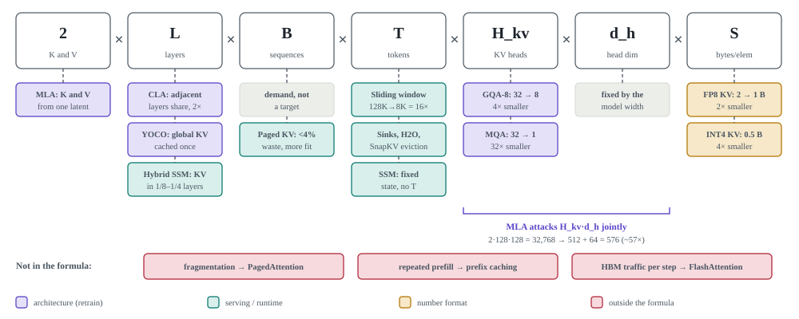{ .plate }

<h4>Architecture</h4><ul><li>The 2, <b>L</b> and <b>H_kv · d_h</b> terms belong to the model.</li><li>Shrinking them means training or uptraining.</li></ul>

<h4>Serving</h4><ul><li><b>B</b> is demand. Paging only lets more of it fit.</li><li><b>T</b> can be capped by windows, eviction or a recurrent state.</li></ul>

<h4>Outside the formula</h4><ul><li>Fragmentation, repeated prefill and HBM traffic all cost real memory or time.</li><li>None of them change M_KV.</li></ul>

In the sheet: <a href="#sheet-comparison@2">comparison § 3, which term each technique attacks</a>

## 2. Fewer KV heads

MHA gives every query head its own K and V. GQA lets a group of query heads share one K/V head,
and MQA takes that to the limit, with one K/V head for all of them. The queries stay different;
only the cached keys and values are shared:

$$
O_i = \operatorname{softmax}\!\left(\frac{Q_i K_{g(i)}^{\top}}{\sqrt{d_h}}\right) V_{g(i)},
\qquad g(i) = \left\lfloor i \,/\, (H_q / H_{kv}) \right\rfloor
$$

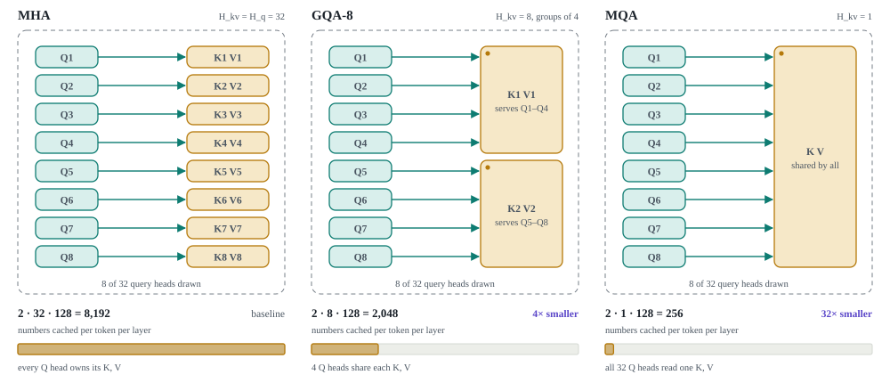{ .plate }

<h4>One knob: H / G</h4><ul><li>32 → 16 → 8 → 4 → 1 KV heads. The cache and the bytes read per decode step shrink by H/G.</li><li>H/G must divide H: each KV head serves exactly H/G query heads.</li></ul>

<h4>Who uses it</h4><ul><li><b>GQA</b>: Llama-2-70B, Llama-3, Mistral, Qwen.</li><li><b>MQA</b>: PaLM, Falcon-7B, StarCoder.</li></ul>

<h4>The price</h4><ul><li>Fewer distinct K/V views.</li><li>GQA-8 stays close to MHA after uptraining. MQA loses noticeably more.</li></ul>

In the sheet: <a href="#sheet-comparison@0">comparison § 1, head wiring</a> · <a href="#sheet-comparison@7">§ 8, the GQA ratio as one knob</a>

## 3. Count the cells

To compare the variants, draw one token in one layer. Each cell holds 128 numbers, which is one
head's K or V vector, so the number of cells is the cache size. MHA needs 64 cells. GQA-8 needs 16,
MQA needs 2, and MLA needs four latent cells plus half a cell for the RoPE key.

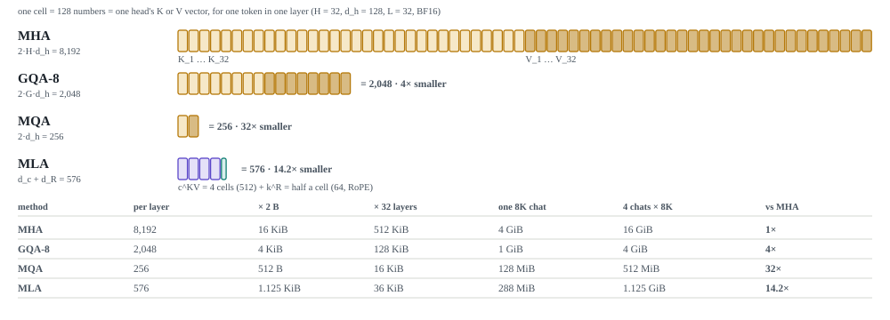{ .plate }

<h4>The ladder</h4><ul><li>MHA 8,192 → GQA-8 2,048 → MLA 576 → MQA 256 numbers per token per layer.</li></ul>

<h4>MLA caches more than MQA here</h4><ul><li>576 vs 256. Every one of MLA's 32 heads still gets its own K/V view.</li><li>MLA's budget equals GQA with 576 / 256 = 2.25 KV heads.</li></ul>

<h4>Scale it</h4><ul><li>× 2 bytes × 32 layers gives the cost per token.</li><li>× 8K tokens × 4 chats gives the batch: 16 GiB for MHA, 1.125 GiB for MLA.</li></ul>

In the sheet: <a href="#sheet-comparison@5">comparison § 6, one worked example</a> · <a href="#sheet-comparison@1">§ 2, the big comparison table</a>

## 4. Compress what is stored

MLA changes the question. GQA asks how many KV heads to keep. MLA asks how many numbers a token
needs, so it is not "GQA with fewer heads". Each token's hidden state is down-projected into a
512-wide latent $c^{KV}$, and a separate 64-wide key $k^R$ carries the position, since RoPE does not
commute with the low-rank projection. Only these 576 numbers are cached. Per-head keys and values
are linear functions of the latent:

$$
\big[k^C_1 \dots k^C_{32} \,;\, v_1 \dots v_{32}\big] = W^{U} c^{KV},
\qquad W^{U} \in \mathbb{R}^{8192 \times 512}
$$

That means a token's 8,192 K/V numbers live in a subspace of rank at most 512, and the factor 2
disappears because K and V are decoded from the same $c^{KV}$.

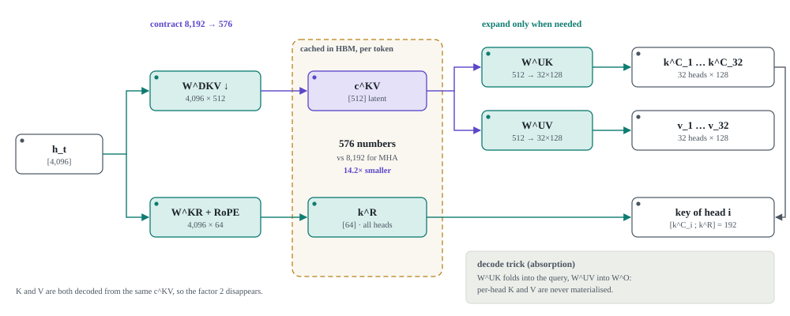{ .plate }

<h4>Absorption at decode</h4><ul><li>W^UK merges into the query projection and W^UV into W^O.</li><li>Attention runs directly on the cached latents. Per-head K and V are never built.</li></ul>

<h4>Prefill is different</h4><ul><li>Prefill is compute-bound and builds K/V for many tokens at once.</li><li>The explicit decompression is fine there.</li></ul>

<h4>DeepSeek-V2 numbers</h4><ul><li>With n_h = d_h = 128: 2·128·128 = 32,768 numbers become 576.</li><li>That is 1.76% of MHA, about 57× smaller.</li></ul>

In the sheet: <a href="#sheet-comparison@6">comparison § 7, two different knobs</a> · deeper: <a href="../sessions/06_mla.html">session 06</a> and <a href="../path/05-attention-variants.html">path step 5</a>

## 5. Quality is not one line

Plotted against compression, GQA and MQA trace a single curve: fewer KV heads cost K/V
diversity. MLA does not lie on that curve, because it changes what is cached instead of how many
heads are kept. Hybrids make a different trade again.

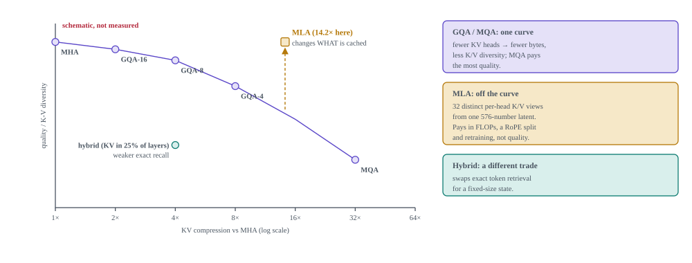{ .plate }

expected trend The curve is a schematic of what the papers report, not a measurement. In the sheet: <a href="#sheet-comparison@3">comparison § 4, quality vs efficiency</a>

## 6. Every step re-reads the cache

Decode is memory-bound. Each step reads the weights plus every cached K/V of every sequence in
the batch, so the step time is bounded below by bytes divided by bandwidth:

$$
t_{\text{step}} \;\ge\; \frac{\text{bytes}_{\text{weights}} + \text{bytes}_{KV}}{\text{HBM bandwidth}}
$$

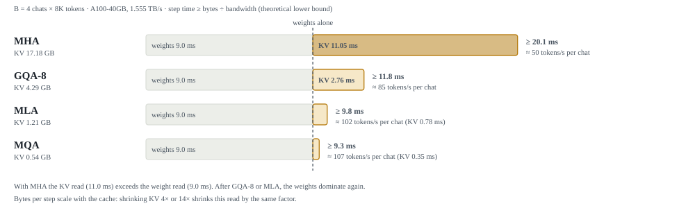{ .plate }

<h4>With MHA</h4><ul><li>The KV read (11 ms) is larger than the weight read (9 ms).</li><li>The cache, not the model, sets the token rate.</li></ul>

<h4>After GQA or MLA</h4><ul><li>The weights dominate again.</li><li>The next win comes from a larger batch (more tokens per weight read), not a smaller cache.</li></ul>

<h4>Arithmetic intensity</h4><ul><li>GQA decode AI ≈ H_q / H_kv: 4 for GQA-8, far below the A100 ridge of about 200.</li><li>Absorbed MLA reaches about 242 (derived), close to the ridge.</li></ul>

theoretical bytes ÷ datasheet bandwidth. In the sheet: <a href="#sheet-comparison@9">comparison § 10, bandwidth</a>

## 7. Fewer caches across layers

Everything so far makes each layer's cache thinner, but each layer still has its own cache.
Cross-layer sharing attacks $L$ instead. **CLA** lets adjacent layers reuse one KV.
**YOCO** splits the stack into two halves. A self-decoder with a small constant cache builds one
global KV, and every layer of the cross-decoder reads it.

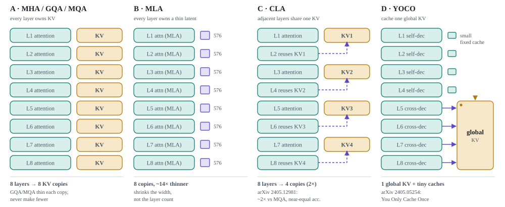{ .plate }

In the sheet: <a href="#sheet-architecture_evolution@1">evolution § 2, per-layer KV pictures</a>

## 8. A state instead of a cache

A recurrent or state-space layer stores no per-token KV at all. It folds each token into a
fixed-size state, $s_t = f(s_{t-1}, x_t)$, so its memory does not grow with $T$. The cost is
recall: the state is a lossy summary, and exact retrieval of one specific token is weak. Hybrids
keep a few full-attention layers for that retrieval and make the rest recurrent:

$$
M_{KV}^{\text{hybrid}} \approx \frac{\#\text{attention layers}}{L} \cdot M_{KV}^{\text{full}}
\;+\; \text{a fixed recurrent state}
$$

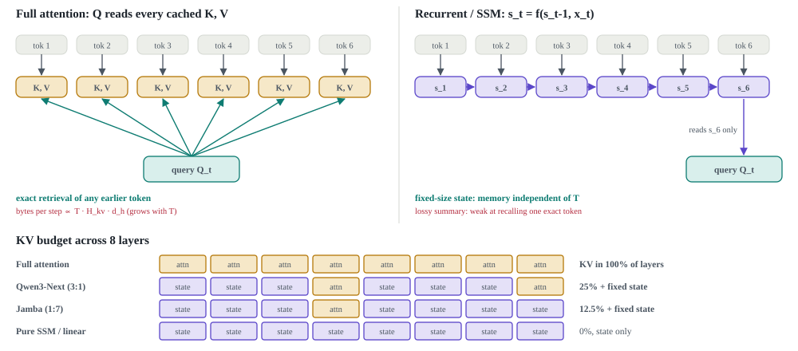{ .plate }

In the sheet: <a href="#sheet-architecture_evolution@2">evolution § 3, exact retrieval vs compressed memory</a>

## 9. The road so far

Each step after MHA attacks a different term. Sharing (violet) cuts heads or layers.
Compression (amber) cuts what a token stores. Recurrence (teal) replaces the growing cache
with a state.

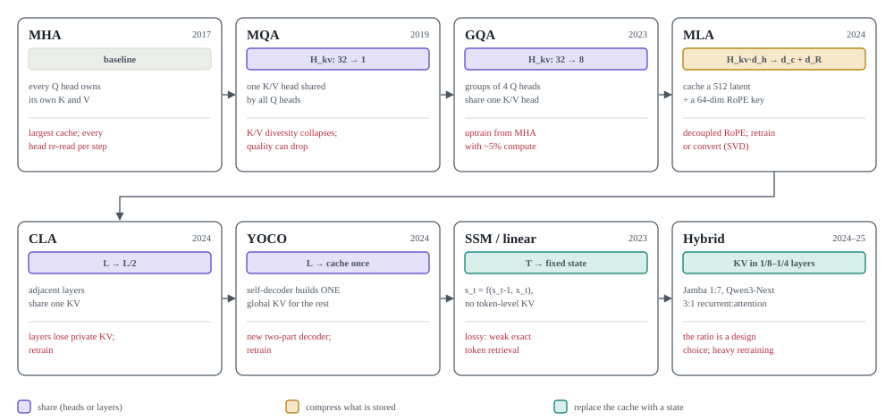{ .plate }

In the sheet: <a href="#sheet-architecture_evolution@0">evolution § 1, timeline</a>

## 10. Choosing, and what it costs

When the cache does not fit, shrink it in order of cost. Serving changes need no retraining.
Architecture changes need some uptraining, and a new model needs full training. If decode is slow
but the cache fits, compare the arithmetic intensity with the GPU's ridge point first. That
comparison tells you whether to cut bytes or FLOPs.

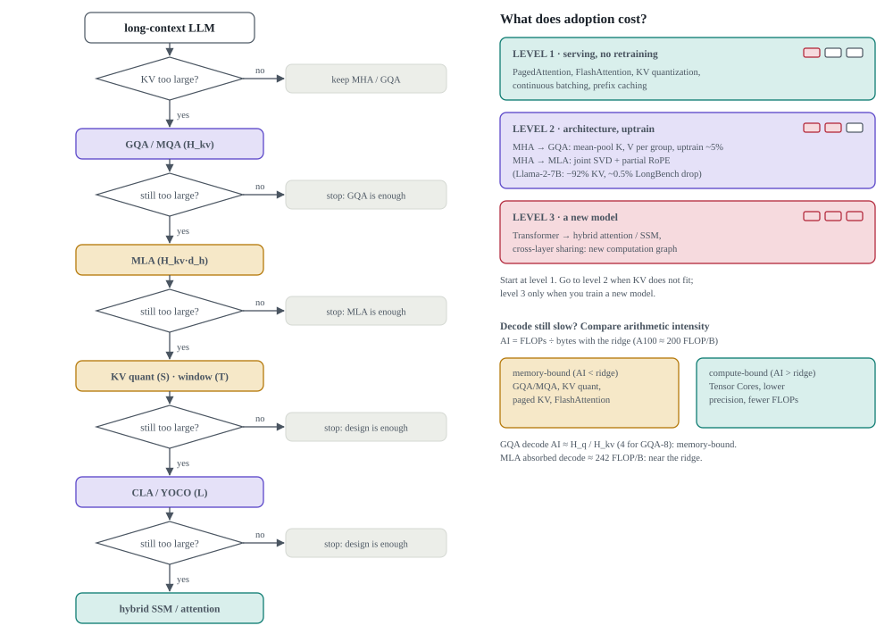{ .plate }

The cheapest retrofit replaces each group's heads with their mean and then uptrains on about 5%
of the pretraining compute (Ainslie et al., 2023):

$$
K_g = \frac{1}{|g|}\sum_{i \in g} K_i, \qquad V_g = \frac{1}{|g|}\sum_{i \in g} V_i
$$

In the sheets: <a href="#sheet-architecture_evolution@3">evolution § 4, decision tree</a> · <a href="#sheet-comparison@4">comparison § 5, retrofit levels</a>

## 11. Where this sits

The architecture decides how much KV there is. The rest of the stack decides where that KV lives
and how fast it is read: paging places it in fixed-size blocks, prefix sharing removes duplicate
blocks, and attention kernels stream it through on-chip memory. The [path](../path/index.md)
covers those steps one at a time.

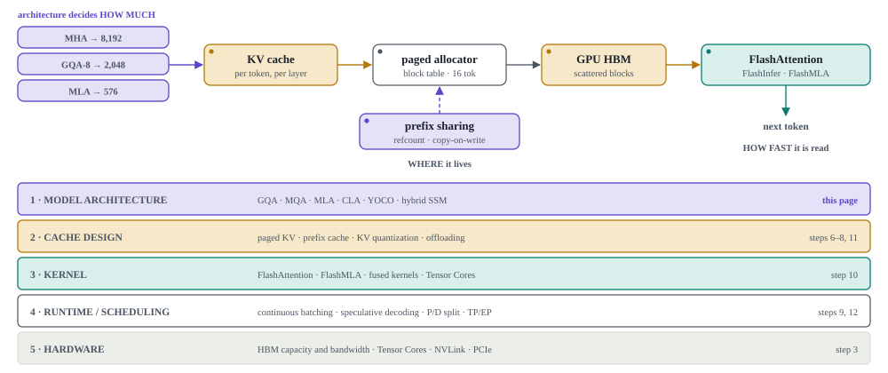{ .plate }

In the sheets: <a href="#sheet-comparison@10">comparison § 11, where this sits</a> · <a href="#sheet-architecture_evolution@4">evolution § 5, the five-layer stack</a>

## The hand-drawn sheets

The two sheets below are the source drawings for the plates, and they contain more detail than
the plates show. They open at reading zoom. Drag or scroll to pan, use the chips to jump to a
section, or switch to **Fit** for an overview.

{ .excalidraw }

{ .excalidraw }

[D05 · MHA / MQA / GQA / MLA cache comparison at matched config](../assets/diagrams/D05_variant_cache_comparison.html){ .diagram }
