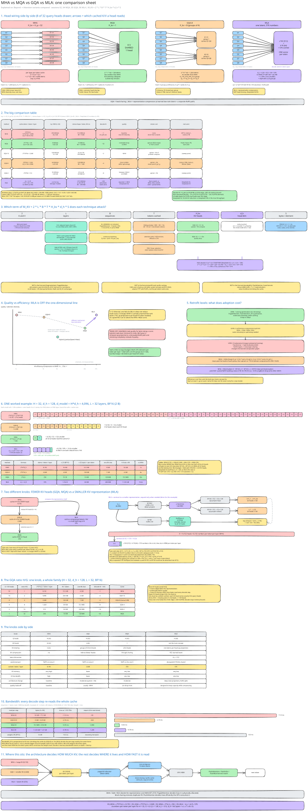
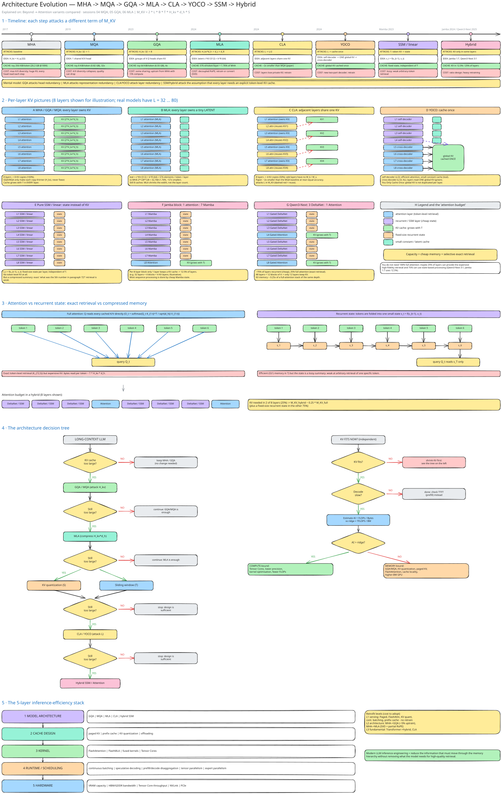

# Attention variants compared

Sessions [04 MQA](../sessions/04_mqa.md), [05 GQA](../sessions/05_gqa.md) and
[06 MLA](../sessions/06_mla.md) each introduce one variant. This page puts them side by side
and follows the line further, to cross-layer sharing, YOCO, state-space layers and hybrids.

Every variant shrinks one term of the same formula:

$$
M_{KV} = 2 \cdot L \cdot B \cdot T \cdot H_{kv} \cdot d_h \cdot S
$$

| Variant | What it caches per layer | Term it shrinks | Llama-3-8B shape, per token (all 32 layers, BF16) |
|---|---|---|---|
| MHA | K, V for all $H_Q = 32$ heads | — | 512 KiB |
| GQA | K, V for $H_{kv} = H_Q/4 = 8$ heads | $H_{kv}$ | 128 KiB (4× less) |
| MQA | K, V for 1 head | $H_{kv}$ | 16 KiB (32× less) |
| MLA | one latent $c_{KV}$ (512) + RoPE key (64) | $H_{kv} \cdot d_h$ | 36 KiB (~14× less) |
| CLA-2 on GQA | GQA cache, shared by 2 adjacent layers | $L$ | 64 KiB (8× less) |

## One comparison sheet

Head wiring, the full comparison table, which term each technique attacks, quality against
efficiency, retrofit cost, and one worked example at matched configuration.

{ .excalidraw }

[D05 · MHA / MQA / GQA / MLA cache comparison at matched config](../assets/diagrams/D05_variant_cache_comparison.html){ .diagram }

## How the architectures evolved

Each step after MHA attacks a different term of $M_{KV}$: MQA and GQA cut heads, MLA compresses
what each token stores, CLA and YOCO share caches across layers, and SSM/linear-attention layers
replace the growing cache with a fixed-size state.

{ .excalidraw }
