# Gallery

Every diagram in these docs in one place. Click a drawing to go to the page that explains it.
The live viewer opens any drawing full screen, and the `.excalidraw` source files are in
[`docs/assets/excalidraw/`](https://github.com/supriyo100/kv-cache-attention-variants/tree/main/docs/assets/excalidraw).

## Excalidraw drawings

<a href="sessions/02_kv_cache_memory_math.html">KV cache memory: worked example</a>
<a href="sessions/02_kv_cache_memory_math.html">A100 40 GB VRAM budget</a>
<a href="sessions/04_mqa.html">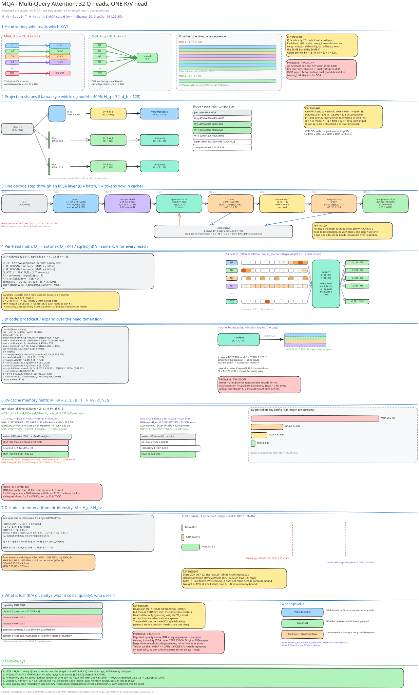MQA: one K/V head</a>
<a href="sessions/05_gqa.html">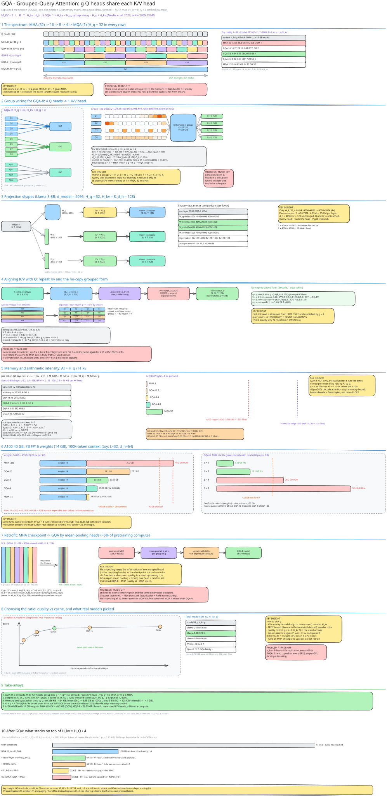GQA: g query heads per K/V head</a>
<a href="sessions/06_mla.html">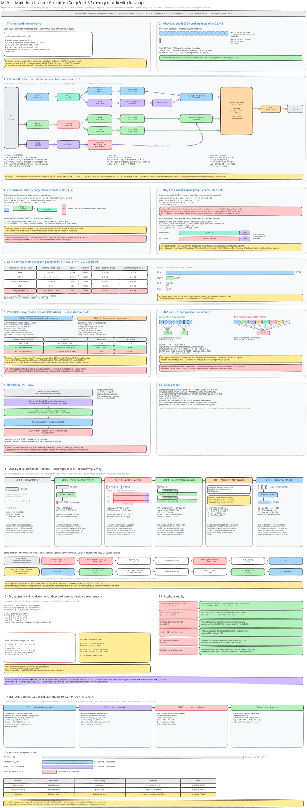MLA: latent cache + decoupled RoPE</a>
<a href="sessions/07_rope.html">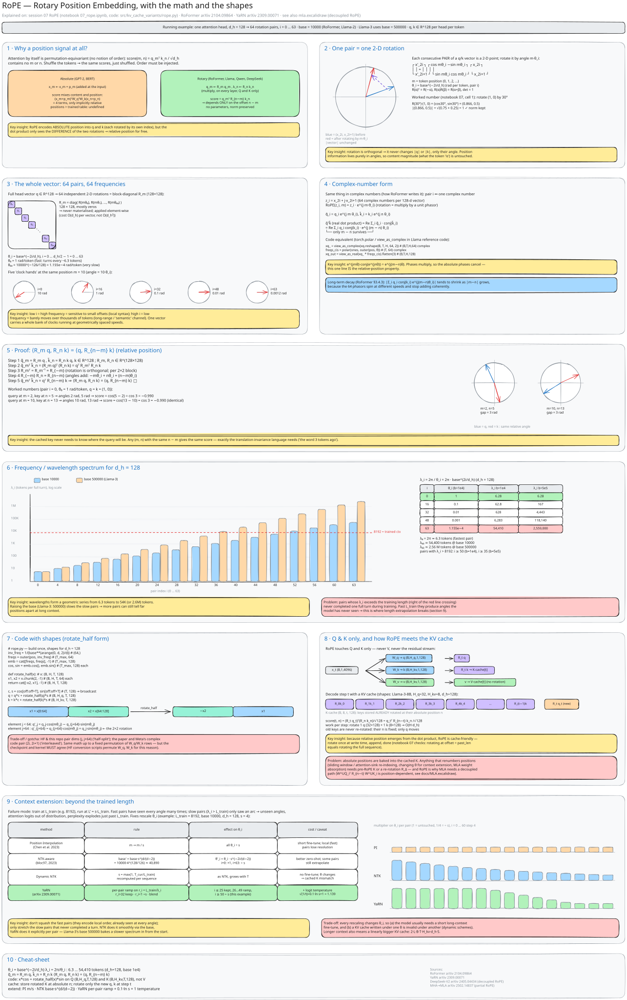RoPE: math and shapes</a>
<a href="sessions/08_flashattention.html">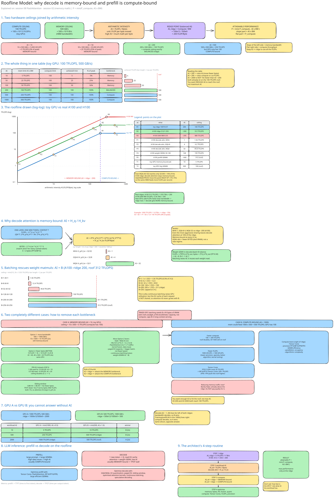Roofline: decode vs prefill</a>
<a href="sessions/10_pagedattention_vllm.html">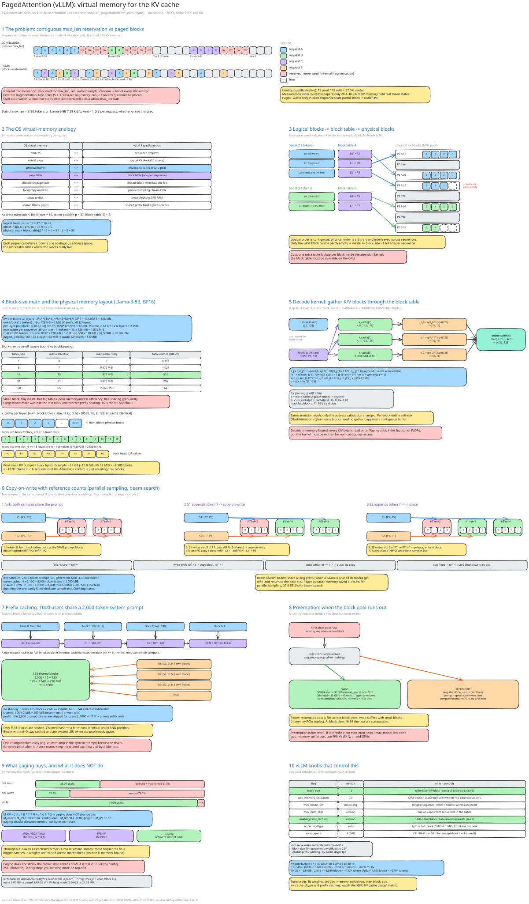PagedAttention</a>
<a href="sessions/10_pagedattention_vllm.html">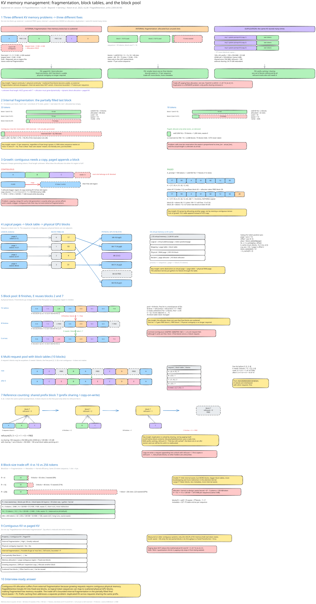KV memory management</a>
<a href="beyond/variants_compared.html">MHA vs MQA vs GQA vs MLA</a>
<a href="beyond/variants_compared.html">Architecture evolution</a>
<a href="beyond/sota_map.html">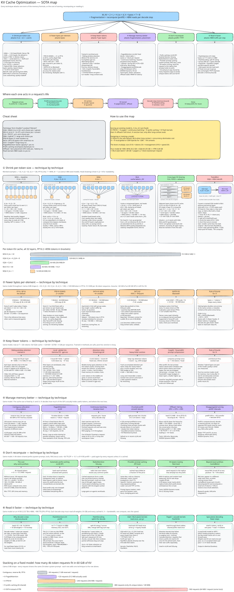KV cache SOTA map</a>
<a href="beyond/sota_map.html">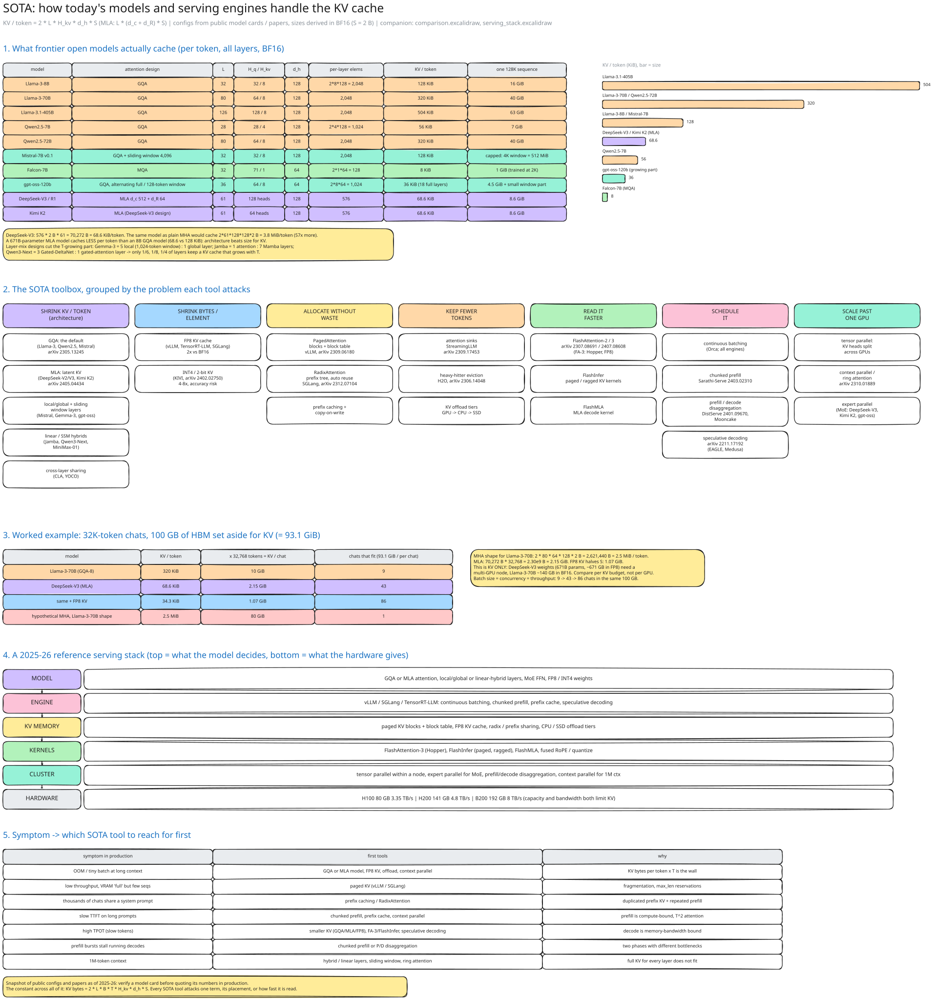SOTA models and engines</a>
<a href="beyond/inference_problems.html">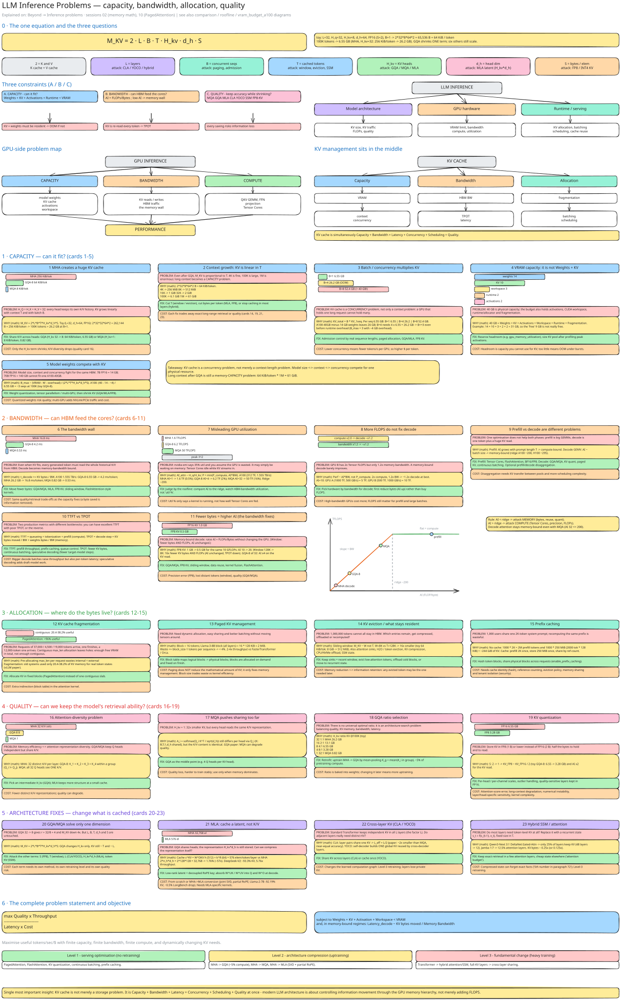Inference problems</a>
<a href="beyond/serving.html">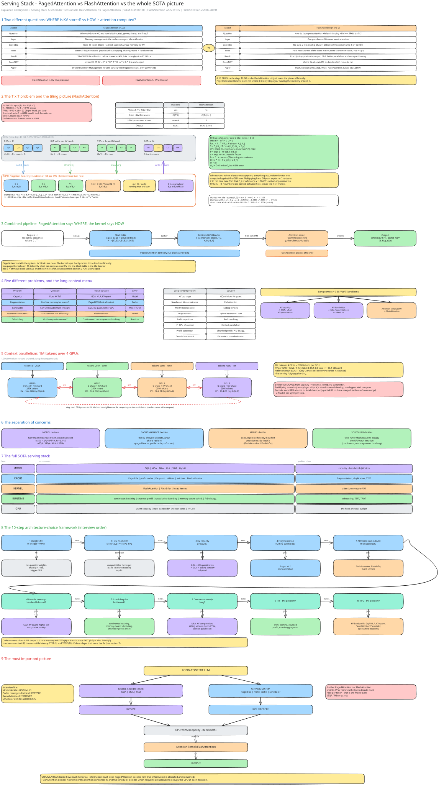Serving stack</a>
<a href="beyond/serving.html">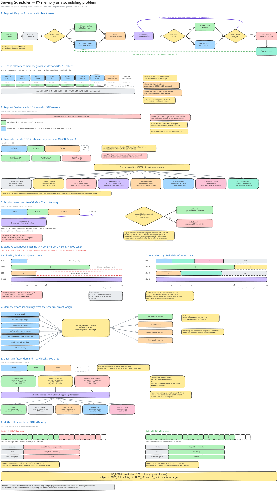Serving scheduler</a>
<a href="study/explanation.html">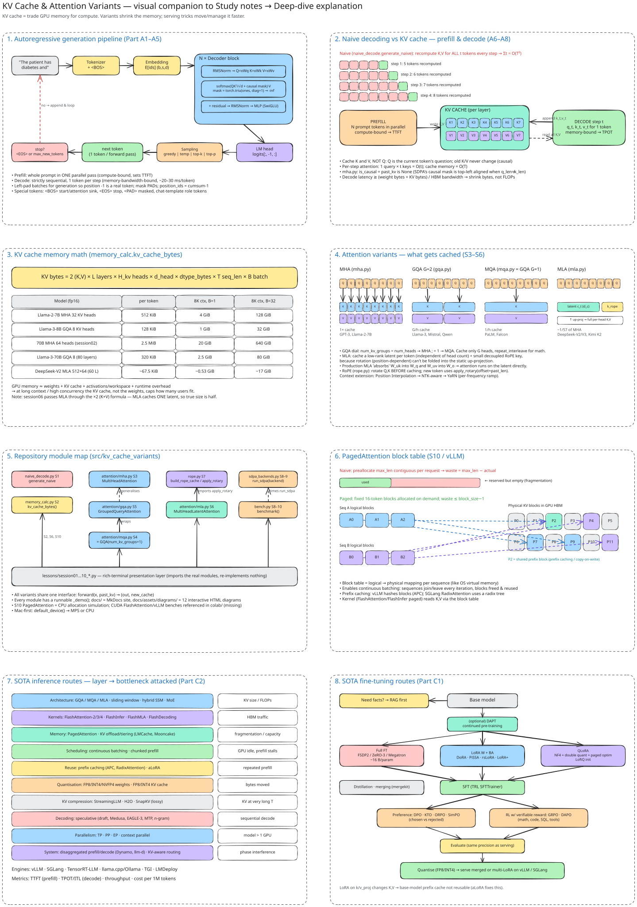Visual companion to the deep dive</a>
<a href="study/interview_questions.html">Interview question map</a>

## Interactive HTML diagrams

Self-contained diagrams with their own pan, zoom, search and PNG/SVG export.

<a href="assets/diagrams/D01_curriculum_dependency.html" target="_blank" rel="noopener">D01 · Curriculum dependency ↗</a>
<a href="assets/diagrams/D02_naive_vs_cached_decode.html" target="_blank" rel="noopener">D02 · Naive vs cached decode ↗</a>
<a href="assets/diagrams/D03_mha_attention_cache.html" target="_blank" rel="noopener">D03 · MHA decode step with cache ↗</a>
<a href="assets/diagrams/D04_kv_cache_memory_formula.html" target="_blank" rel="noopener">D04 · KV cache memory formula ↗</a>
<a href="assets/diagrams/D05_variant_cache_comparison.html" target="_blank" rel="noopener">D05 · Variant cache comparison ↗</a>
<a href="assets/diagrams/D06_gqa_spectrum.html" target="_blank" rel="noopener">D06 · GQA spectrum ↗</a>
<a href="assets/diagrams/D07_mla_latent_compression.html" target="_blank" rel="noopener">D07 · MLA latent compression ↗</a>
<a href="assets/diagrams/D08_rope_rotation.html" target="_blank" rel="noopener">D08 · RoPE rotation ↗</a>
<a href="assets/diagrams/D09_rope_context_extension.html" target="_blank" rel="noopener">D09 · RoPE context extension ↗</a>
<a href="assets/diagrams/D10_flashattention_tiling.html" target="_blank" rel="noopener">D10 · FlashAttention tiling ↗</a>
<a href="assets/diagrams/D11_sdpa_backend_dispatch.html" target="_blank" rel="noopener">D11 · SDPA backend dispatch ↗</a>
<a href="assets/diagrams/D12_pagedattention_blocks.html" target="_blank" rel="noopener">D12 · PagedAttention blocks ↗</a>

