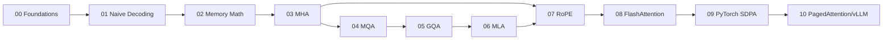

# KV Cache & Attention Variants — Module 03

Zero-to-advanced course docs, from naive decoding to PagedAttention/vLLM. The session
pages are rendered from the teaching notebooks of the upstream course,
[sourangshupal/kv-cache-attention-variants](https://github.com/sourangshupal/kv-cache-attention-variants).
This edition adds Excalidraw diagrams of every flow and comparison, embedded right next to the
text they explain, plus deep-dive study notes.

!!! tip "Reading the diagrams"
    Each Excalidraw drawing shows as an image. Open **Explore here** under it to pan and zoom
    in place, or **Full screen** for a separate tab. The numbered **D01–D12** diagrams are
    interactive too. Every diagram is also listed in the [Gallery](gallery.md).

## Course map

| # | Session | What you leave knowing | Reused source |
|---|---|---|---|
| 00 | Foundations | Tokens, embeddings, self-attention, causal masking, autoregressive generation | (from scratch) |
| 01 | Naive Decoding | Why no-cache decoding is $O(n^2)$ | `naive_decode.py` |
| 02 | KV Cache Memory Math | Derive `kv_cache_bytes` from first principles | `memory_calc.py` |
| 03 | MHA Recap | Multi-head attention, prefill vs. incremental decode | `attention/mha.py` |
| 04 | MQA | Single shared K/V head, max compression | `attention/mqa.py` |
| 05 | GQA | Tunable middle ground between MHA and MQA | `attention/gqa.py` |
| 06 | MLA | Low-rank latent K/V compression + decoupled RoPE (DeepSeek-V2) | `attention/mla.py` |
| 07 | RoPE | Rotary position encoding + context-extension scaling | `rope.py` |
| 08 | FlashAttention | IO-awareness, tiling, SDPA backend selection | `sdpa_backends.py`, `bench.py` |
| 09 | PyTorch SDPA | Migrating hand-rolled attention math to a fused op | — |
| 10 | PagedAttention / vLLM | Block-table KV cache allocation | `memory_calc.py` |



[D01 · Curriculum dependency: which session builds on which](assets/diagrams/D01_curriculum_dependency.html){ .diagram }

## How to use these docs

1. Read the [course sessions](sessions/00_foundations.md) 00 → 10 in order; each one recaps the one before.
2. Run the matching notebook in `teaching_notebooks/` yourself (sessions 00–04 are published).
   These pages are the read-only version; the notebooks are interactive.
3. Then go **Beyond the course**: [variants compared](beyond/variants_compared.md),
   the [KV cache SOTA map](beyond/sota_map.md), [inference problems](beyond/inference_problems.md)
   and [serving](beyond/serving.md).
4. Test yourself with the [deep-dive explanation](study/explanation.md) and the
   [interview questions](study/interview_questions.md).

## Build locally

```bash
uv sync --extra docs
uv run mkdocs serve   # http://127.0.0.1:8000
uv run mkdocs build   # static site -> site/
```

After editing a drawing in `docs/assets/excalidraw/`, regenerate its SVG:

```bash
cd tools/excalidraw_export && npm install && node export.mjs   # or: node export.mjs gqa
```
