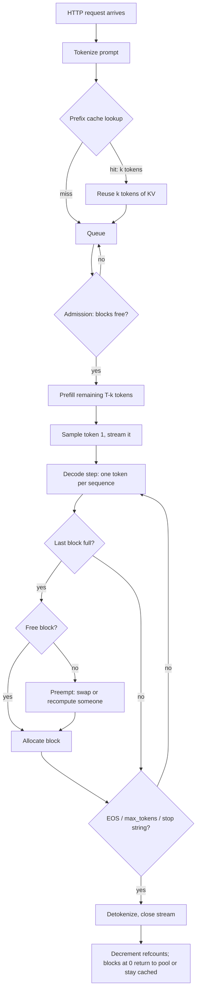

# 1. The request

A user presses send. Hundreds of milliseconds later the first word appears, then
the rest stream in at a steady rhythm. Those two numbers, the wait and the rhythm, are set by
different parts of the system. This step names every stage a request passes through, defines
the metrics precisely, and derives how much KV memory a given load needs.

## Problem

"The model is slow" is not a diagnosis. A request's latency is a sum of stages that live on
different hardware and are fixed by different techniques. Before you optimize anything, you have
to know which stage owns the time.

## The naive picture, and why it misleads

The naive picture treats the server as a function: prompt in, text out, runtime proportional to
model size. It misses four facts that drive the rest of this site:

1. **Output is produced one token at a time.** Token $t+1$ depends on token $t$, so the
   generation loop is sequential no matter how many GPUs you have.
2. **The first token and the rest cost very different amounts.** The first needs the whole
   prompt processed (prefill). Each later token needs one more pass (decode).
3. **Requests share the GPU.** A request's latency depends on what else is in the batch.
4. **Memory is reserved for the life of the request.** Every token so far leaves keys and
   values in GPU memory until the request ends.

## The lifecycle

Each box maps to a later step:

| Stage | What runs | Where the time goes | Step |
|---|---|---|---|
| Tokenize | CPU, BPE merge | under 1 ms for typical prompts; can matter for 100K-token prompts | — |
| Prefix lookup | CPU, hash or radix tree | microseconds; saves up to the whole prefill | [8](08-prefix-sharing.md) |
| Queue + admission | scheduler | zero at low load; grows without bound past capacity | [9](09-scheduling.md) |
| Prefill | GPU, large matmuls | compute-bound: $\approx 2P\,T/\pi$ | [2](02-prefill-and-decode.md) |
| Decode step | GPU, matrix-vector work | bandwidth-bound: $\approx (sP + \text{KV read})/\beta$ | [2](02-prefill-and-decode.md), [4](04-kv-cache.md) |
| Block allocation | scheduler, free list | microseconds, unless the pool is empty | [7](07-paged-kv.md) |
| Free | refcount decrement | microseconds | [8](08-prefix-sharing.md) |

## The metrics, defined precisely

Let a request arrive at $t_0$ and emit output tokens at times $t_1 < t_2 < \dots < t_N$.

$$
\begin{aligned}
\text{TTFT} &= t_1 - t_0 && \text{time to first token} \\
\text{ITL}_i &= t_i - t_{i-1}, \quad i = 2..N && \text{inter-token latency (per gap)} \\
\text{TPOT} &= \frac{t_N - t_1}{N - 1} && \text{time per output token (mean ITL)} \\
\text{E2E} &= t_N - t_0 = \text{TTFT} + (N-1)\,\text{TPOT}
\end{aligned}
$$

TTFT has three parts: $\text{TTFT} = t_{\text{queue}} + t_{\text{prefill}} + t_{\text{first decode
overhead}}$. Queueing dominates under load, and prefill dominates for long prompts.

TPOT is a mean. ITL is a distribution, and its tail matters more than its mean: a user sees a
200 ms stall even when the average gap is 20 ms. Stalls come from a long prefill
landing in the same iteration (step [9](09-scheduling.md)) or from preemption.

**Throughput** is output tokens per second across all requests:
$\Theta = \sum_r N_r / \Delta t$. **Goodput** counts only requests that met their latency
targets (for example TTFT < 500 ms and p99 ITL < 50 ms). Raising batch size usually increases
throughput and worsens latency, so the operating point is a choice, not a number to maximize.

<figure class="ie-fig">
<svg viewBox="0 0 760 210" role="img" aria-label="Timeline of one request: queue, prefill, first token, then decode steps separated by inter-token gaps">
<line x1="20" y1="120" x2="740" y2="120" class="ln"/>
<rect x="40" y="96" width="70" height="24" class="waste"/><text x="75" y="88" text-anchor="middle" class="t-sm">queue</text>
<rect x="110" y="96" width="150" height="24" class="compute"/><text x="185" y="88" text-anchor="middle" class="t-sm">prefill (T prompt tokens)</text>
<g class="f-memory">
<rect x="268" y="102" width="26" height="18" class="memory"/><rect x="302" y="102" width="26" height="18" class="memory"/><rect x="336" y="102" width="26" height="18" class="memory"/><rect x="370" y="102" width="26" height="18" class="memory"/>
<rect x="470" y="102" width="26" height="18" class="memory"/><rect x="504" y="102" width="26" height="18" class="memory"/><rect x="538" y="102" width="26" height="18" class="memory"/><rect x="572" y="102" width="26" height="18" class="memory"/><rect x="606" y="102" width="26" height="18" class="memory"/>
</g>
<rect x="400" y="96" width="64" height="24" class="compute"/><text x="432" y="88" text-anchor="middle" class="t-sm">other request's prefill</text>
<text x="330" y="88" text-anchor="middle" class="t-sm">decode steps</text>
<line x1="40" y1="126" x2="40" y2="140" class="ln"/><text x="40" y="154" text-anchor="middle" class="t-mono">t₀</text>
<line x1="268" y1="126" x2="268" y2="140" class="ln"/><text x="268" y="154" text-anchor="middle" class="t-mono">t₁</text>
<line x1="632" y1="126" x2="632" y2="140" class="ln"/><text x="632" y="154" text-anchor="middle" class="t-mono">t_N</text>
<path d="M40,170 L40,176 L268,176 L268,170" class="ln"/><text x="154" y="194" text-anchor="middle" class="t-b">TTFT</text>
<path d="M268,170 L268,176 L632,176 L632,170" class="ln"/><text x="450" y="194" text-anchor="middle" class="t-b">(N−1) · TPOT</text>
<path d="M396,60 L396,52 L470,52 L470,60" class="ln s-waste" style="stroke:var(--ie-waste)"/><text x="433" y="44" text-anchor="middle" class="t-sm" style="fill:var(--ie-waste)">one long ITL gap</text>
<path d="M294,60 L294,52 L302,52 L302,60" class="ln"/><text x="298" y="44" text-anchor="middle" class="t-sm">ITL</text>
</svg>
<figcaption><b>Where each metric comes from.</b> TTFT covers queueing and prefill. After the
first token, decode steps arrive at a steady ITL until another request's prefill shares the
GPU and stretches one gap. That outlier is invisible in mean TPOT but obvious in p99 ITL.
Colors: compute-bound work, bandwidth-bound
work, time spent waiting.</figcaption>
</figure>

## How much KV memory does a load need? (Little's law)

Little's law says the mean number of requests in a stable system equals arrival rate times mean
time in system: $\bar{n} = \lambda \cdot \overline{\text{E2E}}$. Each live request holds KV for
its current context. Averaged over its lifetime, a request with prompt $T_p$ and output $N$
holds about $T_p + N/2$ tokens. So the KV memory a server must hold on average is

$$
\overline{M}_{\text{KV}} \approx \lambda \cdot \overline{\text{E2E}} \cdot \left(\overline{T_p} + \tfrac{\overline{N}}{2}\right) \cdot m_{\text{tok}},
$$

where $m_{\text{tok}}$ is KV bytes per token (step [4](04-kv-cache.md)). This is the systems
form of the KV problem. Slower decoding raises E2E, which raises live KV, which forces smaller
batches, which slows decoding per GPU. The loop explains why decode speed and KV size are the
same problem seen from two sides.

**Worked example** theoretical. Llama-3-8B in BF16 has
$m_{\text{tok}} = 128$ KiB. At $\lambda = 10$ req/s, E2E = 8 s, $T_p = 2000$ and $N = 400$:
$\bar n = 80$ requests live, each holding about 2,200 tokens. That is
$80 \times 2200 \times 128\text{ KiB} \approx 21.5$ GiB of KV on average, before any
fragmentation and before the peak. On an 80 GB H100 with 16 GB of weights this fits, but the
peak, with $\bar n$ fluctuating, sets the real requirement.

## Implementation

The scheduler model in
[`inference_lab/scheduler.py`](https://github.com/supriyo100/kv-cache-attention-variants/blob/main/src/inference_lab/scheduler.py)
implements this lifecycle: admission against a block budget, prefill, per-iteration decode,
block growth, preemption by recompute, and freeing. It records $t_0, t_1, \dots, t_N$ for every
request and reports TTFT, TPOT, p99 ITL and throughput. Step [9](09-scheduling.md) runs it.

## Trade-offs and failure modes

- **TTFT vs ITL.** Prioritizing new prefills cuts TTFT and stalls running decodes.
  Prioritizing decodes keeps ITL smooth and lets the queue grow.
- **Throughput vs latency.** A bigger batch amortizes weight reads over more tokens, which
  raises throughput, but every sequence's step gets slower.
- **Unknown output length.** The server cannot know $N$ at admission. It must either reserve
  for the worst case (wasting memory, step [6](06-fragmentation.md)) or grow on demand and
  handle running out (step [9](09-scheduling.md)).
- **Overload.** Past capacity, queueing delay grows without bound. Without admission control
  and timeouts, TTFT goes to infinity while throughput stays flat.

## Production notes

Serving engines expose these metrics directly. vLLM exports Prometheus histograms for TTFT,
time per output token, end-to-end latency and queue time. SGLang and TensorRT-LLM report the
same quantities. Load-test tools (vLLM's `benchmarks/`, NVIDIA GenAI-Perf) report p50/p90/p99
for each, and the percentiles, not the means, are what an SLO should name.

## Questions

1. Why can mean TPOT look healthy while users complain about stutter?
2. Doubling prompt length roughly doubles which metric, and leaves which almost unchanged?
3. Using Little's law, what happens to KV memory demand when decode slows by 30% at fixed
   arrival rate?
4. Why is goodput a better optimization target than throughput for a chat product?

**Provenance**

Source
: Little's law (Little, 1961). Metric names follow common serving-engine usage (vLLM metrics,
  NVIDIA GenAI-Perf). Goodput as an SLO-bounded throughput follows DistServe (Zhong et al.,
  OSDI 2024).

Derivation
: The KV-demand estimate from Little's law is this site's. It assumes a stable queue and
  linear growth of context during decode.

Implementation
: `inference_lab.scheduler` (tested in `tests/test_inference_lab.py`).

Experiment
: None on this page. The worked example is arithmetic on stated inputs.

