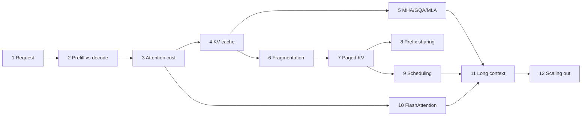

# The path of one request

Twelve steps, one request. We follow a chat request from the moment it reaches the
server to the moment its memory is returned, and stop at each place where something becomes the
bottleneck. Each stop explains why the obvious fix fails, what the field does instead, and what
that costs.

## Why this order

Inference techniques are usually taught as a catalogue: here is GQA, here is PagedAttention,
here is FlashAttention. A catalogue hides the dependency chain. You cannot see why paging is
needed until you know the cache grows one token at a time to an unknown final length. You
cannot see why decode is slow until you have computed its arithmetic intensity. So the steps
build on each other:

## The template every step follows

Each page answers the same questions in the same order, so you can skip to what you need.

1. **Problem.** What breaks, with numbers.
2. **Naive solution, and why it fails.** The obvious fix, and the specific reason it falls short.
3. **Core idea.** One paragraph.
4. **Math.** The derivation, with every variable defined.
5. **System design.** Where it sits in a serving engine, with a figure.
6. **Implementation.** A small, tested reference in `inference_lab`.
7. **Experiment.** A run of that code, labelled measured, theoretical or expected trend.
8. **Trade-offs and failure modes.** What it costs, and when it hurts.
9. **Production notes and state of the art.** What vLLM, SGLang, TensorRT-LLM and current
   models actually do.
10. **Questions.** Ones that test understanding, not recall.
11. **Sources.** Papers and repositories, and what each one contributed.

## Notation used throughout

| Symbol | Meaning | Llama-3-8B |
|---|---|---|
| $L$ | transformer layers | 32 |
| $d$ | model (hidden) width | 4096 |
| $H_q$ | query heads | 32 |
| $H_{kv}$ | key/value heads | 8 |
| $d_h$ | head dimension | 128 |
| $T$ | tokens in context (prompt + generated so far) | — |
| $B$ | sequences in the running batch | — |
| $s$ | bytes per element (2 for BF16, 1 for FP8) | 2 |
| $P$ | parameters (active parameters $P_a$ for MoE) | $8.0\times10^9$ |
| $\beta$ | HBM bandwidth, bytes/s | H100: $3.35\times10^{12}$ |
| $\pi$ | peak dense matmul throughput, FLOP/s | H100 BF16: $9.89\times10^{14}$ |

Hardware figures are NVIDIA datasheet peaks (dense, no sparsity). They are upper bounds that
real kernels approach but never reach.
