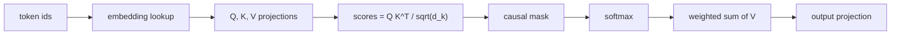
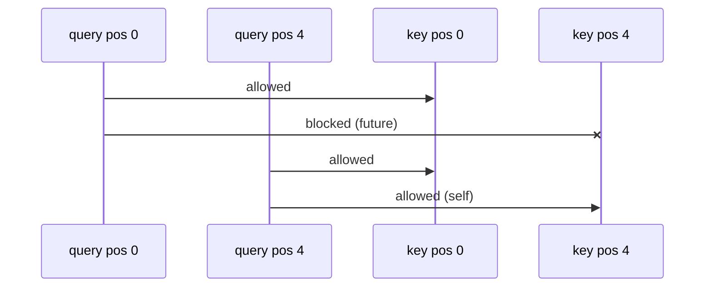

# Session 0 — Foundations: Tokens, Embeddings, Self-Attention

Zero-background start. Everything here builds toward one question every later
notebook answers differently: **what should a transformer remember about past
tokens while generating the next one?**

No prior notebook needed — this is where the course starts.


## 1. Tokens and embeddings

A language model never sees text. It sees integers ("token ids") that a
tokenizer assigns to sub-words. Each integer is looked up in an **embedding
table** — a big matrix where row `i` is a learned vector representing token
`i`.

**Analogy:** a huge dictionary where every word has been replaced by its
coordinates on a map. Words used in similar contexts end up at nearby
coordinates.


```python
import torch

torch.manual_seed(0)

vocab = ["the", "cat", "sat", "on", "mat", "dog"]
vocab_size, d_model = len(vocab), 8

embedding_table = torch.randn(vocab_size, d_model)
sentence = ["the", "cat", "sat"]
token_ids = torch.tensor([vocab.index(w) for w in sentence])

embeddings = embedding_table[token_ids]
print("sentence:", sentence)
print("token ids:", token_ids.tolist())
print("embeddings shape:", tuple(embeddings.shape))  # (seq_len, d_model)

```

    sentence: ['the', 'cat', 'sat']
    token ids: [0, 1, 2]
    embeddings shape: (3, 8)


## 2. Self-attention intuition

Every token produces three vectors from its embedding:

- **Query (Q)** — "what am I looking for?"
- **Key (K)** — "what do I offer, as a label?"
- **Value (V)** — "what do I actually contribute if picked?"

Each token's Query is compared against every other token's Key (dot product =
similarity). High similarity -> that token's Value contributes more to the
output.

**Analogy:** a library search. Your query is what you type in the search box.
Every book has a key (its catalogued subject tags). You get back a weighted
mix of book contents (values), weighted by how well each book's tags matched
your search.


## 3. Scaled dot-product attention, by hand first

$$
\text{Attention}(Q, K, V) = \text{softmax}\left(\frac{QK^\top}{\sqrt{d_k}}\right) V
$$

Dividing by $\sqrt{d_k}$ keeps the dot products from growing too large as
dimension grows (which would make softmax too peaked / gradients too small).


```python
import math

# 3 tokens, head_dim = 4 -- small enough to print every number.
d_k = 4
Q = torch.randn(3, d_k)
K = torch.randn(3, d_k)
V = torch.randn(3, d_k)

scores = Q @ K.T / math.sqrt(d_k)
print("raw scores (3x3, one row per query token):\n", scores)

weights = torch.softmax(scores, dim=-1)
print("\nattention weights (each row sums to 1):\n", weights)
print("row sums:", weights.sum(dim=-1))

output = weights @ V
print("\noutput (3 tokens x d_k):\n", output)

```

    raw scores (3x3, one row per query token):
     tensor([[-0.2284,  0.5448, -0.3085],
            [ 0.8640,  0.4951,  0.3000],
            [-0.6569, -0.0357, -0.4154]])
    
    attention weights (each row sums to 1):
     tensor([[0.2445, 0.5298, 0.2257],
            [0.4424, 0.3059, 0.2517],
            [0.2419, 0.4502, 0.3080]])
    row sums: tensor([1., 1., 1.])
    
    output (3 tokens x d_k):
     tensor([[ 0.7457,  1.3025,  0.4068, -0.6725],
            [ 0.8677,  0.6612,  0.4144, -0.6146],
            [ 0.5289,  1.0287,  0.5016, -0.5933]])


## 4. Causal masking

Generation must not look at future tokens. Before softmax, we set scores for
"future" positions to $-\infty$ so they get exactly 0 weight after softmax.


```python
from rich.console import Console
from rich.table import Table

console = Console()
seq_len = 5
mask = torch.triu(torch.ones(seq_len, seq_len, dtype=torch.bool), diagonal=1)

table = Table(title="causal mask (True = blocked / future position)")
table.add_column("query pos \\ key pos")
for j in range(seq_len):
    table.add_column(str(j), justify="center")
for i in range(seq_len):
    table.add_row(str(i), *["X" if mask[i, j] else "." for j in range(seq_len)])
console.print(table)

```


<pre style="white-space:pre;overflow-x:auto;line-height:normal;font-family:Menlo,'DejaVu Sans Mono',consolas,'Courier New',monospace"><span style="font-style: italic">   causal mask (True = blocked / future    </span>
<span style="font-style: italic">                 position)                 </span>
┏━━━━━━━━━━━━━━━━━━━━━┳━━━┳━━━┳━━━┳━━━┳━━━┓
┃<span style="font-weight: bold"> query pos \ key pos </span>┃<span style="font-weight: bold"> 0 </span>┃<span style="font-weight: bold"> 1 </span>┃<span style="font-weight: bold"> 2 </span>┃<span style="font-weight: bold"> 3 </span>┃<span style="font-weight: bold"> 4 </span>┃
┡━━━━━━━━━━━━━━━━━━━━━╇━━━╇━━━╇━━━╇━━━╇━━━┩
│ 0                   │ . │ X │ X │ X │ X │
│ 1                   │ . │ . │ X │ X │ X │
│ 2                   │ . │ . │ . │ X │ X │
│ 3                   │ . │ . │ . │ . │ X │
│ 4                   │ . │ . │ . │ . │ . │
└─────────────────────┴───┴───┴───┴───┴───┘
</pre>


```python
causal_scores = torch.randn(seq_len, seq_len).masked_fill(mask, float("-inf"))
causal_weights = torch.softmax(causal_scores, dim=-1)
print("row 0 (only sees itself):", causal_weights[0].round(decimals=3))
print("row 4 (sees all 5 tokens):", causal_weights[4].round(decimals=3))

```

    row 0 (only sees itself): tensor([1., 0., 0., 0., 0.])
    row 4 (sees all 5 tokens): tensor([0.0790, 0.2180, 0.1860, 0.2340, 0.2830])


## 5. Autoregressive generation

Generation is a loop: run the model, take the last position's output, turn it
into a token, append it, repeat. Each new token can attend to every token
before it (via the causal mask above).


```python
import torch.nn as nn

torch.manual_seed(0)
vocab_size, d_model = 50, 16
embed = nn.Embedding(vocab_size, d_model)
lm_head = nn.Linear(d_model, vocab_size, bias=False)


def toy_transform(x: torch.Tensor) -> torch.Tensor:
    # stand-in for "the rest of the transformer": identity for this toy demo.
    return x


prompt = torch.randint(0, vocab_size, (1, 3))
ids = prompt
for step in range(4):
    x = embed(ids)
    hidden = toy_transform(x)
    next_id = lm_head(hidden[:, -1, :]).argmax(dim=-1, keepdim=True)
    ids = torch.cat([ids, next_id], dim=1)
    print(f"step {step}: generated token {next_id.item()}, sequence so far: {ids.tolist()}")

```

    step 0: generated token 25, sequence so far: [[42, 27, 38, 25]]
    step 1: generated token 33, sequence so far: [[42, 27, 38, 25, 33]]
    step 2: generated token 9, sequence so far: [[42, 27, 38, 25, 33, 9]]
    step 3: generated token 6, sequence so far: [[42, 27, 38, 25, 33, 9, 6]]


## 6. Where this fits in a transformer decoder block

Each decoder layer is: `x -> self-attention -> add & norm -> feed-forward ->
add & norm -> next layer`. This course's 10 sessions live entirely inside the
self-attention sub-block — specifically, in what gets cached and how it's
computed. The feed-forward part never changes across any of the variants
below.








## Recap

You've now derived self-attention, causal masking, and the generation loop
from scratch. Every remaining notebook asks one question about this loop:
**as the sequence grows, what do we need to keep in memory to avoid
recomputing K and V for old tokens?** That's the KV cache — starting in
Notebook 1.

You are now ready to move to `01_naive_decoding.ipynb`.

