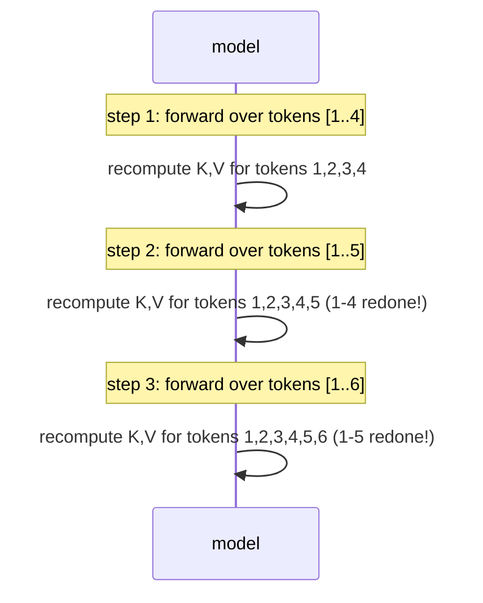

# Session 1 — Naive Decoding: The Cost of Not Caching

**Recap:** Notebook 0 built an autoregressive loop that re-ran the whole
model on the whole sequence at every step. This notebook makes the cost of
that explicit.


## Why naive decoding is expensive

At decode step $t$, generating token $t+1$ requires attention over all $t$
previous tokens. If we don't cache anything, we recompute K and V for **all**
of those $t$ tokens from scratch, every single step — even though tokens
$1..t-1$ never change.


```python
import torch
import torch.nn as nn
from kv_cache_variants.naive_decode import TinyCausalAttention, generate_naive

torch.manual_seed(0)
vocab_size, d_model = 50, 32
embed = nn.Embedding(vocab_size, d_model)
lm_head = nn.Linear(d_model, vocab_size, bias=False)
attn = TinyCausalAttention(d_model)

prompt = torch.randint(0, vocab_size, (1, 4))
out = generate_naive(attn, prompt, embed, lm_head, max_new_tokens=8)
print("prompt length 4 + 8 new tokens ->", tuple(out.shape))

```

    prompt length 4 + 8 new tokens -> (1, 12)


## Hand-trace: what gets recomputed each step

Starting from a 4-token prompt, generating 3 more tokens:

| decode step | sequence length fed to model | tokens whose K/V get recomputed |
|---|---|---|
| 1 | 4 | 4 (all of them, again) |
| 2 | 5 | 5 (all of them, again) |
| 3 | 6 | 6 (all of them, again) |

Nothing here is reused — every step redoes work already done in the previous
step.


```python
from rich.console import Console
from rich.table import Table

console = Console()


class CountingAttention(TinyCausalAttention):
    def __init__(self, d_model: int = 32):
        super().__init__(d_model)
        self.tokens_processed_this_call = 0

    def forward(self, x: torch.Tensor) -> torch.Tensor:
        self.tokens_processed_this_call = x.shape[1]
        return super().forward(x)


counting_attn = CountingAttention(d_model)
prompt_len = 4
new_tokens = 5
ids = torch.randint(0, vocab_size, (1, prompt_len))

table = Table(title="naive decode: full recompute every step")
table.add_column("decode step")
table.add_column("sequence length fed to model", justify="right")
table.add_column("tokens recomputed (all of them)", justify="right")

for step in range(new_tokens):
    x = embed(ids)
    hidden = counting_attn(x)
    next_id = lm_head(hidden[:, -1, :]).argmax(dim=-1, keepdim=True)
    ids = torch.cat([ids, next_id], dim=1)
    table.add_row(str(step + 1), str(counting_attn.tokens_processed_this_call),
                  str(counting_attn.tokens_processed_this_call))
console.print(table)

```


<pre style="white-space:pre;overflow-x:auto;line-height:normal;font-family:Menlo,'DejaVu Sans Mono',consolas,'Courier New',monospace"><span style="font-style: italic">                    naive decode: full recompute every step                     </span>
┏━━━━━━━━━━━━━┳━━━━━━━━━━━━━━━━━━━━━━━━━━━━━━┳━━━━━━━━━━━━━━━━━━━━━━━━━━━━━━━━━┓
┃<span style="font-weight: bold"> decode step </span>┃<span style="font-weight: bold"> sequence length fed to model </span>┃<span style="font-weight: bold"> tokens recomputed (all of them) </span>┃
┡━━━━━━━━━━━━━╇━━━━━━━━━━━━━━━━━━━━━━━━━━━━━━╇━━━━━━━━━━━━━━━━━━━━━━━━━━━━━━━━━┩
│ 1           │                            4 │                               4 │
│ 2           │                            5 │                               5 │
│ 3           │                            6 │                               6 │
│ 4           │                            7 │                               7 │
│ 5           │                            8 │                               8 │
└─────────────┴──────────────────────────────┴─────────────────────────────────┘
</pre>


## Timing blowup across sequence length

Total attention work across a full generation of `n` tokens (with no cache)
is $1 + 2 + \dots + n = \frac{n(n+1)}{2}$ — quadratic in `n`. With a cache,
each step only does $O(1)$ new work, so the total becomes $O(n)$.


```python
import time

table = Table(title="naive decode wall-clock time vs. total generated length")
table.add_column("total tokens generated")
table.add_column("time (s)", justify="right")
table.add_column("n(n+1)/2 (relative work units)", justify="right")

for n in [8, 32, 128, 256]:
    prompt = torch.randint(0, vocab_size, (1, 2))
    start = time.perf_counter()
    generate_naive(attn, prompt, embed, lm_head, max_new_tokens=n)
    elapsed = time.perf_counter() - start
    table.add_row(str(n), f"{elapsed:.4f}", str(n * (n + 1) // 2))
console.print(table)

```


<pre style="white-space:pre;overflow-x:auto;line-height:normal;font-family:Menlo,'DejaVu Sans Mono',consolas,'Courier New',monospace"><span style="font-style: italic">       naive decode wall-clock time vs. total generated length        </span>
┏━━━━━━━━━━━━━━━━━━━━━━━━┳━━━━━━━━━━┳━━━━━━━━━━━━━━━━━━━━━━━━━━━━━━━━┓
┃<span style="font-weight: bold"> total tokens generated </span>┃<span style="font-weight: bold"> time (s) </span>┃<span style="font-weight: bold"> n(n+1)/2 (relative work units) </span>┃
┡━━━━━━━━━━━━━━━━━━━━━━━━╇━━━━━━━━━━╇━━━━━━━━━━━━━━━━━━━━━━━━━━━━━━━━┩
│ 8                      │   0.0006 │                             36 │
│ 32                     │   0.0017 │                            528 │
│ 128                    │   0.0113 │                           8256 │
│ 256                    │   0.0262 │                          32896 │
└────────────────────────┴──────────┴────────────────────────────────┘
</pre>





## Recap

Naive decoding wastes $O(n^2)$ total work by recomputing unchanged K/V every
step. The fix is obvious once stated: cache K and V for tokens already
processed, and only compute K/V for the *new* token each step.

You are now ready to move to `02_kv_cache_memory_math.ipynb`.

