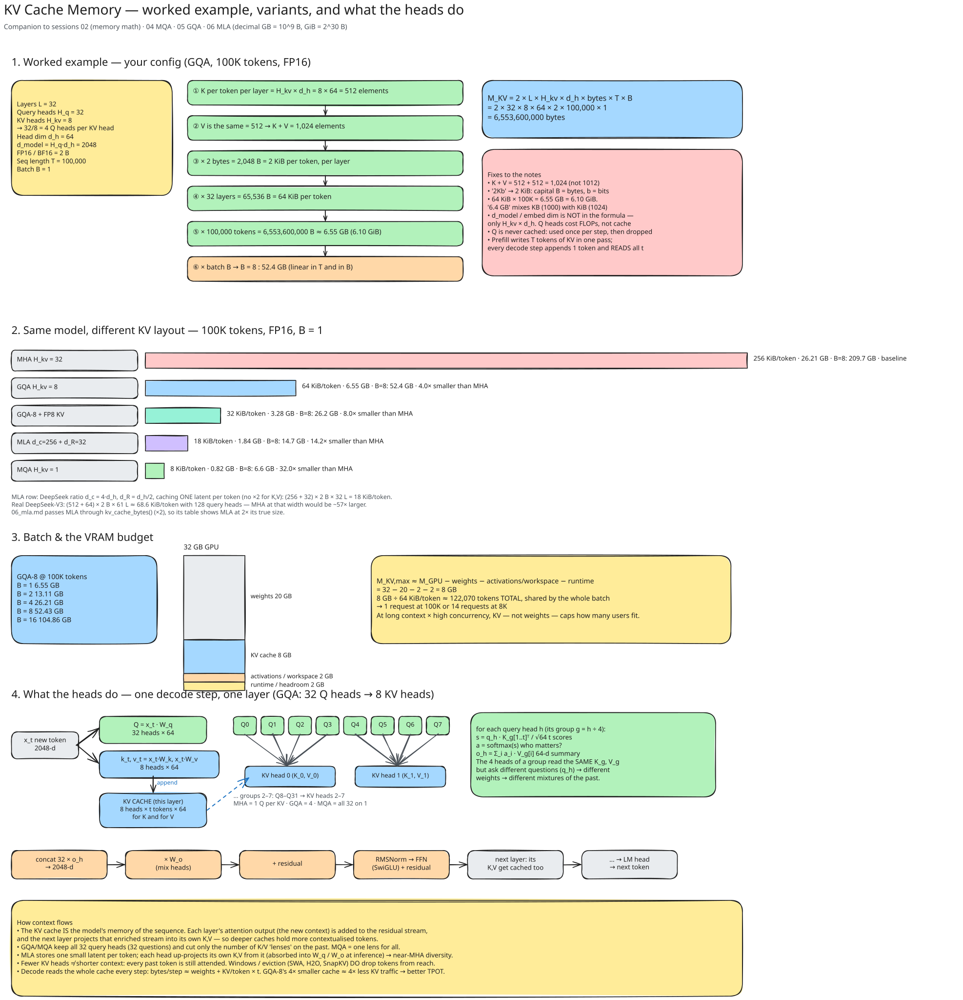
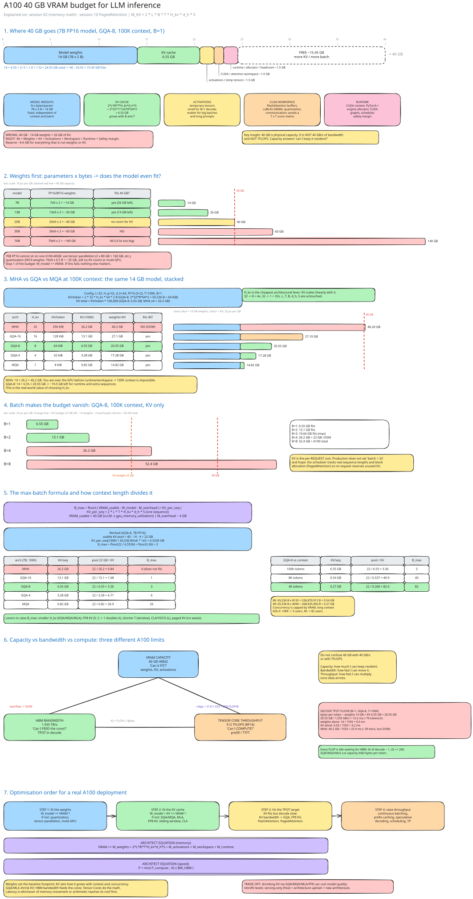
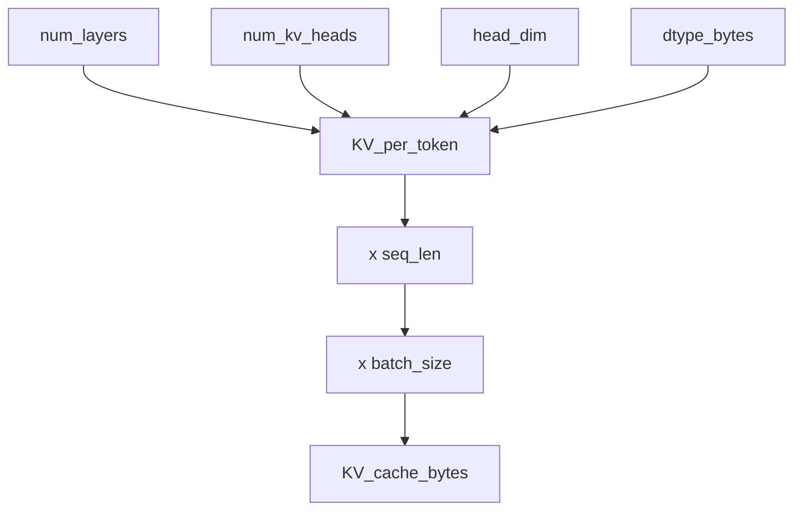

# Session 2 — KV Cache Memory Math

**Recap:** Notebook 1 showed naive decoding recomputes K/V for old tokens
every step. The fix — caching K and V — isn't free: it costs memory. This
notebook derives exactly how much.

## Why only K and V get cached (not Q, not outputs)

At each decode step, only one new Query is needed (for the new token) — it's
immediately consumed and discarded. But that new Query must attend against
**every previous token's Key and Value**. Since old tokens' K/V never change,
they're the only thing worth keeping around.

$$
\text{KV\_per\_token} = 2 \times \text{num\_kv\_heads} \times \text{head\_dim} \times \text{num\_layers} \times \text{dtype\_bytes}
$$

$$
\text{KV\_cache\_bytes} = \text{KV\_per\_token} \times \text{seq\_len} \times \text{batch\_size}
$$

The factor of 2 is for K **and** V.

```python
from kv_cache_variants.memory_calc import kv_cache_bytes, human_bytes
from rich.console import Console
from rich.table import Table

console = Console()

# Llama-2-7B-ish config: 32 layers, 32 heads, head_dim 128, fp16.
configs = {
    "7B-ish": dict(num_layers=32, num_kv_heads=32, head_dim=128),
    "13B-ish": dict(num_layers=40, num_kv_heads=40, head_dim=128),
    "70B-ish": dict(num_layers=80, num_kv_heads=64, head_dim=128),
}

table = Table(title="KV cache size at seq_len=4096, fp16, batch=1 (full MHA, num_kv_heads=num_heads)")
table.add_column("model")
table.add_column("cache bytes", justify="right")
for name, cfg in configs.items():
    total = kv_cache_bytes(seq_len=4096, batch_size=1, dtype_bytes=2, **cfg)
    table.add_row(name, human_bytes(total))
console.print(table)
```

<pre style="white-space:pre;overflow-x:auto;line-height:normal;font-family:Menlo,'DejaVu Sans Mono',consolas,'Courier New',monospace"><span style="font-style: italic">    KV cache size at     </span>
<span style="font-style: italic">   seq_len=4096, fp16,   </span>
<span style="font-style: italic">   batch=1 (full MHA,    </span>
<span style="font-style: italic"> num_kv_heads=num_heads) </span>
┏━━━━━━━━━┳━━━━━━━━━━━━━┓
┃<span style="font-weight: bold"> model   </span>┃<span style="font-weight: bold"> cache bytes </span>┃
┡━━━━━━━━━╇━━━━━━━━━━━━━┩
│ 7B-ish  │     2.00 GB │
│ 13B-ish │     3.12 GB │
│ 70B-ish │    10.00 GB │
└─────────┴─────────────┘
</pre>

```python
table = Table(title="fp16 vs fp32, 7B-ish config, seq_len=4096")
table.add_column("dtype")
table.add_column("bytes/element")
table.add_column("total cache bytes", justify="right")
for dtype_name, dtype_bytes in [("fp16/bf16", 2), ("fp32", 4)]:
    total = kv_cache_bytes(num_layers=32, num_kv_heads=32, head_dim=128,
                            seq_len=4096, dtype_bytes=dtype_bytes)
    table.add_row(dtype_name, str(dtype_bytes), human_bytes(total))
console.print(table)
```

<pre style="white-space:pre;overflow-x:auto;line-height:normal;font-family:Menlo,'DejaVu Sans Mono',consolas,'Courier New',monospace"><span style="font-style: italic">    fp16 vs fp32, 7B-ish config, seq_len=4096    </span>
┏━━━━━━━━━━━┳━━━━━━━━━━━━━━━┳━━━━━━━━━━━━━━━━━━━┓
┃<span style="font-weight: bold"> dtype     </span>┃<span style="font-weight: bold"> bytes/element </span>┃<span style="font-weight: bold"> total cache bytes </span>┃
┡━━━━━━━━━━━╇━━━━━━━━━━━━━━━╇━━━━━━━━━━━━━━━━━━━┩
│ fp16/bf16 │ 2             │           2.00 GB │
│ fp32      │ 4             │           4.00 GB │
└───────────┴───────────────┴───────────────────┘
</pre>

```python
table = Table(title="batch-size scaling, 7B-ish config, seq_len=4096, fp16")
table.add_column("batch_size")
table.add_column("total cache bytes", justify="right")
for batch in [1, 4, 16, 64]:
    total = kv_cache_bytes(num_layers=32, num_kv_heads=32, head_dim=128,
                            seq_len=4096, batch_size=batch, dtype_bytes=2)
    table.add_row(str(batch), human_bytes(total))
console.print(table)
console.print(
    "\n[bold]Takeaway:[/bold] cache bytes scale LINEARLY with seq_len and "
    "batch_size, but multiplicatively with both together -- this is why "
    "serving many long-context requests concurrently is a memory problem, "
    "not just a compute problem."
)
```

<pre style="white-space:pre;overflow-x:auto;line-height:normal;font-family:Menlo,'DejaVu Sans Mono',consolas,'Courier New',monospace"><span style="font-style: italic">batch-size scaling, 7B-ish config,</span>
<span style="font-style: italic">        seq_len=4096, fp16        </span>
┏━━━━━━━━━━━━┳━━━━━━━━━━━━━━━━━━━┓
┃<span style="font-weight: bold"> batch_size </span>┃<span style="font-weight: bold"> total cache bytes </span>┃
┡━━━━━━━━━━━━╇━━━━━━━━━━━━━━━━━━━┩
│ 1          │           2.00 GB │
│ 4          │           8.00 GB │
│ 16         │          32.00 GB │
│ 64         │         128.00 GB │
└────────────┴───────────────────┘
</pre>

<pre style="white-space:pre;overflow-x:auto;line-height:normal;font-family:Menlo,'DejaVu Sans Mono',consolas,'Courier New',monospace">
<span style="font-weight: bold">Takeaway:</span> cache bytes scale LINEARLY with seq_len and batch_size, but multiplicatively with both together -- this 
is why serving many long-context requests concurrently is a memory problem, not just a compute problem.
</pre>

[D04 · The KV cache memory formula](../assets/diagrams/D04_kv_cache_memory_formula.html){ .diagram }

{ .excalidraw }

{ .excalidraw }

## Try it yourself

Reproduce a row of `reference_tables/model_config_memory_worksheet.md` by
hand: pick a config from that file, compute `KV_per_token` on paper, multiply
by `seq_len`, then verify against `kv_cache_bytes(...)` below.

```python
# Try it yourself: change these three numbers and recompute.
num_layers, num_kv_heads, head_dim = 32, 8, 128  # e.g. a GQA-8 config
seq_len = 8192

per_token = 2 * num_kv_heads * head_dim * num_layers * 2  # dtype_bytes=2
total = kv_cache_bytes(num_layers, num_kv_heads, head_dim, seq_len, dtype_bytes=2)
print(f"per-token: {human_bytes(per_token)}, total @ seq_len={seq_len}: {human_bytes(total)}")
assert total == per_token * seq_len

```

    per-token: 128.00 KB, total @ seq_len=8192: 1.00 GB



## Recap

Cache size is a simple product of 5 numbers. The one lever every attention
variant in this course pulls is `num_kv_heads` — MHA uses all of them, MQA
uses 1, GQA uses somewhere in between, MLA replaces heads with a compressed
latent dimension entirely.

**Next:** [Session 03 — MHA Recap](03_mha_recap.md)
