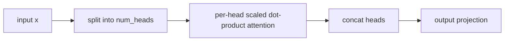
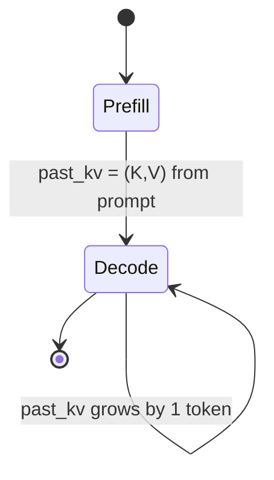

# Session 3 — Multi-Head Attention (MHA) Recap

**Recap:** Notebook 2 gave us the memory formula. Now: the actual mechanics
of MHA's forward pass, prefill vs. incremental decode, and how the cache
grows in practice.


## Why multiple heads

A single attention head computes one weighted average per query. Splitting
`d_model` into `num_heads` independent heads (each of size `head_dim =
d_model / num_heads`) lets the model attend to different *kinds* of
relationships in parallel (e.g. one head tracks syntax, another tracks
coreference) — then the heads' outputs are concatenated and mixed back
together by an output projection.


```python
import torch
from kv_cache_variants.attention.mha import MultiHeadAttention

torch.manual_seed(0)
d_model, num_heads = 32, 4
mha = MultiHeadAttention(d_model, num_heads)
print(f"d_model={d_model}, num_heads={num_heads}, head_dim={d_model // num_heads}")

```

    d_model=32, num_heads=4, head_dim=8


## Prefill vs. incremental decode

- **Prefill:** the full prompt is processed at once; `past_kv=None`; causal
  masking applies across the whole prompt.
- **Incremental decode:** one new token at a time; the *cached* K/V from all
  previous steps is passed in as `past_kv` and concatenated with the new
  token's K/V.


```python
from rich.console import Console
from rich.table import Table

console = Console()
x_prompt = torch.randn(1, 5, d_model)
out, kv = mha(x_prompt)  # prefill: past_kv=None
print("PREFILL")
print("  input shape:", tuple(x_prompt.shape))
print("  output shape:", tuple(out.shape))
print("  cached K shape:", tuple(kv[0].shape), "-- (batch, num_heads, seq_len, head_dim)")
print("  cached V shape:", tuple(kv[1].shape))

table = Table(title="incremental decode: cache grows by 1 token per step")
table.add_column("decode step")
table.add_column("new token seq shape")
table.add_column("cached K seq_len after step", justify="right")

for step in range(1, 6):
    next_x = torch.randn(1, 1, d_model)
    out, kv = mha(next_x, past_kv=kv)
    table.add_row(str(step), str(tuple(next_x.shape)), str(kv[0].shape[2]))
console.print(table)

```

    PREFILL
      input shape: (1, 5, 32)
      output shape: (1, 5, 32)
      cached K shape: (1, 4, 5, 8) -- (batch, num_heads, seq_len, head_dim)
      cached V shape: (1, 4, 5, 8)


<pre style="white-space:pre;overflow-x:auto;line-height:normal;font-family:Menlo,'DejaVu Sans Mono',consolas,'Courier New',monospace"><span style="font-style: italic">        incremental decode: cache grows by 1 token per step        </span>
┏━━━━━━━━━━━━━┳━━━━━━━━━━━━━━━━━━━━━┳━━━━━━━━━━━━━━━━━━━━━━━━━━━━━┓
┃<span style="font-weight: bold"> decode step </span>┃<span style="font-weight: bold"> new token seq shape </span>┃<span style="font-weight: bold"> cached K seq_len after step </span>┃
┡━━━━━━━━━━━━━╇━━━━━━━━━━━━━━━━━━━━━╇━━━━━━━━━━━━━━━━━━━━━━━━━━━━━┩
│ 1           │ (1, 1, 32)          │                           6 │
│ 2           │ (1, 1, 32)          │                           7 │
│ 3           │ (1, 1, 32)          │                           8 │
│ 4           │ (1, 1, 32)          │                           9 │
│ 5           │ (1, 1, 32)          │                          10 │
└─────────────┴─────────────────────┴─────────────────────────────┘
</pre>


## Per-layer cache growth in a small multi-layer model


```python
num_layers = 4
layers = [MultiHeadAttention(d_model, num_heads) for _ in range(num_layers)]
caches = [None] * num_layers

x = torch.randn(1, 3, d_model)  # 3-token prompt
for layer, layer_out_cache in enumerate(caches):
    x, caches[layer] = layers[layer](x)

table = Table(title="per-layer cache after prefill (seq_len=3) + 2 decode steps")
table.add_column("layer")
table.add_column("cached seq_len after prefill", justify="right")
table.add_column("cached seq_len after +2 decode steps", justify="right")

after_prefill = [c[0].shape[2] for c in caches]
for _ in range(2):
    x = torch.randn(1, 1, d_model)
    for layer in range(num_layers):
        x, caches[layer] = layers[layer](x, past_kv=caches[layer])
after_decode = [c[0].shape[2] for c in caches]

for layer in range(num_layers):
    table.add_row(str(layer), str(after_prefill[layer]), str(after_decode[layer]))
console.print(table)

```


<pre style="white-space:pre;overflow-x:auto;line-height:normal;font-family:Menlo,'DejaVu Sans Mono',consolas,'Courier New',monospace"><span style="font-style: italic">          per-layer cache after prefill (seq_len=3) + 2 decode steps           </span>
┏━━━━━━━┳━━━━━━━━━━━━━━━━━━━━━━━━━━━━━━┳━━━━━━━━━━━━━━━━━━━━━━━━━━━━━━━━━━━━━━┓
┃<span style="font-weight: bold"> layer </span>┃<span style="font-weight: bold"> cached seq_len after prefill </span>┃<span style="font-weight: bold"> cached seq_len after +2 decode steps </span>┃
┡━━━━━━━╇━━━━━━━━━━━━━━━━━━━━━━━━━━━━━━╇━━━━━━━━━━━━━━━━━━━━━━━━━━━━━━━━━━━━━━┩
│ 0     │                            3 │                                    5 │
│ 1     │                            3 │                                    5 │
│ 2     │                            3 │                                    5 │
│ 3     │                            3 │                                    5 │
└───────┴──────────────────────────────┴──────────────────────────────────────┘
</pre>








## Recap

MHA caches `num_heads` full K/V heads per layer — the most expensive point
on the memory-vs-quality spectrum. Every following notebook is a variation on
"cache less by sharing or compressing K/V heads."

You are now ready to move to `04_mqa.ipynb`.

