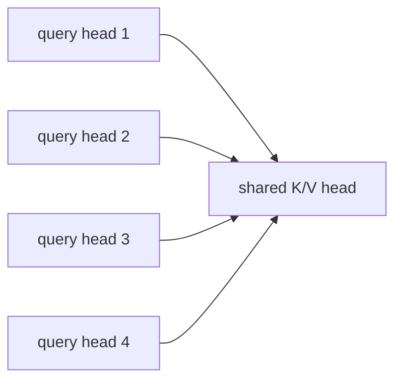

# Session 4 — Multi-Query Attention (MQA)

**Recap:** MHA caches `num_kv_heads = num_heads` full K/V heads. MQA asks:
what if every query head shared a *single* K/V head instead?


## Derivation

All query heads still exist (still `num_heads` of them), but they all attend
against **one** shared Key head and **one** shared Value head. Cache size
drops by a factor of `num_heads` for the K/V portion, independent of how many
query heads there are.


```python
import torch
from kv_cache_variants.attention.mha import MultiHeadAttention
from kv_cache_variants.attention.mqa import MultiQueryAttention
from kv_cache_variants.memory_calc import kv_cache_bytes, human_bytes
from rich.console import Console
from rich.table import Table

console = Console()
torch.manual_seed(0)
d_model, num_heads = 32, 4

mha = MultiHeadAttention(d_model, num_heads)
mqa = MultiQueryAttention(d_model, num_heads)

x = torch.randn(1, 5, d_model)
_, mha_kv = mha(x)
_, mqa_kv = mqa(x)

print("MHA cached K shape:", tuple(mha_kv[0].shape), "-- num_heads distinct K heads")
print("MQA cached K shape:", tuple(mqa_kv[0].shape), "-- always exactly 1 K head")

```

    MHA cached K shape: (1, 4, 5, 8) -- num_heads distinct K heads
    MQA cached K shape: (1, 1, 5, 8) -- always exactly 1 K head


```python
table = Table(title="MHA vs MQA cache bytes across model sizes (seq_len=4096, fp16)")
table.add_column("model")
table.add_column("MHA cache bytes (num_kv_heads=num_heads)", justify="right")
table.add_column("MQA cache bytes (num_kv_heads=1)", justify="right")
table.add_column("reduction factor", justify="right")

configs = {
    "7B-ish (32 layers, 32 heads, hd=128)": dict(num_layers=32, num_heads=32, head_dim=128),
    "13B-ish (40 layers, 40 heads, hd=128)": dict(num_layers=40, num_heads=40, head_dim=128),
    "70B-ish (80 layers, 64 heads, hd=128)": dict(num_layers=80, num_heads=64, head_dim=128),
}
for name, cfg in configs.items():
    mha_bytes = kv_cache_bytes(cfg["num_layers"], cfg["num_heads"], cfg["head_dim"], seq_len=4096)
    mqa_bytes = kv_cache_bytes(cfg["num_layers"], 1, cfg["head_dim"], seq_len=4096)
    table.add_row(name, human_bytes(mha_bytes), human_bytes(mqa_bytes),
                  f"{mha_bytes / mqa_bytes:.0f}x")
console.print(table)

```


<pre style="white-space:pre;overflow-x:auto;line-height:normal;font-family:Menlo,'DejaVu Sans Mono',consolas,'Courier New',monospace"><span style="font-style: italic">                          MHA vs MQA cache bytes across model sizes (seq_len=4096, fp16)                           </span>
┏━━━━━━━━━━━━━━━━━━━━━━━━━━━━━━━┳━━━━━━━━━━━━━━━━━━━━━━━━━━━━━━┳━━━━━━━━━━━━━━━━━━━━━━━━━━━━━━━┳━━━━━━━━━━━━━━━━━━┓
┃<span style="font-weight: bold">                               </span>┃<span style="font-weight: bold">              MHA cache bytes </span>┃<span style="font-weight: bold">               MQA cache bytes </span>┃<span style="font-weight: bold">                  </span>┃
┃<span style="font-weight: bold"> model                         </span>┃<span style="font-weight: bold">     (num_kv_heads=num_heads) </span>┃<span style="font-weight: bold">              (num_kv_heads=1) </span>┃<span style="font-weight: bold"> reduction factor </span>┃
┡━━━━━━━━━━━━━━━━━━━━━━━━━━━━━━━╇━━━━━━━━━━━━━━━━━━━━━━━━━━━━━━╇━━━━━━━━━━━━━━━━━━━━━━━━━━━━━━━╇━━━━━━━━━━━━━━━━━━┩
│ 7B-ish (32 layers, 32 heads,  │                      2.00 GB │                      64.00 MB │              32x │
│ hd=128)                       │                              │                               │                  │
│ 13B-ish (40 layers, 40 heads, │                      3.12 GB │                      80.00 MB │              40x │
│ hd=128)                       │                              │                               │                  │
│ 70B-ish (80 layers, 64 heads, │                     10.00 GB │                     160.00 MB │              64x │
│ hd=128)                       │                              │                               │                  │
└───────────────────────────────┴──────────────────────────────┴───────────────────────────────┴──────────────────┘
</pre>


## The tradeoff

Fewer distinct K/V subspaces means less representational capacity for
attention patterns — MQA models can lose some quality relative to MHA at the
same parameter count, which is exactly why GQA (next notebook) exists as a
middle ground.





## Try it yourself

Change `num_heads` above (e.g. to 8, 16, 32) and rerun the comparison table —
notice the MQA cache size never changes, only MHA's does.


## Recap

MQA is the maximum-compression extreme: 1 shared K/V head no matter how many
query heads. GQA generalizes both MHA and MQA with a tunable group count.

You are now ready to move to `05_gqa.ipynb`.

