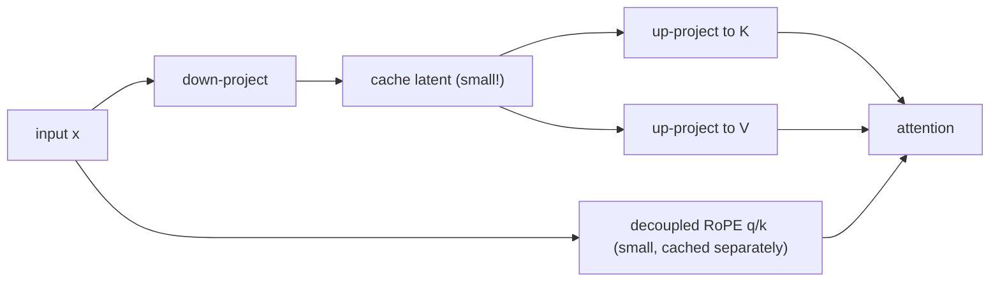

# Session 6 — Multi-Head Latent Attention (MLA)

**Recap:** GQA reduces cache by sharing whole K/V heads across query heads.
MLA (DeepSeek-V2) takes a different approach entirely: compress K/V into a
small low-rank **latent** vector per token, and cache only that.


## Derivation

- Down-project the input into a `latent_dim`-sized vector (much smaller than
  `num_heads * head_dim`).
- Cache only this latent (plus a small decoupled RoPE component — see
  below).
- At attention time, up-project the latent back into full per-head K and V.

Cache size becomes proportional to `latent_dim`, **independent of
`num_heads`** — a fundamentally different scaling than MHA/MQA/GQA.


## Why RoPE needs a separate ("decoupled") path

RoPE rotates Q/K by an angle depending on absolute position, then relies on
that rotation surviving into the dot product. But MLA's K comes from
up-projecting a compressed latent — the down/up projection is a *learned
linear map*, and rotation does not commute with an arbitrary linear map
applied afterward. Rotating post-projection would not produce the same
relative-position property RoPE relies on.

MLA's fix: compute a small, separate ("decoupled") RoPE'd key/query pair
directly from the raw input `x` (not from the compressed latent), of a much
smaller dimension (`rope_head_dim`), and concatenate it onto the
content-based K/Q at attention time. This decoupled piece is cached
alongside the latent, uncompressed but tiny.


```python
import torch
from kv_cache_variants.attention.mla import MultiHeadLatentAttention
from kv_cache_variants.attention.mha import MultiHeadAttention
from kv_cache_variants.attention.gqa import GroupedQueryAttention
from kv_cache_variants.attention.mqa import MultiQueryAttention
from kv_cache_variants.rope import build_rope_cache
from kv_cache_variants.memory_calc import kv_cache_bytes, human_bytes
from rich.console import Console
from rich.table import Table

console = Console()
torch.manual_seed(0)
d_model, num_heads, latent_dim, rope_dim = 32, 4, 8, 8
head_dim = d_model // num_heads

mla = MultiHeadLatentAttention(d_model, num_heads, latent_dim, rope_dim)
cos, sin = build_rope_cache(rope_dim, max_seq_len=16)
x = torch.randn(1, 5, d_model)
out, cache = mla(x, rope=(cos, sin))
print("MLA output shape:", tuple(out.shape))
print("cached latent shape:", tuple(cache[0].shape), "-- (batch, seq_len, latent_dim), independent of num_heads!")

```

    MLA output shape: (1, 5, 32)
    cached latent shape: (1, 5, 8) -- (batch, seq_len, latent_dim), independent of num_heads!


```python
seq_len = 4096
mha_bytes = kv_cache_bytes(num_layers=1, num_kv_heads=num_heads, head_dim=head_dim, seq_len=seq_len)
gqa8_bytes = kv_cache_bytes(num_layers=1, num_kv_heads=2, head_dim=head_dim, seq_len=seq_len)
mqa_bytes = kv_cache_bytes(num_layers=1, num_kv_heads=1, head_dim=head_dim, seq_len=seq_len)
mla_bytes = kv_cache_bytes(num_layers=1, num_kv_heads=1, head_dim=latent_dim + rope_dim, seq_len=seq_len)

table = Table(title=f"cache bytes/layer @ seq_len={seq_len}, matched d_model={d_model}, num_heads={num_heads}")
table.add_column("variant")
table.add_column("cache bytes/layer", justify="right")
for name, total in [("MHA", mha_bytes), ("GQA (groups=2)", gqa8_bytes), ("MQA", mqa_bytes), ("MLA", mla_bytes)]:
    table.add_row(name, human_bytes(total))
console.print(table)

```


<pre style="white-space:pre;overflow-x:auto;line-height:normal;font-family:Menlo,'DejaVu Sans Mono',consolas,'Courier New',monospace"><span style="font-style: italic">  cache bytes/layer @ seq_len=4096,   </span>
<span style="font-style: italic">   matched d_model=32, num_heads=4    </span>
┏━━━━━━━━━━━━━━━━┳━━━━━━━━━━━━━━━━━━━┓
┃<span style="font-weight: bold"> variant        </span>┃<span style="font-weight: bold"> cache bytes/layer </span>┃
┡━━━━━━━━━━━━━━━━╇━━━━━━━━━━━━━━━━━━━┩
│ MHA            │         512.00 KB │
│ GQA (groups=2) │         256.00 KB │
│ MQA            │         128.00 KB │
│ MLA            │         256.00 KB │
└────────────────┴───────────────────┘
</pre>


## Incremental decode equivalence check

Decoding with the cached latent (`past_kv`) must produce cache growth
identical to what a fresh call with the full concatenated sequence would
produce.


```python
next_x = torch.randn(1, 1, d_model)
out2, cache2 = mla(next_x, past_kv=cache, rope=(cos, sin))
print("after 1 decode step, cached latent shape:", tuple(cache2[0].shape))
assert cache2[0].shape[1] == cache[0].shape[1] + 1
print("cache grew by exactly 1 token -- OK")

```

    after 1 decode step, cached latent shape: (1, 6, 8)
    cache grew by exactly 1 token -- OK





## Recap

MLA decouples cache size from `num_heads` entirely — a different axis of
compression than GQA/MQA's head-sharing. This is what lets DeepSeek-V2/V3
serve very long contexts cheaply while keeping many query heads for quality.

You are now ready to move to `07_rope.ipynb`.

