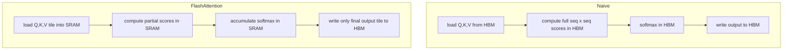
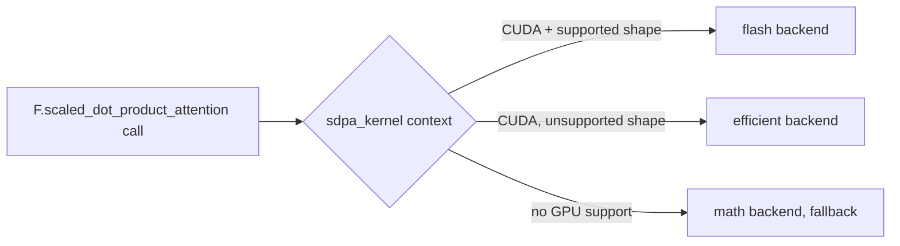

# Session 8 — FlashAttention (concept, via SDPA backend selection)

**Recap:** every notebook so far changed *what* gets cached. FlashAttention
instead speeds up the attention *computation* itself, without changing the
math at all -- same output, less memory traffic.


## IO-awareness: the real bottleneck is memory bandwidth, not FLOPs

Naively computing attention materializes the full `seq_len x seq_len` score
matrix in slow HBM (GPU global memory). FlashAttention tiles the computation
into blocks that fit in fast on-chip SRAM, never writing the full score
matrix to HBM. The FLOP count is roughly unchanged; the memory traffic drops
dramatically, which is what actually limits speed on modern GPUs.

Locally on CPU/MPS we can't run the real fused CUDA kernel, so this notebook
teaches the *concept* via PyTorch's SDPA backend selection
(`torch.nn.attention.sdpa_kernel`), which dispatches to different
implementations of the identical math. The real CUDA FlashAttention-2 kernel
benchmark lives in `colab/session08_flashattention_colab.ipynb` (GPU
required) -- local results here are backend/device dependent, so grade on
methodology, not absolute numbers.


```python
import torch
from kv_cache_variants.sdpa_backends import available_backends, default_device, run_sdpa
from kv_cache_variants.bench import benchmark
from rich.console import Console
from rich.table import Table

console = Console()
device = default_device()
working = available_backends()
print(f"device: {device}, working SDPA backends here: {working}")

```

    device: mps, working SDPA backends here: ['math', 'flash']


```python
batch, heads, seq_len, head_dim = 2, 8, 1024, 64
q = k = v = torch.randn(batch, heads, seq_len, head_dim, device=device)

table = Table(title=f"SDPA backend benchmark, shape=({batch},{heads},{seq_len},{head_dim})")
table.add_column("backend")
table.add_column("mean latency (ms)", justify="right")
table.add_column("throughput (calls/s)", justify="right")
for backend in working:
    result = benchmark(run_sdpa, q, k, v, backend=backend, warmup=3, iters=10)
    table.add_row(backend, f"{result['mean_s'] * 1000:.3f}", f"{result['throughput_per_s']:.1f}")
console.print(table)

```


<pre style="white-space:pre;overflow-x:auto;line-height:normal;font-family:Menlo,'DejaVu Sans Mono',consolas,'Courier New',monospace"><span style="font-style: italic">     SDPA backend benchmark, shape=(2,8,1024,64)      </span>
┏━━━━━━━━━┳━━━━━━━━━━━━━━━━━━━┳━━━━━━━━━━━━━━━━━━━━━━┓
┃<span style="font-weight: bold"> backend </span>┃<span style="font-weight: bold"> mean latency (ms) </span>┃<span style="font-weight: bold"> throughput (calls/s) </span>┃
┡━━━━━━━━━╇━━━━━━━━━━━━━━━━━━━╇━━━━━━━━━━━━━━━━━━━━━━┩
│ math    │             2.059 │                485.6 │
│ flash   │             1.222 │                818.3 │
└─────────┴───────────────────┴──────────────────────┘
</pre>


## Try it yourself

Increase `seq_len` above (e.g. 2048, 4096) and rerun -- on a real CUDA GPU
the gap between `math` and `flash`/`efficient` backends widens as sequence
length grows, because the quadratic-memory `math` path suffers more as the
score matrix grows. On CPU/MPS you may see the backends converge or fall
back to `math` -- see the Colab notebook for real numbers.








## Recap

FlashAttention is a systems optimization, not a math change -- output is
numerically identical to naive attention. Notebook 9 makes that equivalence
explicit for the general SDPA migration.

You are now ready to move to `09_pytorch_sdpa.ipynb`.

