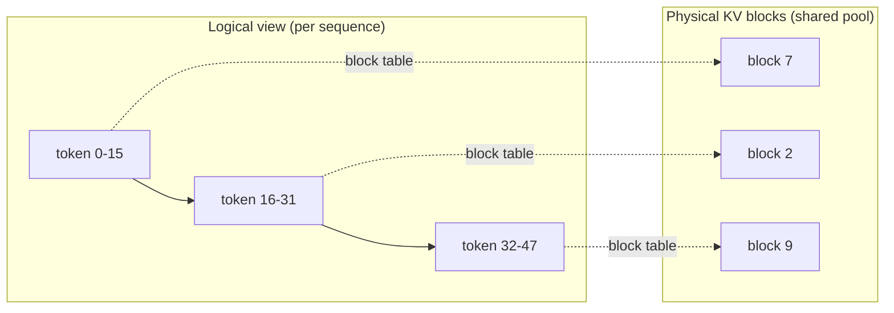

# Session 10 — PagedAttention / vLLM

**Recap:** every notebook so far assumed one contiguous per-sequence cache
buffer. PagedAttention (Kwon et al., 2023, the vLLM paper) changes the
**allocation strategy** for that buffer, not the attention math itself.


## The problem: naive worst-case preallocation

If a serving system doesn't know how long a request's output will be in
advance, the naive approach preallocates a buffer sized for `max_len` per
request. Since actual generated lengths vary a lot, most of that
preallocated memory goes unused -- this is internal fragmentation, and it
limits how many concurrent requests fit in GPU memory.


## The fix: block-table allocation

Split the cache into fixed-size blocks (like OS virtual-memory pages).
Allocate blocks on demand as a sequence grows, tracked via a per-sequence
block table mapping logical positions to physical blocks. Waste per request
is now bounded by at most `block_size - 1` tokens, instead of
`max_len - actual_length`.


```python
import random
from kv_cache_variants.memory_calc import kv_cache_bytes, human_bytes
from rich.console import Console
from rich.table import Table

console = Console()
random.seed(0)
num_layers, num_kv_heads, head_dim, max_len, block_size = 24, 8, 128, 2048, 16

# A batch of concurrent requests with varying ACTUAL generated lengths --
# this variance is exactly what makes naive worst-case preallocation wasteful.
actual_lengths = [random.randint(50, max_len) for _ in range(32)]

naive_total = sum(kv_cache_bytes(num_layers, num_kv_heads, head_dim, max_len) for _ in actual_lengths)
paged_total = sum(
    kv_cache_bytes(num_layers, num_kv_heads, head_dim, seq_len=-(-length // block_size) * block_size)
    for length in actual_lengths
)
actually_used_total = sum(kv_cache_bytes(num_layers, num_kv_heads, head_dim, length) for length in actual_lengths)

table = Table(title=f"{len(actual_lengths)} concurrent requests, max_len={max_len}, block_size={block_size}")
table.add_column("allocation strategy")
table.add_column("total bytes allocated", justify="right")
table.add_column("wasted vs. actually used", justify="right")
table.add_row("naive (preallocate max_len per request)", human_bytes(naive_total),
              human_bytes(naive_total - actually_used_total))
table.add_row("paged (block_size-rounded, per-request)", human_bytes(paged_total),
              human_bytes(paged_total - actually_used_total))
table.add_row("actually used (lower bound)", human_bytes(actually_used_total), "-")
console.print(table)
print(f"memory saved by paging: {(1 - paged_total / naive_total) * 100:.1f}% less allocated than naive")

```


<pre style="white-space:pre;overflow-x:auto;line-height:normal;font-family:Menlo,'DejaVu Sans Mono',consolas,'Courier New',monospace"><span style="font-style: italic">                     32 concurrent requests, max_len=2048, block_size=16                      </span>
┏━━━━━━━━━━━━━━━━━━━━━━━━━━━━━━━━━━━━━━━━━┳━━━━━━━━━━━━━━━━━━━━━━━┳━━━━━━━━━━━━━━━━━━━━━━━━━━┓
┃<span style="font-weight: bold"> allocation strategy                     </span>┃<span style="font-weight: bold"> total bytes allocated </span>┃<span style="font-weight: bold"> wasted vs. actually used </span>┃
┡━━━━━━━━━━━━━━━━━━━━━━━━━━━━━━━━━━━━━━━━━╇━━━━━━━━━━━━━━━━━━━━━━━╇━━━━━━━━━━━━━━━━━━━━━━━━━━┩
│ naive (preallocate max_len per request) │               6.00 GB │                  2.54 GB │
│ paged (block_size-rounded, per-request) │               3.49 GB │                 24.38 MB │
│ actually used (lower bound)             │               3.46 GB │                        - │
└─────────────────────────────────────────┴───────────────────────┴──────────────────────────┘
</pre>


    memory saved by paging: 41.9% less allocated than naive


## Try it yourself: sweep `block_size`


```python
table = Table(title="waste bound shrinks as block_size shrinks (finer-grained allocation)")
table.add_column("block_size")
table.add_column("paged total bytes", justify="right")
table.add_column("waste vs actually used", justify="right")
for bs in [8, 16, 32, 64, 128]:
    paged = sum(
        kv_cache_bytes(num_layers, num_kv_heads, head_dim, seq_len=-(-length // bs) * bs)
        for length in actual_lengths
    )
    table.add_row(str(bs), human_bytes(paged), human_bytes(paged - actually_used_total))
console.print(table)
console.print(
    "\n[bold]Tradeoff:[/bold] smaller block_size -> less waste, but more block-table "
    "bookkeeping overhead per sequence -- real vLLM defaults balance this."
)

```


<pre style="white-space:pre;overflow-x:auto;line-height:normal;font-family:Menlo,'DejaVu Sans Mono',consolas,'Courier New',monospace"><span style="font-style: italic"> waste bound shrinks as block_size shrinks (finer-grained  </span>
<span style="font-style: italic">                        allocation)                        </span>
┏━━━━━━━━━━━━┳━━━━━━━━━━━━━━━━━━━┳━━━━━━━━━━━━━━━━━━━━━━━━┓
┃<span style="font-weight: bold"> block_size </span>┃<span style="font-weight: bold"> paged total bytes </span>┃<span style="font-weight: bold"> waste vs actually used </span>┃
┡━━━━━━━━━━━━╇━━━━━━━━━━━━━━━━━━━╇━━━━━━━━━━━━━━━━━━━━━━━━┩
│ 8          │           3.47 GB │               10.88 MB │
│ 16         │           3.49 GB │               24.38 MB │
│ 32         │           3.51 GB │               46.88 MB │
│ 64         │           3.56 GB │              100.88 MB │
│ 128        │           3.63 GB │              172.88 MB │
└────────────┴───────────────────┴────────────────────────┘
</pre>


<pre style="white-space:pre;overflow-x:auto;line-height:normal;font-family:Menlo,'DejaVu Sans Mono',consolas,'Courier New',monospace">
<span style="font-weight: bold">Tradeoff:</span> smaller block_size -&gt; less waste, but more block-table bookkeeping overhead per sequence -- real vLLM 
defaults balance this.
</pre>


## Beyond this notebook

This is a CPU-only allocation-strategy simulation, not vLLM's actual CUDA
paged-attention kernel. The real vLLM install + throughput benchmark (vs.
naive HuggingFace `generate()`) is in
`colab/session10_vllm_pagedattention_colab.ipynb` (GPU required).





## Recap -- the whole course, tied together

- **Notebook 0-1:** why caching K/V matters at all.
- **Notebook 2:** how to compute cache size.
- **Notebook 3-6:** four ways to shrink `num_kv_heads`/cache layout (MHA
  baseline, MQA, GQA, MLA).
- **Notebook 7:** how position enters via RoPE, and how to extend context.
- **Notebook 8-9:** how the attention computation itself gets fast (SDPA,
  FlashAttention).
- **Notebook 10:** how a serving system allocates cache memory across many
  concurrent requests.

You are now ready for the assignments in `assignments/`, starting with
`assignments/01_naive_decoding/task.md`.

