# The visual story

Follow one request from its prompt to its last token. Each time something
becomes the bottleneck, the story stops and draws it. That makes seventeen plates in six acts,
and each one links to the section of the hand-drawn sheet it was distilled from, where the full
working is.

The [path](path/index.md) tells the same story in prose, math and code. This page is the picture
book: skim the plates to get the shape, then open a sheet when you want the detail.

<ol class="vs-map">
<li><a href="#act-i-one-request">Act I · One request<small>prefill, decode, the ledger</small></a></li>
<li><a href="#act-ii-the-budget">Act II · The budget<small>VRAM, roofline, the four problems</small></a></li>
<li><a href="#act-iii-shrink-what-is-stored">Act III · Shrink what is stored<small>MQA, GQA, MLA, RoPE, beyond</small></a></li>
<li><a href="#act-iv-place-it-without-waste">Act IV · Place it without waste<small>fragmentation, blocks, sharing</small></a></li>
<li><a href="#act-v-run-many-requests">Act V · Run many requests<small>scheduler, kernel, the stack</small></a></li>
<li><a href="#act-vi-the-state-of-the-art">Act VI · The state of the art<small>what models cache today</small></a></li>
</ol>

## Act I · One request

### 1. Two phases, one cache

A request runs in two phases. **Prefill** processes the whole prompt in parallel: large matrix
multiplies, compute-bound, and the phase that sets time to first token. **Decode** then produces one
token per step: small matrix-vector products, memory-bound, and the phase that sets time per output
token. The KV cache connects them. Prefill writes it once, and every decode step reads all of it
and appends one more token.

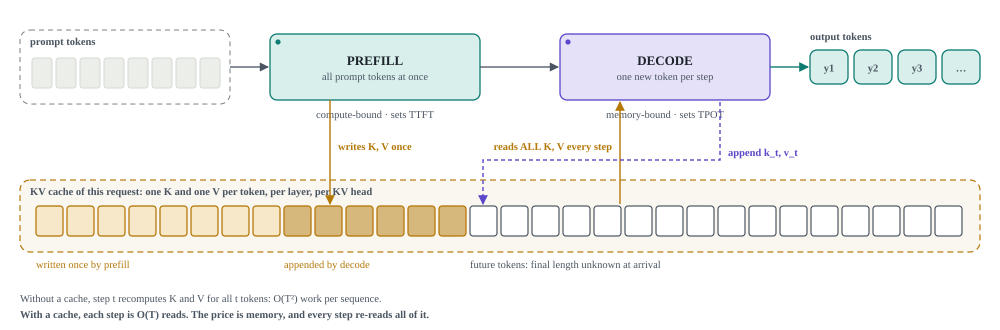{ .plate }

Sheets: <a href="study/explanation.html#sheet-explain@0">explain § 1, the generation pipeline</a> · <a href="study/explanation.html#sheet-explain@1">§ 2, naive decoding vs KV cache</a> · path <a href="path/02-prefill-and-decode.html">step 2</a>

### 2. The ledger

How big is the cache? Multiply it out one factor at a time. A key for one token in one layer is
$H_{kv} \cdot d_h$ numbers. Add the value, convert to bytes, and multiply by the layers, the
tokens and the batch:

$$
M_{KV} = 2 \cdot L \cdot B \cdot T \cdot H_{kv} \cdot d_h \cdot S
$$

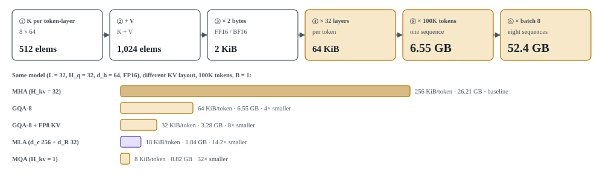{ .plate }

Sheet: <a href="sessions/02_kv_cache_memory_math.html#sheet-memory@0">memory § 1, worked example</a> · <a href="sessions/02_kv_cache_memory_math.html#sheet-memory@1">§ 2, same model, different layout</a> · path <a href="path/04-kv-cache.html">step 4</a>

## Act II · The budget

### 3. Where the 40 GB goes

The weights come first and do not change. The KV cache grows with context and batch. The rest
(activations, workspace, runtime) is small but real. Divide the pool that remains by the cache
one sequence needs, and you have the batch size:

$$
B_{\max} = \left\lfloor \frac{\text{VRAM} - W_{\text{model}} - M_{\text{overhead}}}{2 \cdot L \cdot T \cdot H_{kv} \cdot d_h \cdot S} \right\rfloor
$$

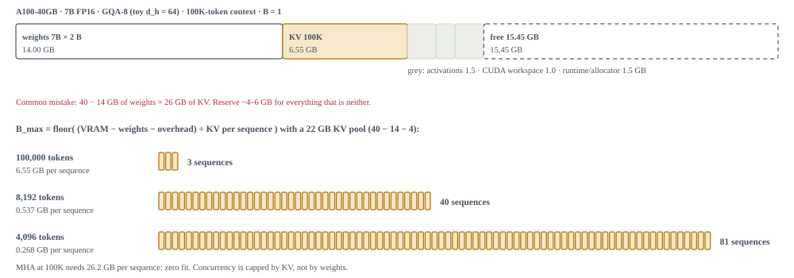{ .plate }

Sheet: <a href="sessions/02_kv_cache_memory_math.html#sheet-vram_budget_a100@0">VRAM budget § 1, where 40 GB goes</a> · <a href="sessions/02_kv_cache_memory_math.html#sheet-vram_budget_a100@4">§ 5, the max-batch formula</a>

### 4. The roofline

Fitting is one question; speed is another. A kernel can run no faster than either its compute
peak or its arithmetic intensity times the memory bandwidth:

$$
P = \min\left(P_{\text{peak}},\; \mathrm{AI} \times BW\right), \qquad \mathrm{AI} = \frac{\text{FLOPs}}{\text{bytes}}
$$

Decode attention has $\mathrm{AI} = H_q / H_{kv}$, which is 1 to 32, against an A100 ridge
of about 200. That is why decode is memory-bound.

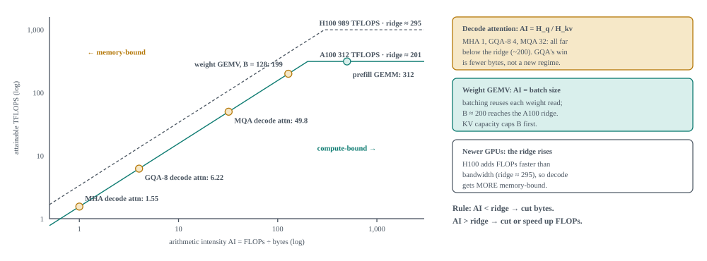{ .plate }

theoretical datasheet peaks. Sheet: <a href="sessions/08_flashattention.html#sheet-roofline@2">roofline § 3, the roofline drawn</a> · <a href="sessions/08_flashattention.html#sheet-roofline@3">§ 4, why decode attention is memory-bound</a> · path <a href="path/03-attention-cost.html">step 3</a>

### 5. Four ways it hurts

Put together, the cache causes four distinct problems. Each has its own fix and its own cost.
The seven terms of the formula show where each fix applies.

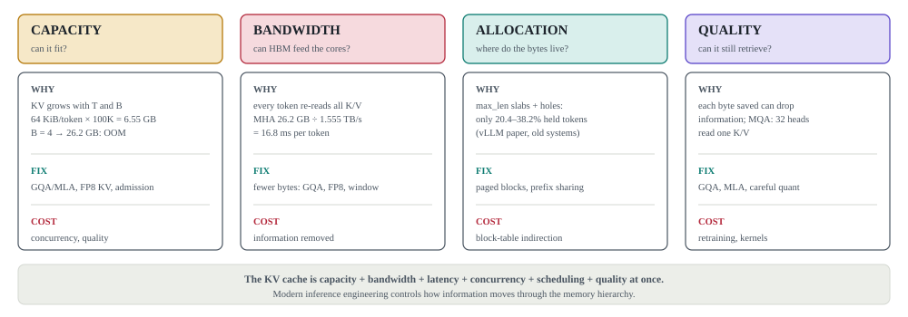{ .plate }

{ .plate }

Sheet: <a href="beyond/inference_problems.html#sheet-inference_problems@0">inference problems § 0, the one equation</a> · <a href="beyond/inference_problems.html#sheet-inference_problems@4">capacity</a> · <a href="beyond/inference_problems.html#sheet-inference_problems@5">bandwidth</a> · <a href="beyond/inference_problems.html#sheet-inference_problems@6">allocation</a> · <a href="beyond/inference_problems.html#sheet-inference_problems@7">quality</a>

## Act III · Shrink what is stored

### 6. Share K/V heads: MQA and GQA

The cheapest architectural lever is $H_{kv}$. Let query heads share K/V heads. GQA keeps groups
and MQA keeps a single shared head.

{ .plate }

Sheets: <a href="sessions/04_mqa.html#sheet-mqa@0">MQA § 1, head wiring</a> · <a href="sessions/04_mqa.html#sheet-mqa@6">§ 7, arithmetic intensity</a> · <a href="sessions/05_gqa.html#sheet-gqa@0">GQA § 1, the spectrum</a> · <a href="sessions/05_gqa.html#sheet-gqa@6">§ 7, retrofit by mean-pooling</a>

### 7. Compress the representation: MLA

MLA caches a 512-wide latent plus a 64-wide RoPE key in place of per-head keys and values,
and at decode it folds the up-projections into the query and output projections.

{ .plate }

Sheet: <a href="sessions/06_mla.html#sheet-mla@1">MLA § 2, what is cached</a> · <a href="sessions/06_mla.html#sheet-mla@3">§ 4, absorption</a> · <a href="sessions/06_mla.html#sheet-mla@4">§ 5, why RoPE breaks absorption</a> · <a href="sessions/06_mla.html#sheet-mla@13">§ 14, TransMLA</a>

### 8. Position inside the cache: RoPE

RoPE rotates each pair of query and key coordinates by an angle proportional to the position.
The score then depends only on the offset between the two tokens. Keys are cached already
rotated, so only the new query has to be rotated at each step:

$$
\langle R_m q,\; R_n k\rangle = \langle q,\; R_{n-m}\, k\rangle, \qquad \theta_i = \text{base}^{-2i/d_h}
$$

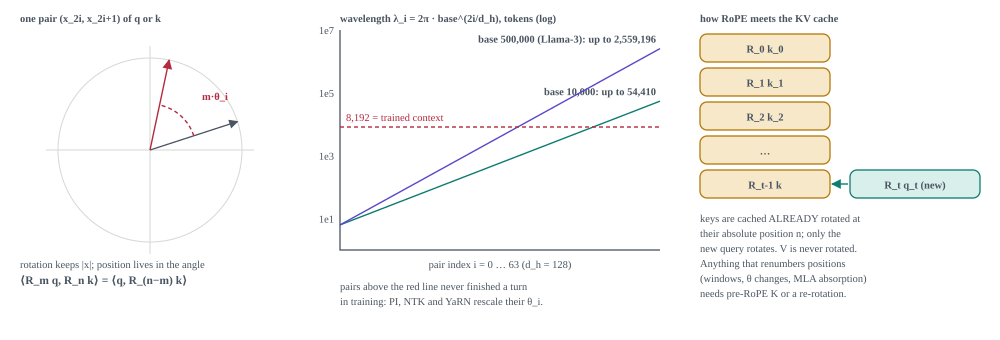{ .plate }

Sheet: <a href="sessions/07_rope.html#sheet-rope@1">RoPE § 2, one pair = one rotation</a> · <a href="sessions/07_rope.html#sheet-rope@5">§ 6, the spectrum</a> · <a href="sessions/07_rope.html#sheet-rope@7">§ 8, RoPE and the KV cache</a> · <a href="sessions/07_rope.html#sheet-rope@8">§ 9, context extension</a>

### 9. Count the cells

The four variants side by side, at one model shape:

{ .plate }

Sheet: <a href="beyond/variants_compared.html#sheet-comparison@5">comparison § 6, one worked example</a> · the full chapter: <a href="beyond/variants_compared.html">Attention variants compared</a>

### 10. Beyond heads

After heads and width come layers (CLA, YOCO) and then the cache itself, replaced by a
recurrent state (SSM and hybrids). Each step attacks a different term.

{ .plate }

Sheet: <a href="beyond/variants_compared.html#sheet-architecture_evolution@0">architecture evolution § 1, timeline</a> · <a href="beyond/variants_compared.html#sheet-architecture_evolution@3">§ 4, decision tree</a>

## Act IV · Place it without waste

### 11. Fragmentation

Even a cache of the right size can be wasted. Reserving `max_len` for every request strands
memory both inside each reservation (internal fragmentation) and between reservations
(external fragmentation).

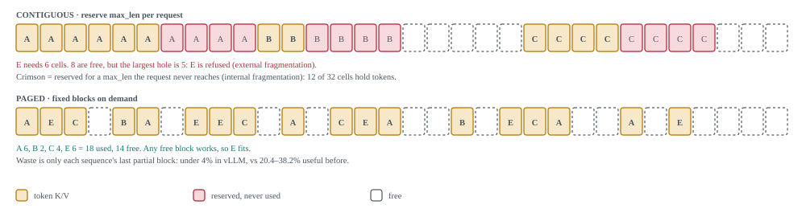{ .plate }

Sheets: <a href="sessions/10_pagedattention_vllm.html#sheet-paged_attention@0">PagedAttention § 1, the problem</a> · <a href="sessions/10_pagedattention_vllm.html#sheet-kv_memory_management@0">KV memory § 1, three problems, three fixes</a> · path <a href="path/06-fragmentation.html">step 6</a>

### 12. The block table

PagedAttention borrows virtual memory. Each sequence sees one contiguous range of logical
blocks, and a per-sequence table maps them to physical blocks anywhere in the pool:

$$
j = \lfloor p / P \rfloor, \quad o = p \bmod P, \quad \text{slot} = \text{table}[j] \cdot P + o
$$

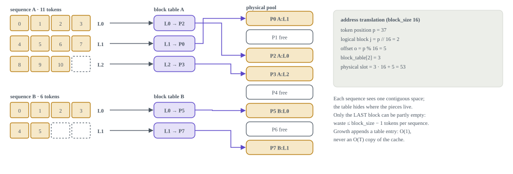{ .plate }

Sheets: <a href="sessions/10_pagedattention_vllm.html#sheet-paged_attention@2">PagedAttention § 3, block table</a> · <a href="sessions/10_pagedattention_vllm.html#sheet-kv_memory_management@2">KV memory § 3, growth without copying</a> · <a href="sessions/10_pagedattention_vllm.html#sheet-kv_memory_management@7">§ 8, block-size trade-off</a> · path <a href="path/07-paged-kv.html">step 7</a>

### 13. Sharing

Once blocks are addressable, identical blocks can be shared. A chained hash identifies a prefix,
reference counts track who still uses a block, and copy-on-write protects the other holders.

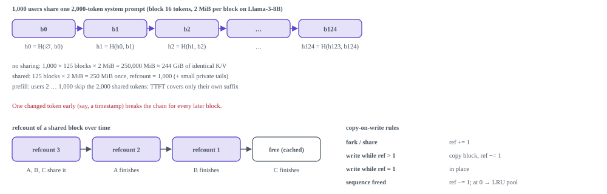{ .plate }

Sheets: <a href="sessions/10_pagedattention_vllm.html#sheet-paged_attention@5">PagedAttention § 6, copy-on-write</a> · <a href="sessions/10_pagedattention_vllm.html#sheet-paged_attention@6">§ 7, prefix caching</a> · <a href="sessions/10_pagedattention_vllm.html#sheet-kv_memory_management@6">KV memory § 7, reference counting</a> · path <a href="path/08-prefix-sharing.html">step 8</a>

## Act V · Run many requests

### 14. The scheduler

Each request's future memory demand is unknown when it arrives. The scheduler admits, grows,
preempts and frees requests one iteration at a time. Continuous batching refills a slot as soon
as its request finishes.

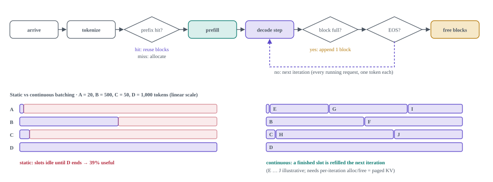{ .plate }

Sheet: <a href="beyond/serving.html#sheet-serving_scheduler@0">scheduler § 1, request lifecycle</a> · <a href="beyond/serving.html#sheet-serving_scheduler@4">§ 5, admission control</a> · <a href="beyond/serving.html#sheet-serving_scheduler@5">§ 6, static vs continuous</a> · <a href="beyond/serving.html#sheet-serving_scheduler@7">§ 8, uncertain demand</a> · path <a href="path/09-scheduling.html">step 9</a>

### 15. The kernel

FlashAttention changes how attention reads the cache. It streams K/V tiles through on-chip
memory with a running max and sum, so the $T \times T$ score matrix never reaches HBM. The
result is exact.

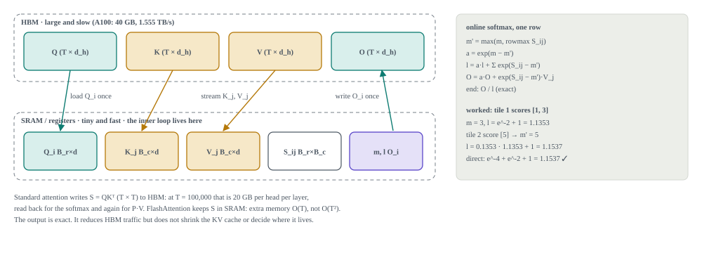{ .plate }

Sheet: <a href="beyond/serving.html#sheet-serving_stack@1">serving stack § 2, the T × T problem</a> · <a href="beyond/serving.html#sheet-serving_stack@2">§ 3, paged + flash pipeline</a> · <a href="beyond/serving.html#sheet-serving_stack@4">§ 5, context parallelism</a> · path <a href="path/10-flashattention.html">step 10</a>

### 16. Who decides what

The model decides how much KV there is. The cache manager decides its lifecycle, the kernel how
fast it is read, and the scheduler which requests run.

{ .plate }

Sheet: <a href="beyond/serving.html#sheet-serving_stack@5">serving stack § 6, separation of concerns</a> · <a href="beyond/serving.html#sheet-serving_stack@7">§ 8, the 10-step framework</a> · <a href="beyond/serving.html#sheet-serving_stack@8">§ 9, the most important picture</a>

## Act VI · The state of the art

### 17. What models cache today

Plug public configs into the formula and the architecture choice dominates. A 671B MLA model
caches less per token than an 8B GQA model.

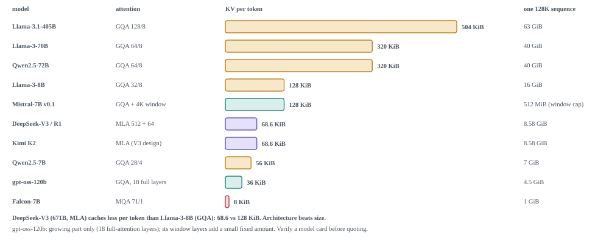{ .plate }

Sheets: <a href="beyond/sota_map.html#sheet-sota@0">SOTA § 1, what frontier models cache</a> · <a href="beyond/sota_map.html#sheet-sota@4">§ 5, symptom → tool</a> · <a href="beyond/sota_map.html#sheet-kv_cache_sota_map@1">SOTA map, cheat sheet</a> · <a href="beyond/sota_map.html#sheet-kv_cache_sota_map@9">stacking on a fixed model</a> · <a href="sota/techniques.html">techniques and implementations</a>

## Check yourself

Three system-design scenarios combine everything above: a 70B chatbot that runs out of memory,
128K-token document QA, and meeting TTFT and TPOT targets under mixed traffic.

Sheet: <a href="study/interview_questions.html#sheet-interview_questions@0">interview question map, scenarios</a> · <a href="study/explanation.html#sheet-explain@6">explain § 7, SOTA inference routes</a> · all eighteen sheets: <a href="gallery.html">diagram gallery</a>

