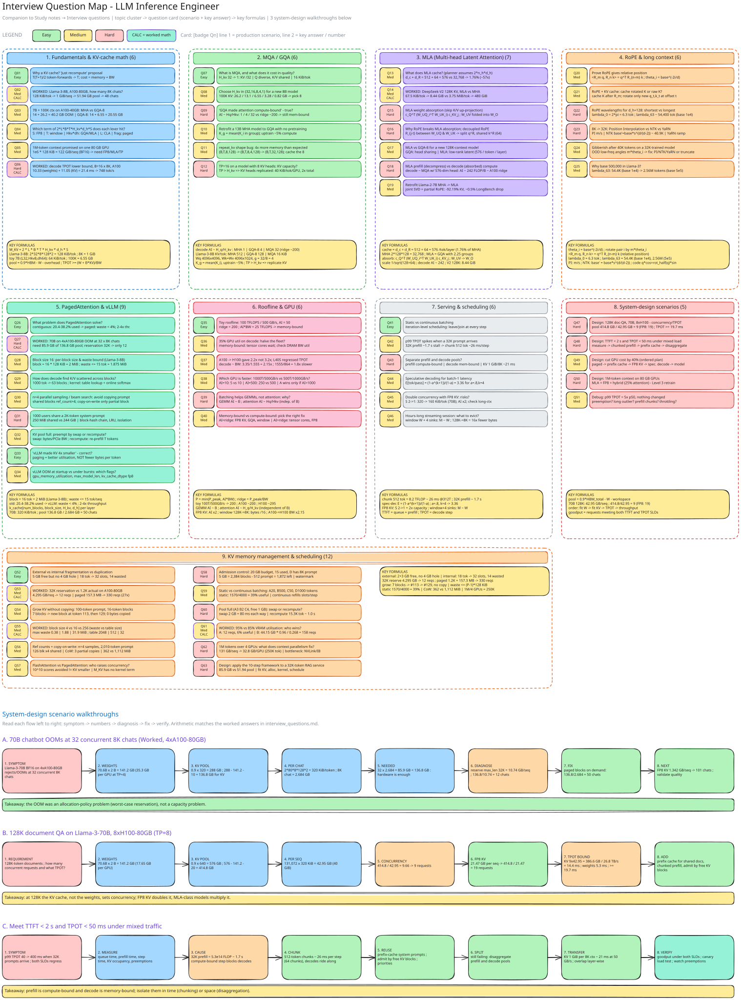

# LLM Inference Interview Questions: KV Cache & Attention Variants

An interview-prep bank for **LLM inference engineers**. Every question starts from a realistic production scenario (OOMs, TPOT regressions, shared system prompts, long-context products) and has a concise model answer with the key formula or number, plus a follow-up an interviewer is likely to ask. Questions tagged `Worked` are **worked calculations** with the full arithmetic shown.

Companion material: the sessions on [MQA](../sessions/04_mqa.md), [GQA](../sessions/05_gqa.md), [MLA](../sessions/06_mla.md), [RoPE](../sessions/07_rope.md) and [PagedAttention](../sessions/10_pagedattention_vllm.md), plus [Serving stack & scheduler](../beyond/serving.md). The map below shows how the questions connect.

{ .excalidraw }

## How to use this bank

- **63 questions** in 9 groups: **7 Easy**, **37 Medium**, **19 Hard**; **7 worked calculations** tagged `Worked`.
- Difficulty tags: `[Easy]` definition/recall in a scenario; `[Medium]` apply a formula or make a design choice; `[Hard]` multi-step reasoning, trade-offs or system design.
- Practise answering aloud in under 90 seconds: state the **formula**, plug in the **numbers**, name the **trade-off**, then volunteer the **follow-up**.
- Units: GB = 10^9 bytes (hardware, weights), GiB/MiB/KiB = powers of two (cache sizes). Assumptions are stated in each calculation.

### Canonical numbers used throughout

| Item | Value |
|---|---|
| KV formula | `M_KV = 2 * L * B * T * H_kv * d_h * S` |
| Toy model | L=32, H_q=32, d_h=64, FP16, T=100K, B=1: MHA 256 KiB/token = 26.2 GB; GQA-8 64 KiB/token = 6.55 GB; GQA-16 13.1 GB; GQA-4 3.28 GB; MQA 8 KiB/token = 0.82 GB |
| Llama-3-8B | L=32, d_model=4096, H_q=32, H_kv=8, d_h=128, BF16: **128 KiB/token** (MHA-equivalent 512 KiB, MQA 16 KiB); 8K context = 1 GiB per sequence |
| Llama-3-70B | L=80, H_kv=8, d_h=128, BF16: **320 KiB/token**; 8K = 2.5 GiB; 128K = 40 GiB |
| DeepSeek-V2 MLA | d_c=512, d_R=64 -> 576 elements/token/layer vs 32,768 for MHA (1.76%, about 57x); L=60 |
| Hardware | A100: 312 TFLOPS BF16, 1.555 TB/s -> ridge ~ 200 FLOP/B. H100 SXM: 989 TFLOPS, 3.35 TB/s -> ridge ~ 295 FLOP/B |
| PagedAttention | block = 16 tokens; Llama-3-8B block (all layers) = 2 MiB; old systems used 20.4-38.2% of KV memory for real tokens, vLLM waste < 4%; 2-4x throughput |
| KV memory management | 33 tokens -> 3 blocks = 48 slots, 15 wasted (31%); 18 tokens -> 32 slots, 14 wasted; 100-token prompt -> 7 blocks, new block at token #113 and #129; 1.2K actual vs 32K reserved -> 75 blocks; 1M tokens / 4 GPUs = 250K each |

## Table of contents

**1. Fundamentals & KV-cache math** (6 questions)

- [Q1](#q1) `[Easy]` Why do we need a KV cache at all?
- [Q2](#q2) `[Medium / Worked]` Worked: how many 8K chats fit on one A100-80GB?
- [Q3](#q3) `[Medium]` 7B model, 100K-token request, A100-40GB: does it fit?
- [Q4](#q4) `[Medium]` Which term of the KV formula does each technique attack?
- [Q5](#q5) `[Medium]` Sales promises 1M-token context. Is it feasible?
- [Q6](#q6) `[Hard / Worked]` Worked: what is the decode TPOT lower bound?

**2. MQA / GQA** (6 questions)

- [Q7](#q7) `[Easy]` What is MQA and what does it cost in quality?
- [Q8](#q8) `[Medium]` Pick the GQA ratio for the next 8B model
- [Q9](#q9) `[Hard]` Is GQA attention now compute-bound?
- [Q10](#q10) `[Medium]` Convert a fine-tuned MHA checkpoint to GQA
- [Q11](#q11) `[Medium]` Shapes in repeat_kv for Llama-3 (debug)
- [Q12](#q12) `[Hard]` TP=16 on Llama-3-70B: why is KV capacity disappointing?

**3. MLA (Multi-head Latent Attention)** (7 questions)

- [Q13](#q13) `[Medium]` What exactly does MLA cache?
- [Q14](#q14) `[Medium / Worked]` Worked: DeepSeek-V2 KV size at 128K context
- [Q15](#q15) `[Hard]` Explain the weight-absorption trick
- [Q16](#q16) `[Hard]` Why does RoPE break absorption? What is decoupled RoPE?
- [Q17](#q17) `[Medium]` MLA or GQA for a greenfield 70B-class model?
- [Q18](#q18) `[Hard]` MLA decode vs prefill: where does the compute go?
- [Q19](#q19) `[Medium]` Can we convert an existing Llama MHA model to MLA?

**4. RoPE & long context** (6 questions)

- [Q20](#q20) `[Medium]` Derive why RoPE encodes relative position
- [Q21](#q21) `[Medium]` RoPE and the KV cache: what exactly is cached?
- [Q22](#q22) `[Hard]` Frequency spectrum of RoPE (d_h = 128)
- [Q23](#q23) `[Hard]` Extend an 8K model to 32K: PI vs NTK vs YaRN
- [Q24](#q24) `[Medium]` Model degrades beyond its trained length
- [Q25](#q25) `[Medium]` Why did Llama-3 raise the RoPE base to 500,000?

**5. PagedAttention & vLLM** (9 questions)

- [Q26](#q26) `[Easy]` What problem does PagedAttention solve?
- [Q27](#q27) `[Hard / Worked]` Worked: 70B chatbot OOMs at 32 concurrent 8K chats
- [Q28](#q28) `[Medium]` Block-size math and the waste bound
- [Q29](#q29) `[Medium]` Block table and the decode kernel
- [Q30](#q30) `[Medium]` Copy-on-write for parallel sampling
- [Q31](#q31) `[Hard]` 1000 users share a 2K-token system prompt
- [Q32](#q32) `[Medium]` Preemption: swap vs recompute
- [Q33](#q33) `[Easy]` 'We enabled vLLM, so KV is now 4x smaller'
- [Q34](#q34) `[Medium]` OOM at startup vs OOM at runtime: which vLLM flags?

**6. Roofline & GPU** (6 questions)

- [Q35](#q35) `[Easy]` Roofline basics: toy GPU numbers
- [Q36](#q36) `[Medium]` GPU utilisation is 35%: is the GPU underused?
- [Q37](#q37) `[Medium]` TPOT after a hardware change (H100 vs L40S)
- [Q38](#q38) `[Medium]` GPU A (1000 TFLOPS, 500 GB/s) vs GPU B (500 TFLOPS, 1000 GB/s)
- [Q39](#q39) `[Hard]` Why does batching help weight GEMMs but not attention?
- [Q40](#q40) `[Medium]` Memory-bound vs compute-bound: which fix applies?

**7. Serving & scheduling** (6 questions)

- [Q41](#q41) `[Easy]` Static vs continuous batching
- [Q42](#q42) `[Medium]` Long prompts spike everyone's TPOT
- [Q43](#q43) `[Hard]` Prefill/decode disaggregation
- [Q44](#q44) `[Medium]` Why does speculative decoding speed up decode?
- [Q45](#q45) `[Medium]` FP8 KV cache: gains and risks
- [Q46](#q46) `[Medium]` Eviction, sliding window and attention sinks

**8. System-design scenarios** (5 questions)

- [Q47](#q47) `[Hard]` Design: 128K document QA with Llama-3-70B on 8xH100
- [Q48](#q48) `[Hard]` Design: meet TTFT and TPOT SLOs under mixed traffic
- [Q49](#q49) `[Medium]` Design: cut the chatbot GPU bill by 40%
- [Q50](#q50) `[Hard]` Design: architecture for a 1M-token context product
- [Q51](#q51) `[Medium]` Debug: p99 TPOT is 5x p50 with no traffic change

**9. KV memory management & scheduling** (12 questions)

- [Q52](#q52) `[Easy]` Three different KV memory problems: which fix for which?
- [Q53](#q53) `[Medium / Worked]` Worked: why does max_len reservation fail? (Llama-3-8B, A100-80GB)
- [Q54](#q54) `[Medium]` How does a sequence grow without copying its KV?
- [Q55](#q55) `[Medium / Worked]` Worked: choosing the block size (4 vs 16 vs 256)
- [Q56](#q56) `[Medium]` Reference counts, copy-on-write and when a block is freed
- [Q57](#q57) `[Medium]` "We turned on FlashAttention, so we can serve 4x more users"
- [Q58](#q58) `[Hard]` Admission control when output length is unknown
- [Q59](#q59) `[Medium]` Static vs continuous batching on uneven output lengths
- [Q60](#q60) `[Hard]` Pool is full and a running sequence needs one more block
- [Q61](#q61) `[Medium / Worked]` Worked: 95% VRAM utilisation vs 85% - which fleet serves more?
- [Q62](#q62) `[Hard]` 1M-token context: does context parallelism solve it?
- [Q63](#q63) `[Hard]` Design: walk the 10-step framework on a long-context RAG service

- [Quick-reference formula sheet](#quick-reference-formula-sheet)
- [Sources](#sources)

---

## 1. Fundamentals & KV-cache math

<a id="q1"></a>
### Q1. [Easy] Why do we need a KV cache at all?

**Scenario.** Your chat API's latency per generated token keeps growing with conversation length. A teammate proposes dropping the cache: "just recompute attention each step, it is simpler."

**Answer.**

- Without a cache, step t re-runs the whole model over all t tokens (re-projecting K and V everywhere). Processing T generated tokens costs T(T+1)/2 token-forwards, i.e. O(T^2).
- With a cache, step t projects only the new token (k_t, v_t), appends it, and attends over t cached entries: T token-forwards in total, plus an O(t) read of the cache per step.
- You trade compute for memory: `M_KV = 2 * L * B * T * H_kv * d_h * S`. The cache is the reason decode is memory-bound instead of compute-bound.

**Follow-up.** What are the two costs the cache introduces? (Capacity: it grows with B and T. Bandwidth: every step re-reads it.)

<a id="q2"></a>
### Q2. [Medium / Worked calculation] Worked: how many 8K chats fit on one A100-80GB?

**Scenario.** Product asks how many concurrent 8K-token chats one A100-80GB can serve for Llama-3-8B in BF16 (L=32, H_kv=8, d_h=128).

**Answer.**

- Per token: `2 * 32 * 8 * 128 * 2 B = 131,072 B = 128 KiB`. Per 8K sequence: `8192 * 128 KiB = 1 GiB = 1.074 GB`.
- Budget: `0.9 * 80 = 72 GB` usable; weights `8.03 B * 2 B = 16.06 GB`; assume 4 GB activations/workspace. KV pool = `72 - 16.06 - 4 = 51.94 GB`.
- Concurrency = `51.94 / 1.074 = 48.4` -> **48 chats** (paged, waste < 4%).
- Sanity check against MHA (32 KV heads): 4x bigger = 4.295 GB/seq -> `51.94 / 4.295 = 12.1` -> only **12 chats**. That is what GQA buys you: 4x concurrency.

**Follow-up.** What if you switch the KV cache to FP8? (S=1 halves it: 0.537 GB/seq -> 51.94 / 0.537 = 96.7 -> 96 chats.)

<a id="q3"></a>
### Q3. [Medium] 7B model, 100K-token request, A100-40GB: does it fit?

**Scenario.** A legal-document summariser sends one 100K-token request to a 7B FP16 model on an A100-40GB (toy config: L=32, H_q=32, d_h=64).

**Answer.**

- Weights: `7 B * 2 B = 14 GB`.
- MHA (H_kv=32): `2 * 32 * 1 * 100,000 * 32 * 64 * 2 = 26.2 GB`. Total `14 + 26.2 = 40.2 GB > 40 GB` -> **OOM** before activations or runtime.
- GQA-8: `26.2 * 8/32 = 6.55 GB` -> total 20.55 GB (fits). GQA-16: 13.1 GB; GQA-4: 3.28 GB; MQA: 0.82 GB.
- Do not budget `40 GB - weights`: reserve ~4-6 GB for activations, CUDA workspace and allocator headroom.

**Follow-up.** Now serve batch 4 on the GQA-8 model. (4 * 6.55 = 26.2 GB + 14 GB = 40.2 GB: OOM again. KV is a concurrency problem, not only a context problem.)

<a id="q4"></a>
### Q4. [Medium] Which term of the KV formula does each technique attack?

**Scenario.** Infra review: the model cannot be retrained this quarter. Your manager asks which memory levers are available and which need a new model.

**Answer.**

- `M_KV = 2 * L * B * T * H_kv * d_h * S`. Map: **S** -> FP8/INT8 KV (2x, serving only); **T** -> sliding window / eviction / sinks; **H_kv, d_h** -> GQA/MQA/MLA (need new or uptrained weights); **L** -> CLA/YOCO (retrain); token-level KV replaced -> SSM/hybrid (retrain).
- Runtime-only levers (no retrain): PagedAttention (fragmentation, 20-38% -> >96% utilisation), prefix caching (redundant prefill), FP8 KV, continuous batching, chunked prefill.
- Three adoption levels: 1) serving optimisation (cheap), 2) architecture compression with uptraining (GQA ~5% of pretraining compute), 3) fundamental architecture change (hybrid, CLA).

**Follow-up.** Which single no-retrain change gives the biggest win for a bursty chat workload? (Paging: it fixes fragmentation, then FP8 KV for another 2x.)

<a id="q5"></a>
### Q5. [Medium] Sales promises 1M-token context. Is it feasible?

**Scenario.** A sales engineer promises 1M-token context on a Llama-3-8B-class model (128 KiB/token with GQA-8) running on one 80 GB GPU.

**Answer.**

- `1,000,000 * 128 KiB = 128,000,000 KiB = 122 GiB` for ONE sequence in BF16 -> does not fit in 80 GB, even before the 16 GB of weights.
- Context table at 64 KiB/token (the toy GQA-8 config): 4K = 256 MiB, 8K = 512 MiB, 16K = 1 GiB, 32K = 2 GiB, 100K = 6.1 GiB, 1M = 61 GiB. Linear in T: GQA divides the slope, it does not remove it.
- Options: FP8 KV (61 GiB), tensor parallel to pool HBM, MLA (about 57x smaller per token), hybrid/SSM layers, sliding window + sinks, CPU/NVMe offload. Each trades quality, latency or complexity.

**Follow-up.** Even if one request fits, how many can you run? (KV scales with B: 1 request at 61 GiB means concurrency ~1 per GPU.)

<a id="q6"></a>
### Q6. [Hard / Worked calculation] Worked: what is the decode TPOT lower bound?

**Scenario.** Llama-3-8B on A100 (1.555 TB/s HBM), batch 16, 8K context each. The SLO says TPOT < 25 ms. Is that feasible?

**Answer.**

- Every step reads all weights once plus every sequence's KV once.
- Weights: `16.06 GB / 1.555 TB/s = 10.33 ms`.
- KV: `16 * 1.074 GB = 17.18 GB` -> `17.18 / 1.555 = 11.05 ms`.
- Bound: `10.33 + 11.05 = 21.4 ms` -> 46.8 tok/s per sequence, `16 / 0.0214 = 748 tok/s` aggregate. The 25 ms SLO needs `21.4 / 25 = 86%` of peak bandwidth: very tight.
- At B=1 the KV part is only 0.69 ms vs 10.33 ms of weights; KV dominates once tokens-in-flight `B*T > 16.06e9 / 131,072 = 122,528`. Here 16 * 8192 = 131,072 > 122,528, so KV already dominates.
- With FP8 KV: `8.59 GB / 1.555 = 5.5 ms` -> total 15.9 ms.

**Follow-up.** Which levers lower this bound? (GQA/FP8/MLA shrink KV bytes; larger batch amortises weights but grows KV bytes.)

---

## 2. MQA / GQA

<a id="q7"></a>
### Q7. [Easy] What is MQA and what does it cost in quality?

**Scenario.** A code-completion service (StarCoder-style) needs the cheapest possible KV cache per request. Someone suggests MQA.

**Answer.**

- MQA sets `H_kv = 1` while keeping `H_q = 32`: all query heads attend against ONE shared K and V head. KV shrinks by `H_q = 32x` (Llama-3-8B shape: 128 KiB -> 16 KiB per token; the MHA-equivalent is 512 KiB).
- Per head: `softmax(Q_i K^T / sqrt(d_h)) V`, with Q_i of shape (T_q, 128) and shared K, V of shape (T, 128). K/V projections shrink from 4096x4096 to 4096x128.
- Q diversity remains (Q_i K^T != Q_j K^T), K/V diversity collapses -> quality drop and sometimes training instability. Used in PaLM, Falcon-7B, StarCoder.

**Follow-up.** Does MQA make decode compute-bound? (No: AI ~ H_q/H_kv = 32 FLOP/B, far below the A100 ridge of ~200.)

<a id="q8"></a>
### Q8. [Medium] Pick the GQA ratio for the next 8B model

**Scenario.** You are specifying the next 8B model (32 query heads) and must choose H_kv from {32, 16, 8, 4, 1}.

**Answer.**

- Toy 100K-token KV: 32 -> 26.2 GB, 16 -> 13.1 GB, 8 -> 6.55 GB, 4 -> 3.28 GB, 1 -> 0.82 GB (sharing 1:1, 2:1, 4:1, 8:1, 32:1).
- H_kv = 8 (4 query heads per group) is the industry default (Llama-2-70B, Llama-3, Mistral, Qwen): 4x smaller than MHA with quality close to MHA.
- Also constrain by tensor parallelism: H_kv should be divisible by (or at least >=) the TP degree, otherwise KV heads are replicated.
- There is no universal optimum: it is quality <-> KV memory <-> bandwidth <-> latency.

**Follow-up.** Why not H_kv = 4? (Memory is only 2x better again, while quality risk and the TP-8 replication problem grow.)

<a id="q9"></a>
### Q9. [Hard] Is GQA attention now compute-bound?

**Scenario.** Profiler: attention kernel at 90% of HBM bandwidth and 5% tensor-core utilisation on a GQA-8 model. Your manager says "GQA made it compute-bound, so buy cheaper GPUs."

**Answer.**

- Decode attention for one layer and one token: FLOPs ~ `4 * H_q * d_h * T`, bytes ~ `2 * H_kv * d_h * T * S`. So **AI ~ H_q/H_kv** (S=2): MHA ~ 1, GQA-8 of 32 ~ 4, MQA ~ 32.
- Ridge points: A100 `312/1.555 ~ 200`, H100 SXM `989/3.35 ~ 295` FLOP/B. All of 1, 4 and 32 are far left of the ridge -> still memory-bound.
- GQA lifts the ceiling: `P = AI * BW = 4 * 1.555 TB/s ~ 6.2 TFLOPS`, vs ~1.6 TFLOPS for MHA. Decode attention time is proportional to KV bytes read.
- Batching does NOT raise attention AI (each sequence has its own KV); only sharing helps (MLA, shared-prefix kernels, speculative multi-token verify).

**Follow-up.** How does that differ from the weight GEMMs in decode? (There AI ~ batch size; batching raises it.)

<a id="q10"></a>
### Q10. [Medium] Convert a fine-tuned MHA checkpoint to GQA

**Scenario.** You own a fine-tuned 13B MHA model; the cache must shrink 4x and there is no budget for pretraining.

**Answer.**

- Group the heads and **mean-pool** K and V within each group: `K_g = (1/n) * sum_{i in g} K_i` (pool the W_k / W_v head slices), likewise V. Mean pooling beats picking one head or random init.
- Then uptrain for ~5% of the original pretraining compute (GQA paper, arXiv 2305.13245) to recover quality. Query heads and W_q are unchanged.
- Result: H_kv drops by 4x -> KV and decode KV-traffic /4, with near-MHA quality. Far cheaper than MHA->MLA, which needs SVD and a RoPE redesign.

**Follow-up.** Why not just drop heads? (Information loss: pooling preserves the average of all heads' content.)

<a id="q11"></a>
### Q11. [Medium] Shapes in repeat_kv for Llama-3 (debug)

**Scenario.** You port Llama-3 attention to your own engine and hit a shape error at the score matmul. Memory is also 4x higher than expected.

**Answer.**

- W_q: 4096x4096 -> q (B, T, 32, 128). W_k = W_v: 4096x1024 -> (B, T, 8, 128). Group size `g = 32/8 = 4`.
- Expand: `(B,T,8,128) -> (B,T,8,1,128) -> expand (B,T,8,4,128) -> reshape (B,T,32,128)`, scores `(B,32,T_q,T_k)`.
- Bug: caching K,V AFTER repeat_kv stores 32 heads (4x waste). Cache the unexpanded (B,T,8,128) tensor and expand per step, or better index `kv_head = q_head // g` inside the kernel (no copy).

**Follow-up.** Why is the expand free in a fused kernel? (Each program loads a KV head once and reuses it for its g query heads.)

<a id="q12"></a>
### Q12. [Hard] TP=16 on Llama-3-70B: why is KV capacity disappointing?

**Scenario.** You serve Llama-3-70B (H_kv=8) with TP=16 over two nodes. Weights per GPU halved, yet the KV pool grew less than expected.

**Answer.**

- A KV head cannot be split below 1 head per GPU, so with `TP > H_kv` each KV head is **replicated** across `16/8 = 2` GPUs.
- KV per token per GPU: TP=8 -> `2*80*1*128*2 = 40 KiB`; TP=16 -> still 40 KiB (replicated), so total KV bytes across the node double (640 KiB/token vs 320 KiB/token).
- Prefer TP=8 per replica plus data parallel replicas (or pipeline parallel across nodes). Cross-node all-reduce latency also hurts TPOT.

**Follow-up.** Which attention variant would avoid this problem? (MLA: latent cache has no head dimension to split, typically replicated/sharded by sequence.)

---

## 3. MLA (Multi-head Latent Attention)

<a id="q13"></a>
### Q13. [Medium] What exactly does MLA cache?

**Scenario.** You evaluate DeepSeek-V2 for on-prem use; your capacity planner still uses `2 * n_h * d_h` elements per token per layer.

**Answer.**

- MLA caches the latent `c^KV` (d_c = 512) plus ONE shared decoupled-RoPE key `k^R` (d_R = 64): **576 elements/token/layer**.
- MHA would cache `2 * n_h * d_h = 2 * 128 * 128 = 32,768` -> `576 / 32,768 = 1.76%` (about 57x smaller). Equivalent to GQA with `576 / (2*128) = 2.25` groups.
- Paper claim: 93.3% KV reduction vs DeepSeek 67B and 5.76x max generation throughput. Cache is independent of n_h.

**Follow-up.** Does smaller cache mean fewer FLOPs? (No: extra up/down projections; the win is bytes moved and capacity.)

<a id="q14"></a>
### Q14. [Medium / Worked calculation] Worked: DeepSeek-V2 KV size at 128K context

**Scenario.** Capacity planning for DeepSeek-V2 (L=60, BF16): per-token and 128K-token KV for MLA vs a hypothetical MHA of the same shape.

**Answer.**

- MLA per token: `576 * 60 layers * 2 B = 69,120 B = 67.5 KiB`.
- MHA per token: `32,768 * 60 * 2 B = 3,932,160 B = 3.75 MiB`.
- 128K context (131,072 tokens): MLA `131,072 * 67.5 KiB = 8.44 GiB`; MHA `131,072 * 3.75 MiB = 480 GiB`.
- Ratio `480 / 8.44 = 56.9x`, matching `32,768 / 576 = 56.9`. So one 128K sequence of MLA fits in a single GPU's spare HBM; MHA could not even fit on 6 80-GB GPUs.

**Follow-up.** Does MLA make FP8 KV unnecessary? (No: they multiply; S=1 gives another 2x -> 4.2 GiB.)

<a id="q15"></a>
### Q15. [Hard] Explain the weight-absorption trick

**Scenario.** Your MLA decode kernel is slow because it up-projects the whole cached latent into 128 heads x 128 dims at every step.

**Answer.**

- Content score for head i: `q^C_i . k^C_{j,i} = (W^UQ_i c^Q)^T (W^UK_i c^KV_j) = c^Q^T (W^UQ_i^T W^UK_i) c^KV_j`.
- Precompute `W^UQ_i^T W^UK_i` (1536x512 per head) once (or, as real kernels do, apply W^UK_i^T to q^C_i at runtime: same math, without the 100.7M-parameter merged matrix) -> attention scores are computed directly against the cached `c^KV` (512-dim): no per-step K up-projection.
- Likewise `W^UV` is folded into `W^O`: `o = sum_j a_j W^UV_i c^KV_j = W^UV_i (sum_j a_j c^KV_j)`, then `W^O W^UV_i`. Attention happens in latent space.

**Follow-up.** What breaks this? (RoPE applied between W^UQ and W^UK: next question.)

<a id="q16"></a>
### Q16. [Hard] Why does RoPE break absorption? What is decoupled RoPE?

**Scenario.** Naively applying RoPE to MLA's up-projected keys prevents the absorption optimisation, and caching full keys defeats the purpose of MLA.

**Answer.**

- RoPE puts a position-dependent rotation between the two matrices: `c^Q^T W^UQ_i^T R_{j-t} W^UK_i c^KV_j`. Because `R_{j-t}` depends on the relative position, `W^UQ^T R W^UK` cannot be precomputed once.
- Fix: a **decoupled** RoPE path. Extra query part `q^R_i` per head (W^QR: 8192x1536 = 128 heads x 64) and ONE key `k^R = RoPE(W^KR h)` (64x5120) shared by all heads and cached.
- Score = `q^C . k^C + q^R . k^R`, scaled by `1/sqrt(d_h + d_R) = 1/sqrt(192)`. The content path stays absorbable, the position path is tiny (64 elements).

**Follow-up.** Where are the extra 64 elements counted? (They are the d_R in the 576 = 512 + 64 cache entry.)

<a id="q17"></a>
### Q17. [Medium] MLA or GQA for a greenfield 70B-class model?

**Scenario.** You are the inference lead consulted on the architecture for a new 128K-context chat model. Training team asks: GQA-8 or MLA?

**Answer.**

- GQA = head sharing: simple, mature kernels (FlashAttention, FlashInfer), cheap retrofit (5% uptraining), well understood at scale.
- MLA = representation compression: 576 elements/token/layer (~GQA with 2.25 groups) with MHA-or-better quality in DeepSeek's ablations. Costs: extra matmuls, decoupled RoPE, specialised kernels (FlashMLA), hard retrofit, TP sharding is awkward.
- Decision rule: if KV capacity/bandwidth is the product bottleneck at long context and you control pretraining -> MLA; if you need ecosystem compatibility or must retrofit -> GQA-8 (+ FP8 KV).

**Follow-up.** Is MLA just 'GQA with 2.25 groups'? (Cache size yes; capacity per cache byte is higher because K/V are low-rank projections of the same latent, and Q keeps all 128 heads.)

<a id="q18"></a>
### Q18. [Hard] MLA decode vs prefill: where does the compute go?

**Scenario.** Prefill throughput on your MLA model is lower than expected, yet decode looks great.

**Answer.**

- **Prefill** (many tokens): up-project latent to full K/V and run standard MHA-style attention; compute-bound, extra up-projections are amortised.
- **Decode** (one token): use the absorbed form. All 128 heads attend over the same 576-dim K = [c^KV; k^R] and 512-dim V = c^KV, like **MQA with a 576-dim head**.
- AI (absorbed, S=2): FLOPs `2*128*(576+512)*T = 278,528*T`, bytes `576*2*T = 1,152*T` -> **AI ~ 242 FLOP/B**, near the A100 ridge (~200). MLA decode moves toward compute-bound, hence specialised kernels (FlashMLA) and tensor-core-friendly tiling.

**Follow-up.** So what limits MLA decode? (Tensor-core efficiency with only 128 query rows per KV; kernel quality.)

<a id="q19"></a>
### Q19. [Medium] Can we convert an existing Llama MHA model to MLA?

**Scenario.** Your company has Llama-2-7B in production and wants MLA-like cache savings without pretraining from scratch.

**Answer.**

- Harder than MHA->GQA. Approximate `K ~ W^UK c`, `V ~ W^UV c` with `c = W^D h`: a low-rank factorisation (joint SVD of K and V projections).
- Handle RoPE with partial-RoPE: keep a small rotary subspace, compress the rest. Then fine-tune/adapt.
- Reported (arXiv 2502.14837): 92.19% KV-cache reduction on Llama-2-7B with ~0.5% LongBench drop. Still invasive vs GQA's mean-pool + 5% uptraining.

**Follow-up.** Which Level of the retrofit ladder is this? (Level 2: architecture compression with adaptation; Level 1 = serving-only, Level 3 = fundamental change.)

---

## 4. RoPE & long context

<a id="q20"></a>
### Q20. [Medium] Derive why RoPE encodes relative position

**Scenario.** Interviewer at a long-context startup: "Show on a whiteboard why RoPE gives relative position and not absolute."

**Answer.**

- Split q, k into pairs (x_{2i}, x_{2i+1}); rotate pair i by `m * theta_i` with the 2x2 matrix `R(m*theta_i)`; `theta_i = base^(-2i/d)`, base = 10,000 (Llama-3: 500,000).
- `<R_m q, R_n k> = q^T R_m^T R_n k = q^T R_{n-m} k` because rotations compose: `R_m^T = R_{-m}`. The score depends only on `n - m`.
- Rotation is orthogonal (norm preserving), applied to Q and K only, not V. In code: `q*cos + rotate_half(q)*sin` with cos, sin of shape (T, d_h) (the (T, d_h/2) angle table duplicated: `cat([freqs, freqs], -1)`) broadcast over (B, H, T, d_h).

**Follow-up.** Why not add sinusoidal absolute embeddings to the input? (Absolute position leaks into V and does not extrapolate; RoPE acts only inside the QK dot product.)

<a id="q21"></a>
### Q21. [Medium] RoPE and the KV cache: what exactly is cached?

**Scenario.** A teammate re-applies RoPE to the entire cached K at each decode step, and the engine runs 3x slower.

**Answer.**

- Cache K **after** rotation at its absolute position m. At step t rotate only the new q_t and k_t with position t (offset = t).
- Because the score depends on `n - m`, the cached rotated keys remain valid forever; the incremental rotation equals the full recompute (verified numerically in the course notebook).
- Caveat: eviction/sliding-window keeps original absolute positions; if you re-index positions, you must re-rotate. MLA caches `k^R` rotated, the content latent un-rotated.

**Follow-up.** What breaks if you cache K before rotation? (You must re-rotate all T keys every step: O(T) extra work per layer per token.)

<a id="q22"></a>
### Q22. [Hard] Frequency spectrum of RoPE (d_h = 128)

**Scenario.** Product asks why 128K context needs long wavelengths, and what the lowest-frequency pair does.

**Answer.**

- d_h = 128 -> 64 pairs, `theta_i = 10000^(-2i/128)`; wavelength `lambda_i = 2*pi / theta_i = 2*pi * 10000^(2i/128)`.
- i = 0: `lambda_0 = 2*pi = 6.3` tokens (fine local position). i = 63: `lambda_63 = 2*pi * 10000^(126/128) = 6.283 * 8,660 ~ 54,400` tokens.
- High-frequency pairs resolve neighbouring tokens; low-frequency pairs encode far-range distance. Positions beyond the trained length put the low-frequency pairs at angles never seen in training.

**Follow-up.** What changes for Llama-3 (base 500,000)? (lambda_63 = 2*pi * 500,000^(126/128) ~ 2.56 M tokens: far slower rotation, so 128K positions stay within unique angles.)

<a id="q23"></a>
### Q23. [Hard] Extend an 8K model to 32K: PI vs NTK vs YaRN

**Scenario.** A customer needs 32K context from an 8K-trained model (scale s = 4) and can afford only a short fine-tune.

**Answer.**

- **Position Interpolation**: `m -> m/s` (linear). Simple, but squeezes high-frequency pairs and hurts local precision.
- **NTK-aware**: scale the base, `base' = base * s^(d/(d-2))`; for d=128, s=4: `4^(128/126) = 4.089`, `base' ~ 40,900`. High frequencies are barely touched, low frequencies stretched.
- **YaRN**: per-frequency ramp (high freq unscaled, low freq interpolated, in between blended) plus an attention-temperature fix (sqrt(1/t) = 0.1 ln s + 1). Needs far fewer tokens to adapt.

**Follow-up.** Is the KV cache size affected? (No: only the cos/sin tables change; KV memory still grows linearly with T.)

<a id="q24"></a>
### Q24. [Medium] Model degrades beyond its trained length

**Scenario.** A customer sends 60K tokens to a 32K-trained model; output turns to gibberish after ~40K. KV memory is fine.

**Answer.**

- Not a memory problem. RoPE angles `m * theta_i` for large m on the low-frequency pairs are out-of-distribution -> attention logits become erratic and perplexity spikes.
- Fixes: truncate or summarise; use a model trained for the length; apply PI/NTK/YaRN with a short fine-tune; for streaming use window + attention sinks (quality only on recent text).
- Diagnose: perplexity-vs-position curve flat up to the trained length, then rising.

**Follow-up.** How does 'lost in the middle' differ? (Within the trained range, retrieval accuracy dips mid-context: a training-data/attention issue, not OOD positions.)

<a id="q25"></a>
### Q25. [Medium] Why did Llama-3 raise the RoPE base to 500,000?

**Scenario.** You compare Llama-2 (base 10,000, 4K) with Llama-3 (base 500,000, 8K -> 128K variants) in a design review.

**Answer.**

- A larger base makes `theta_i = base^(-2i/d)` smaller for high i, so the longest wavelength grows from ~54,400 tokens to `2*pi * 500,000^(126/128) ~ 2.56 M` tokens.
- Every position up to 128K maps to a unique angle on the slowest pair; high-frequency pairs (local precision) change little.
- It is the same idea as NTK-aware scaling, but baked in at pretraining instead of patched afterwards.

**Follow-up.** What is the downside? (Lower resolution at long distances; fine positions need the high-frequency pairs to stay precise.)

---

## 5. PagedAttention & vLLM

<a id="q26"></a>
### Q26. [Easy] What problem does PagedAttention solve?

**Scenario.** Your GPU shows free memory yet the server rejects requests; KV utilisation measured at only ~30% real token states.

**Answer.**

- Contiguous per-request allocation reserves `max_len` up front. Result: internal fragmentation (reserved but unused), reservation waste, and external fragmentation (free memory split into unusable holes).
- Measured in the vLLM paper (2309.06180): old systems used only **20.4-38.2%** of KV memory for real token states. PagedAttention waste is **< 4%** (only the last partial block), giving **2-4x** throughput vs FasterTransformer/Orca.
- Analogy: page <-> block, page table <-> block table, process <-> sequence.

**Follow-up.** Does paging change the attention math? (No: only where K/V live; kernels gather through the block table.)

<a id="q27"></a>
### Q27. [Hard / Worked calculation] Worked: 70B chatbot OOMs at 32 concurrent 8K chats

**Scenario.** Your Llama-3-70B chatbot (BF16, L=80, H_kv=8, d_h=128) on 4x A100-80GB OOMs / rejects requests at 32 concurrent 8K chats. Is the hardware too small?

**Answer.**

- Per token: `2 * 80 * 8 * 128 * 2 B = 327,680 B = 320 KiB`; 8K chat = `8192 * 327,680 = 2.684 GB` (2.5 GiB).
- Memory: `4 * 80 = 320 GB`; at 0.9 utilisation 288 GB; weights `70.6 B * 2 = 141.2 GB`; assume 10 GB workspace -> KV pool = `288 - 141.2 - 10 = 136.8 GB`.
- The math needs only `32 * 2.684 = 85.9 GB` -> **the hardware is big enough**. Paged capacity: `136.8 / 2.684 = 50.96` -> 50 chats.
- Diagnosis: a contiguous allocator reserving `max_model_len = 32,768` per request uses `32,768 * 327,680 = 10.74 GB` each -> `136.8 / 10.74 = 12.7` -> only 12 chats (32 would need 343.6 GB).
- Fix: PagedAttention (allocate blocks on demand), lower `--max-model-len`; then FP8 KV: 1.342 GB/seq -> `136.8 / 1.342 = 101` chats.

**Follow-up.** What would change at 128K prompts? (42.95 GB/seq -> about 3 sequences, so use FP8, MLA-class models or offload.)

<a id="q28"></a>
### Q28. [Medium] Block-size math and the waste bound

**Scenario.** You tune vLLM's `--block-size` (default 16) for Llama-3-8B and need the per-block size and worst-case waste.

**Answer.**

- Block (all layers) = `16 tokens * 128 KiB = 2 MiB`. Per-layer slice: `k_cache[num_blocks, block_size, H_kv, d_h]` = (N, 16, 8, 128).
- Waste per sequence <= `block_size - 1 = 15` tokens = `15 * 128 KiB = 1.875 MiB`, so 100 sequences waste at most `187.5 MiB`.
- Smaller blocks: less waste, bigger block tables, less efficient gathers (poorer coalescing); larger blocks: the reverse. 16 is the balance.

**Follow-up.** Which blocks are never partially full? (All but the last block of each sequence; copy-on-write only needs to copy a partial block.)

<a id="q29"></a>
### Q29. [Medium] Block table and the decode kernel

**Scenario.** Explain to a new hire how a decode step finds the K/V of a 1,000-token sequence that is scattered across the pool.

**Answer.**

- Each sequence has a block table: logical block j -> physical block id. 1,000 tokens = `ceil(1000/16) = 63` blocks (last holds 8 tokens).
- The paged-attention kernel loops over logical blocks, loads the physical block id from the table, gathers K/V from `k_cache[phys, :, h, :]`, and updates an online softmax (as in FlashAttention).
- New token: write k_t, v_t into the last block's next free slot; if the block is full, grab a free block from the allocator and append to the table. No copying of old data.

**Follow-up.** What is the cost of the indirection? (An extra table lookup per block and less contiguous reads; typically a few percent vs ideal.)

<a id="q30"></a>
### Q30. [Medium] Copy-on-write for parallel sampling

**Scenario.** An API offers `n = 4` completions per prompt (parallel sampling) and beam search. Your 2,000-token prompt is duplicated 4 times in memory.

**Answer.**

- Share prompt blocks: the 4 samples' block tables point to the SAME physical blocks, each with `ref_count = 4`.
- When a sample writes to a shared block (only the partially filled last prompt block), the allocator copies it first (copy-on-write) and decrements the original ref count; full blocks stay shared.
- Saving for 4 samples of a 2K prompt in Llama-3-8B: unshared `4 * 250 MiB = 1,000 MiB` vs shared `~250 MiB` (plus at most one 2 MiB block copied per sample if the prompt ends mid-block; 2,000 tokens = 125 full blocks).

**Follow-up.** Where else is ref counting used? (Prefix caching and beam search forks.)

<a id="q31"></a>
### Q31. [Hard] 1000 users share a 2K-token system prompt

**Scenario.** A support bot gives 1,000 concurrent users the same 2,000-token system prompt. Prefill cost and KV memory are both exploding.

**Answer.**

- Enable prefix caching (`--enable-prefix-caching`): hash each full block's tokens chained with the previous block's hash; matching blocks are reused (ref counted) instead of recomputed.
- Memory (Llama-3-8B, 128 KiB/tok): shared `2000 * 128 KiB = 250 MiB` once (125 blocks) vs `1000 * 250 MiB = 244 GiB` without sharing.
- Compute: prefill of 2,000 tokens x 1,000 users removed after the first request -> big TTFT win. Requires the prefix to be an identical token prefix (block-aligned for reuse).
- Issues: eviction policy (LRU), cache identity/hash collisions, and **tenant isolation** (timing side channels; use a per-tenant cache salt).

**Follow-up.** What if every user's system prompt differs by a timestamp at the start? (The hash chain breaks at block 0; move volatile text to the end.)

<a id="q32"></a>
### Q32. [Medium] Preemption: swap vs recompute

**Scenario.** At peak load the KV pool is full and a new high-priority request arrives. Running sequences must give up blocks.

**Answer.**

- Preempt a sequence (all-or-nothing per sequence group): either **swap** its blocks to CPU memory over PCIe, or **drop and recompute** its KV later by re-running prefill over prompt + generated tokens.
- Swap cost ~ bytes / PCIe BW (e.g. 1 GiB over ~25 GB/s ~ 43 ms); recompute cost ~ prefill FLOPs for T tokens. Recompute wins for short contexts; swap for long ones; recent vLLM defaults to recompute.
- Too many preemptions mean thrashing: tail latency explodes. Lower `max_num_seqs`/`max_model_len` or add capacity.

**Follow-up.** How do you detect a preemption storm? (vLLM preemption counters/metrics and a p99 TPOT spike without changed load.)

<a id="q33"></a>
### Q33. [Easy] 'We enabled vLLM, so KV is now 4x smaller'

**Scenario.** A colleague reports that after migrating to vLLM the mathematical KV size dropped 4x. You suspect a misunderstanding.

**Answer.**

- Paging does **not** reduce `2*L*B*T*H_kv*d_h*S`: the same bytes per token are stored.
- What improved: utilisation (20-38% -> >96% of reserved memory holds real tokens), fewer OOMs, bigger effective batch, sharing (COW, prefix cache).
- To reduce actual bytes you need GQA/MLA (H_kv, d_h), FP8 KV (S), window/eviction (T).

**Follow-up.** How would you measure the real benefit? (Max concurrent sequences at fixed latency before vs after.)

<a id="q34"></a>
### Q34. [Medium] OOM at startup vs OOM at runtime: which vLLM flags?

**Scenario.** Case 1: vLLM fails to start with 'no available memory for the cache blocks'. Case 2: after hours in production it OOMs on a burst.

**Answer.**

- `--gpu-memory-utilization` (default 0.9) caps weights + activations + KV pool. Startup profiling measures peak activation memory; the rest becomes the KV block pool.
- Case 1: weights + profiled activations leave no room: lower `--max-model-len`/`--max-num-batched-tokens`, quantise weights, raise TP, or raise utilisation slightly.
- Case 2: non-KV memory outside vLLM's accounting (CUDA graphs, NCCL buffers, other processes) -> lower utilisation to 0.85-0.9 and cap `--max-num-seqs`. Related knobs: `--block-size`, `--kv-cache-dtype fp8`, `--enable-prefix-caching`, `--enable-chunked-prefill`.

**Follow-up.** Which flag gives 2x KV capacity without retraining? (`--kv-cache-dtype fp8`, with a quality check.)

---

## 6. Roofline & GPU

<a id="q35"></a>
### Q35. [Easy] Roofline basics: toy GPU numbers

**Scenario.** A GPU datasheet lists 100 TFLOPS and 500 GB/s. Is a kernel with AI = 50 FLOP/B fast?

**Answer.**

- `P = min(P_compute, AI * BW)`. Ridge `AI* = 100e12 / 500e9 = 200 FLOP/B`.
- AI = 50 -> `50 * 500 GB/s = 25 TFLOPS` < 100 TFLOPS -> **memory-bound** at 25% of peak. AI 10 -> 5 TFLOPS; AI 100 -> 50; AI 200 -> 100 (balanced); AI 500/1000 -> capped at 100.
- Real ridges: A100 `312 TFLOPS / 1.555 TB/s ~ 200`; H100 SXM `989 / 3.35 ~ 295` FLOP/B.

**Follow-up.** What does doubling bandwidth to 1000 GB/s give at AI = 10? (10 TFLOPS: still memory-bound; shrinking bytes by 4x gives AI = 40 -> 20 TFLOPS.)

<a id="q36"></a>
### Q36. [Medium] GPU utilisation is 35%: is the GPU underused?

**Scenario.** Grafana shows 35% GPU utilisation on a decode-heavy service. Finance wants to halve the GPU count.

**Answer.**

- `nvidia-smi` utilisation only says some kernel was running; it does not say tensor cores are busy. Decode is memory-bound: tensor cores wait for HBM.
- Check memory-bandwidth utilisation (e.g. DCGM `DRAM_ACTIVE`) and achieved vs peak bandwidth. If HBM BW is ~85-90% busy, the GPU is effectively saturated.
- Actions: raise batch (amortise weights), shrink bytes (GQA/FP8 KV), fuse kernels; do not cut GPUs until bandwidth utilisation is low.

**Follow-up.** What would low bandwidth AND low compute utilisation indicate? (Launch overhead, CPU scheduling, small batch: use CUDA graphs, async scheduling.)

<a id="q37"></a>
### Q37. [Medium] TPOT after a hardware change (H100 vs L40S)

**Scenario.** Case A: you move a decode service from A100 to H100 SXM and hoped for 3.2x (compute ratio); you got ~2.2x. Case B: to save money you moved to L40S and TPOT regressed.

**Answer.**

- Decode is bandwidth-bound: speedup ~ BW ratio. A100 -> H100: `989/312 = 3.17x` compute but `3.35/1.555 = 2.15x` bandwidth -> expect ~2.2x. Matches Case A.
- L40S: ~864 GB/s vs 1.555 TB/s: `1555/864 = 1.8x` slower for memory-bound decode even though its FP16 tensor throughput is similar -> TPOT rises ~1.8x. Case B.
- Rule: pick GPUs for HBM bandwidth (and capacity) for decode, tensor FLOPs for prefill/throughput.

**Follow-up.** When would the H100 deliver the full compute gain? (Compute-bound prefill, large-batch GEMMs, FP8 tensor cores.)

<a id="q38"></a>
### Q38. [Medium] GPU A (1000 TFLOPS, 500 GB/s) vs GPU B (500 TFLOPS, 1000 GB/s)

**Scenario.** Procurement asks: which of two accelerators is faster for our LLM workloads?

**Answer.**

- Cannot be answered without AI. Compute `P = min(P_c, AI * BW)`.
- AI = 10: A = 10 * 0.5 = 5 TFLOPS; B = 10 * 1.0 = 10 TFLOPS -> **B is 2x faster** (decode-like).
- AI = 500: A = min(1000, 500 * 0.5 = 250) = 250; B = min(500, 500 * 1.0 = 500) = 500 -> **B still faster, 2x**; A only wins once AI > 1000 (A = 0.5*AI > 500; A's ridge is 2000, B's is 500).
- Method: compute ridge = X/Y, estimate workload AI, compare, optimise the right bottleneck.

**Follow-up.** Which GPU for a prefill-only batch workload with AI ~ 3000? (A: 1000 vs B: 500 TFLOPS.)

<a id="q39"></a>
### Q39. [Hard] Why does batching help weight GEMMs but not attention?

**Scenario.** Throughput scales almost linearly with batch up to 128 but your long-context attention does not improve. Explain with AI.

**Answer.**

- Weight GEMM in decode: batch B, weight N params in BF16: FLOPs `2*B*N`, bytes `~2*N` (weights dominate) -> **AI ~ B**. A100 ridge ~ 200 -> need B ~ 200 to become compute-bound.
- Attention: each sequence reads its own KV; FLOPs and bytes both scale with B -> **AI independent of B** (~ H_q/H_kv).
- So larger batches amortise weight reads (better throughput) but make KV bytes grow with B. Past `B*T > weights/KV-per-token` KV dominates, and TPOT grows linearly with B.

**Follow-up.** How can attention AI be raised? (Cut bytes: GQA/MQA/MLA/FP8; reuse KV across queries: shared-prefix kernels, speculative verify.)

<a id="q40"></a>
### Q40. [Medium] Memory-bound vs compute-bound: which fix applies?

**Scenario.** Two services: (A) decode, 1 GB of KV per step for 10 GFLOPs; (B) prefill of long prompts at AI = 1000 on a 100 TFLOPS / 500 GB/s GPU.

**Answer.**

- (A) AI = 10 GFLOPs / 1 GB = 10 -> memory-bound. Fix bytes: FP8 KV halves traffic -> AI 20 (ceiling 5 -> 10 TFLOPS); sliding window 128K -> 8K cuts KV bytes 16x; GQA, kernel fusion, higher-BW GPU.
- (B) AI = 1000 > ridge 200 -> compute-bound at 100 TFLOPS; reducing bytes does nothing. Fix FLOPs/throughput: tensor cores, lower precision (FP8), better kernels (FlashAttention), sparsity, more GPUs.
- Rule: `AI < ridge` -> attack memory; `AI > ridge` -> attack compute.

**Follow-up.** Is maximising AI always right? (No: enough AI to reach the roof; AI 2000 vs 200 gives the same 100 TFLOPS.)

---

## 7. Serving & scheduling

<a id="q41"></a>
### Q41. [Easy] Static vs continuous batching

**Scenario.** Your batch server waits for the slowest request in each static batch of 16; GPU idles and p99 latency is bad.

**Answer.**

- Static batching: all sequences start and finish together, so short ones wait for long ones and slots go idle.
- Continuous (iteration-level) batching (Orca/vLLM): at every decode step finished sequences leave and waiting ones join. Requires per-sequence KV management -> PagedAttention.
- Typical result: several-times higher throughput at similar latency; the scheduler admits requests by available KV blocks.

**Follow-up.** What new failure mode does it add? (Prefill of a new request stalls ongoing decodes: chunked prefill.)

<a id="q42"></a>
### Q42. [Medium] Long prompts spike everyone's TPOT

**Scenario.** p99 TPOT jumps from 40 ms to 400+ ms whenever someone submits a 32K-token prompt.

**Answer.**

- Cause: the 32K-token prefill is one compute-bound step (Llama-3-8B: `2 * 8.03e9 * 32,768 = 5.3e14 FLOP` ~ 1.7 s at 312 TFLOPS peak; linear layers only, causal attention adds ~2.8e14 more, so ~2.5 s) that blocks all decodes.
- **Chunked prefill**: split into chunks (e.g. 512 tokens: `2*8.03e9*512 = 8.2 TFLOP ~ 26 ms` at peak -> 64 chunks) and piggy-back decode tokens in the same step under a token budget (`--max-num-batched-tokens`).
- Trade-off: TTFT of the long prompt rises slightly; TPOT of everyone else stays flat.

**Follow-up.** Chunk size too small? (More steps and weight re-reads; lower prefill efficiency.)

<a id="q43"></a>
### Q43. [Hard] Prefill/decode disaggregation

**Scenario.** A platform serves both interactive chat (tight TPOT) and long-document ingestion (heavy prefill) on one pool; tuning one hurts the other.

**Answer.**

- Prefill is compute-bound, decode is memory-bound; colocating forces one set of parallelism/batch settings on both. Disaggregation runs prefill on one pool (compute-optimised, big TP) and decode on another (bandwidth/capacity-optimised, large batches), transferring KV between them.
- Cost: KV transfer. 8K-token Llama-3-8B context = 1 GiB; over 50 GB/s RDMA ~ 21 ms; overlap with layer-wise streaming. Benefit: independent TTFT and TPOT SLOs and higher goodput.
- Not free: two pools to size, KV-transfer network, and under-utilisation if the ratio is wrong.

**Follow-up.** When is it not worth it? (Short prompts, small cluster, or a fast interconnect missing.)

<a id="q44"></a>
### Q44. [Medium] Why does speculative decoding speed up decode?

**Scenario.** Single-stream chat latency (batch 1) is too high; GPU is memory-bound; you consider a draft model.

**Answer.**

- Decode at batch 1 reads all weights for one token. Speculative decoding: a cheap draft proposes k tokens; the target verifies all k+1 positions in ONE forward pass (weights read once, AI ~ k+1).
- Expected tokens per target pass with acceptance rate alpha: `(1 - alpha^(k+1)) / (1 - alpha)`. alpha = 0.8, k = 4: `(1 - 0.8^5)/0.2 = (1 - 0.328)/0.2 = 3.36` tokens.
- Output distribution is exactly preserved (rejection sampling). Gains shrink at high batch (already compute-richer) and when alpha is low; the draft adds KV/memory overhead.

**Follow-up.** Why does it help less at batch 64? (Weights already amortised; extra verify tokens are real compute.)

<a id="q45"></a>
### Q45. [Medium] FP8 KV cache: gains and risks

**Scenario.** You must double concurrency on an existing deployment without changing the model. Someone proposes FP8 KV.

**Answer.**

- `S` 2 -> 1: KV bytes halve (Llama-3-70B: 320 -> 160 KiB/token), capacity ~2x and decode KV traffic ~2x lower -> AI of the KV read doubles (e.g. 10 -> 20).
- Risks: quantisation error in attention scores, long-context degradation, head/layer sensitivity; needs per-tensor/per-head scales and dequant in the kernel.
- Validate with long-context evals (needle-in-haystack, LongBench) and perplexity; roll out by canary. Keep K in higher precision if sensitive.

**Follow-up.** Why is quantising KV riskier than quantising weights? (KV is dynamic, errors accumulate across the context and attention softmax amplifies score errors.)

<a id="q46"></a>
### Q46. [Medium] Eviction, sliding window and attention sinks

**Scenario.** A streaming assistant runs for hours; the context exceeds any KV budget. Quality collapses when you just drop the oldest tokens.

**Answer.**

- Pure sliding window drops the first tokens, which act as attention sinks (large softmax mass) -> quality collapse. StreamingLLM keeps ~4 sink tokens + a recent window `W`; `M_KV ~ W` rather than `T`.
- Alternatives: H2O/heavy-hitter eviction (keep high-attention tokens), KV compression/quantisation, offload to CPU/NVMe, recompute, or hybrid/SSM layers.
- Every method trades memory for information retention: exact long-range retrieval is lost beyond the window.

**Follow-up.** Does a sliding window help bandwidth too? (Yes: bytes per token fall from T to W: 128K -> 8K = 16x.)

---

## 8. System-design scenarios

<a id="q47"></a>
### Q47. [Hard] Design: 128K document QA with Llama-3-70B on 8xH100

**Scenario.** Design a document-QA service: Llama-3-70B, 128K-token documents, 8x H100-80GB (TP=8). How many concurrent requests, and what TPOT?

**Answer.**

- Per token 320 KiB; 128K sequence = `131,072 * 327,680 = 42.95 GB` (40 GiB).
- Budget: `0.9 * 640 = 576 GB`; weights 141.2 GB; workspace 20 GB -> KV pool = `576 - 141.2 - 20 = 414.8 GB`. Concurrency = `414.8 / 42.95 = 9.66` -> **9 requests**. FP8 KV: 21.47 GB/seq -> `19.3` -> **19**.
- Decode lower bound (aggregate BW `8 * 3.35 = 26.8 TB/s`): 9 sequences KV `9 * 42.95 = 386.6 GB` -> 14.4 ms; weights `141.2 / 26.8 = 5.3 ms`; TPOT >= 19.7 ms (~51 tok/s per request) in the ideal case.
- Add prefix caching for shared docs, chunked prefill for TTFT, queue by KV-block admission control; consider MLA-class model or FP8 KV if concurrency target is higher.

**Follow-up.** What if the target is 40 concurrent? (Need ~2x more from FP8 + prefix sharing, a smaller-cache model, or more GPUs.)

<a id="q48"></a>
### Q48. [Hard] Design: meet TTFT and TPOT SLOs under mixed traffic

**Scenario.** A shared cluster serves 500-token chats and 32K-token ingestion jobs; the p99 SLOs are TTFT < 2 s and TPOT < 50 ms but both regress at peak.

**Answer.**

- Step 1: measure the split: queueing time, prefill time, per-step decode time, KV-pool occupancy, preemption count.
- Step 2: enable chunked prefill with a token budget (e.g. 512-2048/step) so decode steps stay under 50 ms.
- Step 3: prefix caching for repeated system prompts; admission control by free KV blocks; priority classes.
- Step 4: if still bad, disaggregate prefill and decode pools; right-size ratio via goodput = requests meeting both SLOs.
- Step 5: verify with canary load tests: TTFT p99, TPOT p99, goodput, preemptions.

**Follow-up.** Which metric would you put on the dashboard first? (Goodput under SLO, not raw tokens/s.)

<a id="q49"></a>
### Q49. [Medium] Design: cut the chatbot GPU bill by 40%

**Scenario.** A 7B-70B chatbot fleet is KV-capacity-bound. Finance wants -40% GPUs with no quality regression. What do you do, in order?

**Answer.**

- Follow the 4-step order: 1) fit weights, 2) fit KV, 3) hit TPOT, 4) raise throughput.
- Cheap and serving-only first: paged KV + continuous batching (utilisation 20-38% -> >96%), prefix caching (shared system prompts), FP8 KV (2x capacity, after eval), tune `gpu_memory_utilization`.
- Then the decode/throughput tools: speculative decoding for latency-sensitive tiers, batch tuning, route small queries to a smaller model.
- Only then consider model changes: GQA-based or MLA-based models, weight quantisation (FP8/INT4). Quantify each by concurrency per GPU.

**Follow-up.** How do you prove the -40% is real? (Concurrency-per-GPU at fixed p99 SLOs and the eval suite unchanged.)

<a id="q50"></a>
### Q50. [Hard] Design: architecture for a 1M-token context product

**Scenario.** You advise on a model that must serve 1M-token contexts on 80 GB GPUs, with exact retrieval of facts anywhere in the context.

**Answer.**

- Baseline GQA-8 (64 KiB/tok toy config) = 61 GiB per sequence at 1M: ~1 sequence per GPU, bandwidth-bound decode.
- Stack the levers: MLA (~57x less per token than MHA), FP8 KV (2x), fewer global-attention layers (hybrid like Jamba 1:7, Qwen3-Next 3:1 DeltaNet:attention, CLA/YOCO), sliding window for local layers.
- Attention budget idea: keep exact-retrieval full-attention layers for 25% of layers, cheap recurrent state for 75%; this attacks `T * H_kv * d_h` for most layers.
- Caveat: recurrent state is a compressed summary (weaker arbitrary retrieval); validate with needle/multi-hop evals; hybrid is Level 3 (retrain).

**Follow-up.** How do you compare options? (KV GiB per 1M-token sequence at fixed quality on retrieval evals.)

<a id="q51"></a>
### Q51. [Medium] Debug: p99 TPOT is 5x p50 with no traffic change

**Scenario.** p50 TPOT is 30 ms but p99 is 150 ms; request rate and mix are unchanged; no errors.

**Answer.**

- Hypotheses by layer: KV pool near-full -> preemption/recompute storms; a long-context outlier request dominating KV reads; prefill chunks interleaved; GC/CPU scheduling stalls; thermal/clock throttling; one slow GPU in TP.
- Check: preemption counter, KV-block occupancy (`vllm:gpu_cache_usage_perc`), per-step batch composition, queue time, SM/DRAM clocks, NCCL timing.
- Fix by cause: raise capacity or lower `max_num_seqs`/`max_model_len`, enable chunked prefill, cap output length, separate long-context traffic, enable CUDA graphs/async scheduling.

**Follow-up.** Which one signal distinguishes preemption from prefill interference? (Preemption count rising vs step-time spikes only on steps containing prefill tokens.)

---

## 9. KV memory management & scheduling

<a id="q52"></a>
### Q52. [Easy] Three different KV memory problems: which fix for which?

**Scenario.** Your KV pool is 16 GB and a new 4 GB request is rejected although a dashboard shows 5 GB free (a 2 GB hole and a 3 GB hole). Separately, 100 requests carry the same 2K-token system prompt. A colleague says "PagedAttention fixes all of this."

**Answer.**

- **External fragmentation**: free memory exists but is split into holes. `2 GB + 3 GB = 5 GB > 4 GB` yet no 4 GB contiguous region -> allocation fails. Fix: fixed-size blocks + block table, so scattered free blocks are usable (physical contiguity is no longer required).
- **Internal fragmentation**: allocated but unused space inside a unit. Block = 16 tokens, 18-token sequence -> 2 blocks = 32 slots, 18 used, **14 wasted** (all in the last block); bound `waste < block_size` per sequence. Paging bounds it; it does not remove it. Smaller blocks shrink it.
- **Duplication**: the same KV stored many times: 100 requests x the same prefix = `100 x KV_prefix`. Paging does not fix this; prefix caching (shared, ref-counted blocks) does.
- Say it precisely: "PagedAttention substantially reduces external fragmentation and bounds internal fragmentation; prefix caching handles duplication."

**Follow-up.** Which of the three does a 32K max_len reservation make worst? (Internal: reserved but never written, plus it creates external holes when requests end at different times.)

<a id="q53"></a>
### Q53. [Medium / Worked calculation] Worked: why does max_len reservation fail? (Llama-3-8B, A100-80GB)

**Scenario.** The legacy serving path reserves a contiguous KV region for the full `max_model_len = 32K` at request start. Typical requests end at about 1.2K tokens, and you are stuck at a dozen concurrent users on an A100-80GB.

**Answer.**

- Per token: `2 * 32 * 8 * 128 * 2 B = 131,072 B = 128 KiB`. KV pool (from the earlier worked example) = `51.94 GB`.
- Reserved per request: `32,768 * 131,072 B = 4.295 GB`. Concurrency = `51.94 / 4.295 = 12.09` -> **12 requests**.
- Actually used per request: `1,200 * 131,072 B = 157.3 MB` = `ceil(1200/16) = 75` blocks x 2 MiB. Useful fraction = `1200 / 32768 = 3.66%` -> over 96% of what is reserved is never written.
- Paged (allocate on demand): `51.94 GB / 157.3 MB = 330` requests by memory, about **27x more** (330 / 12 = 27.5). Real concurrency is then capped by `max_num_seqs` and decode bandwidth, not by reservation.
- Why not just reserve less? Final length is unknown at arrival; under-reserving forces a copy-and-resize or a kill, over-reserving wastes memory. Paging removes the need to guess.

**Follow-up.** What is the cost of the dynamic scheme? (Bounded last-block waste, a block-table lookup in the kernel, and the need for a scheduler that handles running out of blocks mid-generation.)

<a id="q54"></a>
### Q54. [Medium] How does a sequence grow without copying its KV?

**Scenario.** A reviewer asks why your engine never stalls to resize a sequence's KV during generation. A 100-token prompt is being decoded with 16-token blocks.

**Answer.**

- Prompt 100 tokens -> `ceil(100/16) = 7` blocks = 112 slots. Block table e.g. `[17, 93, 4, 51, 82, 12, 65]` (not adjacent; logically contiguous).
- Tokens 101-112 still fit in the last block (65). At token **#113** the allocator pops any free block (say 28) and appends it: `[17, 93, 4, 51, 82, 12, 65, 28]`. The next append is at token **#129**. **Nothing already stored is moved.**
- Contiguous alternative: allocate a bigger region, copy, free the old one. Copy cost for a 4K-token Llama-3-8B sequence (512 MiB): read + write = `2 * 536.9 MB = 1.07 GB` / 1.555 TB/s = **0.69 ms** at best; for 32K (4 GiB) = **5.5 ms** - per resize, during which that sequence (and often the whole batch) stalls, and it needs a larger free contiguous region to exist at all.
- Slogan: the KV cache grows by allocating another page, not by resizing a contiguous tensor (the same idea as virtual memory: page table <-> block table).

**Follow-up.** Does growing by one block ever fail? (Yes, when the free pool is empty: that is when the scheduler must preempt, swap or recompute.)

<a id="q55"></a>
### Q55. [Medium / Worked calculation] Worked: choosing the block size (4 vs 16 vs 256)

**Scenario.** A teammate proposes `--block-size 256` "because fewer blocks means less metadata". You serve Llama-3-8B (128 KiB/token) with 100 concurrent sequences of 8K context.

**Answer.**

- Block bytes = `P * 128 KiB`: P=4 -> 512 KiB; P=16 -> 2 MiB; P=256 -> 32 MiB.
- Max waste per sequence = `(P - 1)` tokens: P=4 -> 3 tok = 384 KiB; P=16 -> 15 tok = 1.875 MiB; P=256 -> 255 tok = 31.9 MiB. Average over random lengths is about half: 100 sequences waste about `93.75 MiB` (P=16) vs `1,594 MiB = 1.56 GiB` (P=256).
- Block-table entries for one 8K sequence = `8192 / P`: P=4 -> 2,048; P=16 -> 512; P=256 -> 32. Fewer entries means less metadata and fewer indirections, but 1.56 GiB of waste (about 3% of a 51.94 GB pool) buys nothing you need.
- Trade-off: `block size <-> fragmentation <-> metadata <-> kernel efficiency`. Tiny blocks hurt coalescing and add lookups; huge blocks waste memory and make prefix sharing coarser (a prefix only shares whole blocks). 16 is the balanced default; 32 can win on kernels with big tiles.

**Follow-up.** How does block size interact with prefix caching? (Only full blocks are hashed and shared, so a 256-token block needs a 256-token-identical prefix chunk; 16 matches at finer granularity.)

<a id="q56"></a>
### Q56. [Medium] Reference counts, copy-on-write and when a block is freed

**Scenario.** You serve `n = 4` samples per request over a 2,010-token prompt (Llama-3-8B). Engineers disagree on when shared blocks may be freed or modified.

**Answer.**

- Prompt = `ceil(2010/16) = 126` blocks: 125 full + one with 10 tokens. All 4 samples map the same 126 physical blocks, `ref_count = 4` (252 MiB total instead of `4 * 252 = 1,008 MiB`).
- Writing token 2011 into the shared partial block would corrupt the others -> **copy-on-write**: allocate a fresh block, copy 10 tokens, point that sample at it, decrement the original. Three samples copy (3 x 2 MiB); the last sees `ref_count = 1` and writes in place.
- After 200 generated tokens each (2,210 tokens = 139 blocks): shared `125 * 2 = 250 MiB` + private `4 * 14 * 2 = 112 MiB` = **362 MiB** vs unshared `4 * 139 * 2 = 1,112 MiB` -> **67% saved**.
- Lifecycle: a block becomes FREE only at `ref_count = 0` (e.g. 3 -> 2 -> 1 -> 0 as A, B, C finish). With prefix caching, a zero-ref block may stay in an LRU cache and be evicted lazily so a later request can still hit it.

**Follow-up.** What breaks if you free at the first finisher? (Use-after-free: the other sequences read garbage KV. Ref counts are the safety mechanism.)

<a id="q57"></a>
### Q57. [Medium] "We turned on FlashAttention, so we can serve 4x more users"

**Scenario.** A PR claims FlashAttention will raise max concurrency on your 100K-token workload. You are asked to review the claim.

**Answer.**

- FlashAttention answers *how is attention computed with little HBM traffic*: it tiles Q and K/V into SRAM with an online softmax and never writes the `T x T` score matrix (`100,000^2 = 10^10` scores; about 20 GB in FP16 per head per layer if materialised).
- PagedAttention answers *where is KV stored and how does it grow and get reclaimed*: block table, free pool, ref counts.
- KV bytes are unchanged by FlashAttention: `M_KV = 2 * L * B * T * H_kv * d_h * S` has no kernel term. A 10 GB cache stays 10 GB. So **FlashAttention != KV compression and != KV allocator**; at best it removes the score-matrix workspace in prefill and speeds attention.
- They compose: the paged kernel reads K/V through the block table and processes blocks with a FlashAttention-style online softmax. Capacity levers: GQA/MLA, FP8 KV, paging; speed lever: FlashAttention.

**Follow-up.** Which separate problem does each solve? (Capacity: GQA/MLA/quant; fragmentation: paging; bandwidth: GQA/quant; attention IO: FlashAttention; scheduling: continuous batching.)

<a id="q58"></a>
### Q58. [Hard] Admission control when output length is unknown

**Scenario.** KV budget is 20 GB with 15 GB used (A 5, B 4, C 6). Request D arrives with an 8K-token prompt and unknown output length. The naive rule "free VRAM > 0 -> accept" has caused mid-generation OOMs. (Llama-3-8B: 128 KiB/token.)

**Answer.**

- Convert to blocks (2 MiB each): free `5e9 / 2,097,152 = 2,384` blocks. D's prompt = `8192 / 16 = 512` blocks (1.07 GB). After admitting D: `2,384 - 512 = 1,872` blocks remain for the growth of 4 running sequences.
- Growth check: 1,872 blocks / 4 = 468 blocks = 7,488 tokens of headroom each. Typical outputs of 500 tokens need 32 blocks each (128 total); even a p99 of 4K tokens (256 blocks each, 1,024 total) fits -> **admit D**.
- Policy: never reserve the theoretical max; admit while `free_blocks_after_prompt >= watermark`, where watermark is about `active_seqs * expected_growth_blocks` (tuned from the output-length p99), and allow limited oversubscription because requests finish early.
- Backstop: if the pool still runs out, preempt the lowest-priority or most recently admitted sequence (swap or recompute) rather than crash. Prefer an upfront token/block budget plus preemption to a worst-case reservation.

**Follow-up.** What changes if D has `max_tokens = 32K`? (Worst case 2,048 more blocks > 1,872 free: still admit on the prompt, but the scheduler needs preemption and a lower watermark, not a reservation.)

<a id="q59"></a>
### Q59. [Medium] Static vs continuous batching on uneven output lengths

**Scenario.** Four requests share a batch: A emits 20 tokens, B 500, C 50, D 1,000. Your GPU shows low utilisation while users wait in the queue.

**Answer.**

- Static batching keeps all four slots until the longest (D) finishes: `4 slots * 1,000 steps = 4,000` slot-steps, of which `20 + 500 + 50 + 1,000 = 1,570` are useful -> **39% utilisation**; A's slot idles for 980 steps, B's 500, C's 950. Queued requests wait for the whole batch.
- Continuous (iteration-level) batching re-schedules every decode step: when A finishes after step 20, E takes its slot immediately; C's slot is refilled at step 50. Slots stay close to full, so tokens/s rises and queue time drops.
- It works best with a paged allocator: finished sequences free blocks instantly and newcomers take any free blocks, so no contiguous hole is needed. (Orca introduced iteration-level scheduling but still reserved max-length contiguous KV; vLLM's paging packs many more sequences into the batch, which is where its 2-4x over FasterTransformer/Orca comes from.)

**Follow-up.** What new problem does continuous batching create? (Prefill of a newcomer interrupts running decodes -> chunked prefill and per-step token budgets.)

<a id="q60"></a>
### Q60. [Hard] Pool is full and a running sequence needs one more block

**Scenario.** KV capacity 10 GB: A 3 GB, B 2 GB, C 4 GB, free 1 GB. In the next second C wants +0.5 GB, A +0.7 GB, B +1 GB. C and A each fit individually, B's +1 GB would consume every last byte; together they ask for 2.2 GB > 1 GB free. What does the scheduler do? (Llama-3-8B, PCIe 25 GB/s, A100 at 312 TFLOPS.)

**Answer.**

- Options: stop admitting new requests; pause a request; evict KV; swap KV to CPU; recompute later; shrink the batch; cancel; compress KV (FP8). Memory management has become **scheduling**.
- Cheapest first: stop admitting, then preempt a victim (lowest priority / youngest) so the others advance. Victim B (2 GB): **swap** = `2 GB / 25 GB/s = 80 ms` out + 80 ms back; **recompute** = 2 GB / 128 KiB = 15,259 tokens x `2 * 8.03e9 FLOP` = 2.45e14 FLOP of GEMMs (+~0.6e14 causal attention) = **~1.0 s at peak** (about 2 s at 50% efficiency).
- Per token: swap about 10 us round trip vs recompute about 100 us -> swap wins for long KV when CPU RAM and PCIe are free; recompute wins for short contexts, avoids the CPU buffer, and can hit the prefix cache for blocks still resident. Both stall B, so avoid thrashing: preemption counters should be near zero in steady state.
- Structural fix: capacity (FP8 KV, more GPUs), a better admission watermark, cap `max_tokens`.

**Follow-up.** Which victim and why? (The one with the least sunk compute or lowest priority; evicting the longest sequence frees the most memory but costs the most to restore.)

<a id="q61"></a>
### Q61. [Medium / Worked calculation] Worked: 95% VRAM utilisation vs 85% - which fleet serves more?

**Scenario.** Config A shows ~95-99% VRAM in use (32K max_len reservations) but poor TPOT; config B runs at 85% with excellent TPOT. Your manager wants A because "we pay for the whole GPU." Llama-3-8B, 51.94 GB KV pool, average request 2K tokens.

**Answer.**

- Per request actual KV = `2,048 * 131,072 B = 0.268 GB`.
- A (32K reservation per request): `51.94 / 4.295 = 12` requests. Memory looks full (99% reserved) but only `12 * 0.268 = 3.2 GB` is real KV: **6% useful** (2K of 32K).
- B (paged, 85% occupied, about 4% waste): `0.85 * 51.94 = 44.15 GB` -> `44.15 * 0.96 / 0.268 = 158` requests by memory. Throughput is then bounded by decode bandwidth, still far above A's 12-way batch.
- Moral: VRAM utilisation is not GPU efficiency. Measure goodput = tokens/s (or requests/s) that meet the TTFT and TPOT SLOs, plus useful-KV fraction. The real objective is: maximum useful throughput subject to latency and quality SLOs.

**Follow-up.** Why not push B to 99%? (No headroom for growth -> preemption storms and tail-latency spikes; keep a watermark.)

<a id="q62"></a>
### Q62. [Hard] 1M-token context: does context parallelism solve it?

**Scenario.** A customer wants 1M-token context on a Llama-3-8B-class model (128 KiB/token) on 80 GB H100s (3.35 TB/s HBM, NVLink about 450 GB/s per direction). Someone proposes sharding the sequence across 4 GPUs.

**Answer.**

- KV for one sequence = `1,000,000 * 131,072 B = 131.1 GB` > 80 GB. Shard over 4 GPUs: `250,000 tokens * 131,072 B = 32.8 GB` per GPU + 16.06 GB weights = 48.8 GB: fits.
- Decode: each GPU computes partial attention over its shard (output + softmax max and sum), then the partials are merged. HBM time per step drops from `131.1 GB / 3.35 TB/s = 39.1 ms` to `32.8 / 3.35 = 9.8 ms` per GPU (4x), at the cost of one small merge (about 16 KB per layer per sequence) over NVLink.
- Prefill is the harder part: every query shard must see every earlier K/V shard (causal), so use load-balanced (zig-zag) sharding (ring or all-to-all exchange of KV), so traffic crosses the interconnect: NVLink is `3,350 / 450 = 7.4x` slower than HBM and InfiniBand (about 50 GB/s) is `67x` slower. The bottleneck **moves from HBM to NVLink/InfiniBand**.
- It does not shrink KV; it pools memory. Combine with FP8 KV (65.5 GB total), GQA/MLA, or a hybrid model; keep context parallelism inside one NVLink domain.

**Follow-up.** When is context parallelism the wrong tool? (When KV could be shrunk architecturally, when batch is large and TP/DP is cheaper, or across slow links.)

<a id="q63"></a>
### Q63. [Hard] Design: walk the 10-step framework on a long-context RAG service

**Scenario.** You inherit a Llama-3-8B RAG service (BF16, one A100-80GB) with 32K-token prompts, 20 concurrent users, rising TTFT and p99 TPOT, and OOM restarts. The interviewer asks for a structured diagnosis, not a list of buzzwords.

**Answer.**

- 1) **Weights fit?** 16.06 GB < 80 GB. 2) **KV needed?** `32,768 * 128 KiB = 4.295 GB` per user; `20 * 4.295 = 85.9 GB` > 51.94 GB pool -> capacity-bound at about 12 users (`51.94 / 4.295`).
- 3) **Capacity pressure ->** FP8 KV (2.15 GB/user -> 24 users), GQA already used, sliding window if the task is local. 4) **Fragmentation ->** confirm paged KV is on (not max_len reservation).
- 5) **Attention IO ->** FlashAttention/FlashInfer on. 6) **Decode bandwidth ->** 12 users x 4.295 GB = 51.5 GB / 1.555 TB/s = 33 ms of KV reads per step + 10.3 ms weights: TPOT >= 43 ms. FP8 KV at the same 12 users halves the KV part (16.6 ms, TPOT >= 26.9 ms); at 24 users it buys capacity instead (same 33 ms).
- 7) **Scheduling ->** continuous batching, admission watermark, prefix-aware routing. 8) **Very long context ->** not needed here (32K); skip MLA/hybrid/context parallelism. 9) **TTFT ->** prefix cache the shared instructions, chunked prefill (32K prefill is about 1.7 s of GEMMs alone, ~2.6 s including causal attention, at A100 peak), P/D split if needed. 10) **TPOT ->** FP8 KV, speculative decoding.
- Verify with goodput under both SLOs, preemption count and useful-KV fraction; the order matters: fit, then allocate, then compute, then schedule.

**Follow-up.** Which step would you skip first with a deadline? (8: nothing is 1M-token long; steps 4 and 7 are the cheapest, serving-only wins.)

---

## Quick-reference formula sheet

```text
KV cache        M_KV = 2 * L * B * T * H_kv * d_h * S          (2 = K and V)
Llama-3-8B      2*32*8*128*2 B = 131,072 B = 128 KiB / token  -> 8K ctx = 1 GiB
Llama-3-70B     2*80*8*128*2 B = 327,680 B = 320 KiB / token  -> 128K ctx = 42.95 GB
MLA             cache = d_c + d_R = 512 + 64 = 576 / token / layer ; MHA = 2*128*128 = 32,768
Roofline        P = min(P_peak, AI * BW) ; ridge = P_peak / BW (A100 ~ 200, H100 ~ 295)
Decode attn AI  ~ 4*H_q*d_h*T / (2*H_kv*d_h*T*S) = H_q / H_kv  (S=2): MHA 1, GQA-8 4, MQA 32
Decode GEMM AI  ~ batch size B (weights dominate bytes)
TPOT bound      >= (W_bytes + B * T * KV_per_token) / BW_HBM
KV pool         = util * HBM - W - activations/workspace ; concurrency = pool / (T * KV_per_token)
RoPE            theta_i = base^(-2i/d) ; <R_m q, R_n k> = q^T R_{n-m} k ; lambda_i = 2*pi/theta_i
NTK scaling     base' = base * s^(d/(d-2))
Paged waste     <= (block_size - 1) tokens per sequence
Fragmentation  external = free but non-contiguous ; internal = allocated - used (< block_size per seq) ; duplication = same prefix stored N times
Block growth    ceil(T/16) blocks ; new block at token 16k+1 (100-token prompt: 7 blocks, #113, #129) ; no copy
Static batching useful fraction = sum(len_i) / (B * max_len) ; A20,B500,C50,D1000 -> 1570/4000 = 39%
Admission       admit if free_blocks - prompt_blocks >= watermark ~ active_seqs * expected_growth_blocks
Context par.    1M tok / 4 GPUs = 250K each ; per-GPU KV = 250K * 128 KiB = 32.8 GB (Llama-3-8B)
Spec. decoding  E[tokens/pass] = (1 - a^(k+1)) / (1 - a)
```

## Sources

- GQA: arXiv 2305.13245; DeepSeek-V2 (MLA): arXiv 2405.04434; CLA: arXiv 2405.12981; YOCO: arXiv 2405.05254; Jamba: arXiv 2403.19887; MHA to MLA: arXiv 2502.14837
- FlashAttention: arXiv 2205.14135; FlashAttention-2: arXiv 2307.08691
- RoFormer (RoPE): arXiv 2104.09864; YaRN: arXiv 2309.00071; vLLM / PagedAttention: arXiv 2309.06180
- Course pages on this site: [02 Memory math](../sessions/02_kv_cache_memory_math.md), [04 MQA](../sessions/04_mqa.md), [05 GQA](../sessions/05_gqa.md), [06 MLA](../sessions/06_mla.md), [07 RoPE](../sessions/07_rope.md), [10 PagedAttention](../sessions/10_pagedattention_vllm.md)
